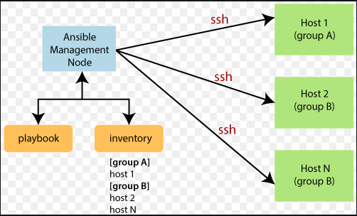
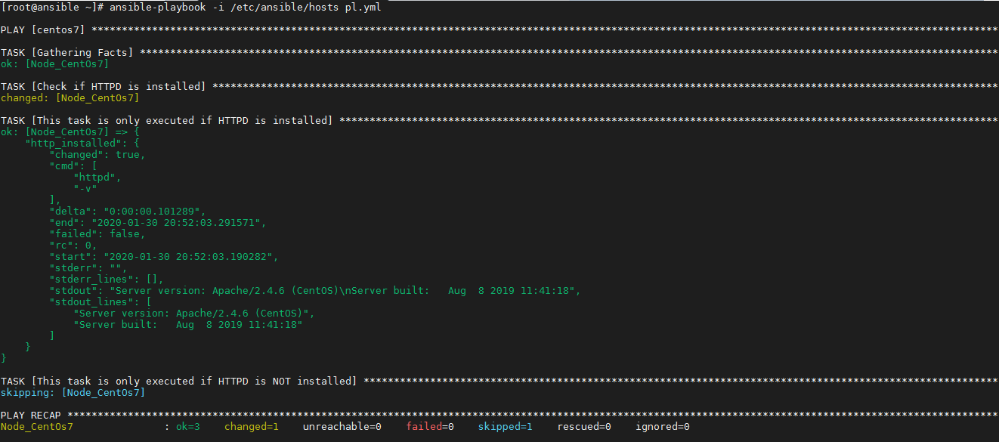
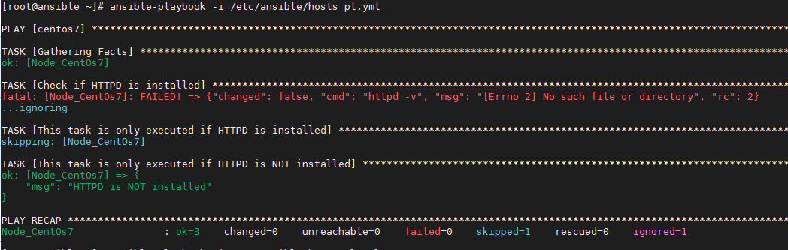

_Lý thuyết cơ bản về Ansible_

## Mục lục

[I. Cơ bản về Ansible](#1)

[II. Hiểu hơn về Ansible](#2)

- [1. Các thuật ngữ thường gặp](#2.1)
- [2. Định dạng của Task](#2.2)
- [3. Định dạng của Playbook](#2.3)
- [4. Làm việc với các biến](#2.4)
- [5. Sử dụng vòng lặp](#2.5)
- [6. Sử dụng các điều kiện (Conditionals)](#2.6)
- [7. Làm việc với các Template](#2.7)
- [8. Khai báo và kích hoạt các Handler](#2.8)

[Tài liệu tham khảo từ website cloud365s](#0)

## <a name="1" >I. Cơ bản về Ansible</a>

Ansible là công cụ hỗ trợ tự động hoá các công việc cần làm trong khi triển khai các hệ thống máy chủ, ví dụ như cài đặt: wordpress, CEPH, HAproxy,... Chủ yếu dùng cho các hệ thống máy chủ sử dụng Linux.

Các ứng dụng nổi bật của Ansible:

- Đảm bảo việc quản lý cấu hình của thiết bị, ứng dụng một cách hiệu quả, tức là quản lý đơn giản, kiểm soát được các cấu hình đúng và đủ hay chưa, chúng chạy có chính xác hay không.
- Tiết kiệm được công sức & thời gian khi phải triển khai đi triển khai lại.
- Tái sử dụng được các bước triển khai trước đó (các bước lặp đi lặp lại khi cài đặt, cấu hình máy chủ, cấu hình ứng dụng)
- Tự động hóa và áp dụng hàng loạt các việc trên hoàng loạt các server, hàng loạt các ứng dụng với thời gian ngắn nhất.

Và trước khi muốn bắt tay vào sử dụng Ansible thì ta cần phải nắm chắc được các thành phần, cách thức triển khai cấu hình cơ bản cho ứng dụng mà ta muốn triển khai. Hoặc chí ít ta nên tự viết được hoặc đọc hiểu được các script bằng bash shell.

## <a name="2" >II. Hiểu hơn về Ansible</a>

### <a name="2.1" >1. Các thuật ngữ thường gặp</a>

Dưới đây là danh sách một số thuật ngữ được sử dụng trong Ansible:

- Control Node/Management Control: server cài đặt Ansible, chịu trách nhiệm cho việc “đưa các công việc bạn cung cấp đến các server từ xa mà bạn quản lý và chạy chúng” .Nói một cách dễ hiểu hơn thì đây là server mà bạn đứng trên đó và lệnh cho các server khác thực hiện các việc bạn muốn mà không cần trực tiếp đăng nhập vào chúng.
- Inventory: Một file INI chứa các thông tin về các server từ xa mà bạn quản lý. Thường thì nó là các địa chỉ IPv4 hoặc các hostname. Có thể được gom nhóm các server lại với nhau tuỳ theo mục đích sử dụng.
- Playbook: Một file [YAML](https://en.wikipedia.org/wiki/YAML) - với đuôi file là `.yml` chứa một tập các công việc cần tự động hóa.
- Tasks: một hoặc nhiều công việc sẽ được thực hiện.
- Modules: Một Module sẽ trừu tượng hóa một tác vụ hệ thống. Hay có thể hiểu là các câu lệnh điều khiển hệ thống ta sẽ không thể sử dụng trực tiếp trong Ansible mà cần thông qua các module. Ví dụ như việc ta muốn chỉnh sửa file config nào đó thì ta cần sử dụng 1 trình soạn thảo văn bản để mở file rồi tiến hành tìm kiếm chỉnh sửa. Với module của Ansible thì ta chỉ cần cung cấp đường dẫn đến file, và dữ liệu cần thay thế là có thể chỉnh sửa được, và còn chỉnh sửa đồng thời hàng loạt cho rất nhiều máy. Ansible cũng cung cấp rất nhiều Module tích hợp để ta sử dụng nhưng nếu muốn bạn cũng có thể tự tạo Module.
- Roles: Một tập hợp các Playbook, các template và các file khác, được tổ chức theo cách được xác định trước để tạo điều kiện tái sử dụng và chia sẻ.
- Play: Một lần thực thi
- Group vars: chứa các biến toàn cục cho một lần thực thi triển khai.
- Facts/Gathering Facts: chứa các thông tin về hệ thống, như các network interface hay operating system.
- Handlers: thường chứa các playbook kích hoạt thay đổi trạng thái các service, như việc ta restart hay reload một service

Ví dụ:

<p align="center">
 
</p>

>Bạn đứng trên một Node Control và ra lệnh cho các server mà bạn quản lý.
>
>Tuy nhiên vấn đề đặt ra là số lượng thao tác cần thực hiện trên các server kìa thì nhiều, nhiều server có tác dụng,nhiệm vụ giống nhau nên cần thực hiện các tháo tác giống nhau.
>
>Vậy không lẽ bạn định gõ tay hàng trăm thậm chí hàng ngàn lệnh. Để rồi khi có một server mới, bạn lại gõ tay lại, chưa kể việc sai sót khi thao tác.
>
>Lúc này bạn sẽ cần viết một Playbook - nơi sẽ chứa chi tiết tất cả những gì bạn muốn làm với các server từ xa kia và cách thức thực hiện chúng
>
>Mỗi một thao tác trong Playbook gọi là một Task (Cài đặt, khởi động, dừng,....)
>
>Ta sử dụng Module để tạo thành Task (Ví dụ: muốn cài đặt một gói trên CentOs7 ta sử dụng Module yum của Ansible).
>
>Có việc cần làm rồi, giờ ta cần truyền thông tin chi tiết hơn về server cho Playbook chứ không thì làm sao nó biết sẽ làm việc với ai. Lúc này ta cần đến  

### <a name="2.2" >2. Định dạng của Task</a>

Một task là một công việc đơn lẻ sử dụng module nhất định để thực hiện một công việc nào đó. Nhiều task gộp lại sẽ cho ta một công việc hoàn chỉnh.
Ví dụ:

  ```sh
    - name: Install or update httpd
      yum:
        name: httpd
        state: latest
  ```

> Một task có công việc là cài đặt hoặc cập nhật http service, sử dụng module yum

Tuỳ chọn `name` là một tùy chọn nhưng bạn nên sử dụng nó để đặt tên cho Task. Nó sẽ hiển thị khi Task được thực thi, giúp bạn dễ quan sát, theo dõi. Với những người sử dụng lại Playbook của bạn, họ sẽ dễ dàng đọc, hiểu Playbook hơn.

### <a name="2.3" >3. Định dạng của Playbook</a>

Các Playbook là các file có định dạng `.yml` hoac `.yaml` chứa một loạt các task được viết bằng YAML nhằm mục đích tự động hóa các công việc đó trên server từ xa.

ví dụ:

```sh
- hosts: centos7
  remote_user: root
  become: True
  tasks:
  - name: Install httpd
    yum:
      name: httpd
      state: latest
  - name: Start httpd
    service:
      name: httpd
      state: started
      enabled: True
```

YAML dựa vào việc thụt đầu dòng để phân cấp và sắp xếp cấu trúc dữ liệu. Bạn cần cẩn thận điều này khi viết Playbook và đặc biệt là khi sao chép nội dung của chúng.

### <a name="2.4" >4. Làm việc với các biến</a>

Xem chi tiết tại đây: <https://docs.ansible.com/ansible/latest/playbook_guide/playbooks_variables.html>

Các đơn giản nhất để xác định các biến là sử dụng section có tên là vars của Playbook.

Ví dụ dưới đây, ta định nghĩa biến package – biến mà sau này được sử dụng bên trong các Task.

```sh

- hosts: centos7
  become: True
  vars:
    package: httpd
  tasks:
  - name: Install httpd
    yum:
      name: "{{package}}"
      state: latest

```

> Lúc này, Biến package có phạm vi sử dụng trên toàn Playbook.

### <a name="2.5" >5. Sử dụng vòng lặp</a>

Ta sử dụng vòng lặp khi phải lặp lại cùng một task nhiều lần, chỉ khác giá trị input.

Chẳng hạn như cài 20 package khác nhau. Chắc hẳn bạn không muốn viết đi viết lại 30 task này đúng không nào.

Để tạo một vòng lặp bên trong một task, ta sử dụng with_items kèm theo bên dưới là 1 mảng các giá trị. Ta truy xuất đến các giá trị này thông qua biến vòng lặp item.

```sh
- hosts: centos7
  become: True
  tasks:
  - name: Install packages
    yum:
      name: "{{item}}"
      state: latest
    with_items:
    - httpd
    - mariadb-server
    - mariadb
    - php
    - php-mysql
    - php-fpm  
```

Hiện nay với module `yum` đã ưu tiên chuyển qua biến mảng.

```sh
- hosts: centos7
  become: True
  tasks:
  - name: Install packages
    yum:
      name: ['httpd','mariadb-server','mariadb','php','php-mysql','php-fpm']
      state: latest
```

Còn 1 loại vòng lặp nữa xuất hiện từ phiên bản 2.5 đó là `Loop`. Xem chi tiết tại đây: <https://docs.ansible.com/ansible/latest/playbook_guide/playbooks_loops.html>

```sh
- name: Add several users
  ansible.builtin.user:
    name: "{{ item.name }}"
    state: present
    groups: "{{ item.groups }}"
  loop:
    - { name: 'testuser1', groups: 'wheel' }
    - { name: 'testuser2', groups: 'root' }
```

### <a name="2.6" >6. Sử dụng các điều kiện (Conditionals)</a>

Xem chi tiết tại đây: <https://docs.ansible.com/ansible/latest/playbook_guide/playbooks_conditionals.html>

Các điều kiện được sử dụng để tự động quyết định xem liệu một task có được thực thi hay không dựa trên một biến hay một output từ một nguồn, ví dụ : output của một command.

```sh
  - name: Shutdown CentOS Based Systems
    command: /sbin/shutdown -t now
    when: ansible_facts['distribution'] == "CentOS"
```

Ở ví dụ trên tôi sử dụng một trong các biến ansible_facts (các biến đặc biệt của Ansible) là ansible_facts[‘distribution’] nhằm kiểm tra OS hiện tại của node client. Nếu node này cài CentOS thì sẽ thực hiện lệnh shutdown để tắt nó.

Một ví dụ khác:

```sh
---
- hosts: centos7
  become: True
  tasks:
  - name: Check if HTTPD is installed
    register: http_installed
    command: httpd -v
    ignore_errors: true

  - name: This task is only executed if HTTPD is installed
    debug: var=http_installed
    when: http_installed is success

  - name: This task is only executed if HTTPD is NOT installed
    debug: msg='HTTPD is NOT installed'
    when: http_installed is failed
```

Ở ví dụ này ta viết 3 task

- task 1 : Chạy lệnh kiểm tra version của apache trên CentOS. Nếu đã cài apache thì lệnh sẽ chạy bình thường ; output và các giá trị trả về sẽ lưu vào biến http_installed
- task 2 : Kiểm tra xem lệnh ở task 1 có được thực thi thành công không thông qua việc kiểm tra biến http_installed. Nếu thành công thì hiển thị nội dung của biến http_installed.



- task 3 : Kiểm tra xem lệnh ở task 1 có được thực thi thành công không thông qua việc kiểm tra biến http_installed. Nếu không thành công thì hiển thị nội dung HTTPD is NOT installed.



### <a name="2.7" >7. Làm việc với các Template</a>

Xem chi tiết tại đây: <https://docs.ansible.com/ansible/latest/collections/ansible/builtin/template_module.html>

Các template thường được sử dụng để thiết lập các tệp cấu hình, cho phép sử dụng các biến và các tính năng khác nhằm làm cho các tệp trở nên linh hoạt hơn và thuận tiện cho việc sử dụng lại chúng.

Ansible sử dụng template engine có tên Jinja2

Ví dụ:

Ta có 1 file tên là `index.html` có nội dung như sau:

```sh
<h1>Heyyy, I'm {{my_name}}</h1>
```

Và một file playbook có nội dung như sau:

```sh
- hosts: centos7
  become: True
  vars:
    my_name: 'Pham Khanh'

  tasks:
  - name: Test template
    template:
      src: index.html
      dest: /var/www/html/index.html
```

Cả 2 file đều nằm trong 1 thư mục và máy đã được cài Web server: Nginx. Sau khi chạy playbook ta thu được kết quả.


### <a name="2.8" >8. Khai báo và kích hoạt các Handler</a>

Xem chi tiết tại đây: <https://docs.ansible.com/ansible/latest/playbook_guide/playbooks_handlers.html#handlers>

Các handler thường được sử dụng để kích hoạt một trạng thái nào đó của service như restart hay stop.

Các handler trông khá giống các task nhưng chúng chỉ được thực thi khi được kích hoạt bởi một chỉ thị notify bên trong một task.

Chúng thường được khai báo như một mảng trong phần handlers của playbook nhưng cũng hoàn toàn có thể đặt trong các tệp riêng biệt.

ví dụ:

```sh
---
- hosts: centos7
  become: True
  vars:
    my_name: 'PhamKhanh123'
  tasks:
  - name: template configuration file
    template:
      src: index.html
      dest: /var/www/html/index.html
    notify:
      - restart httpd
  handlers:
      - name: restart httpd
        service:
          name: httpd
          state: restarted
```

Tổng hợp lại tất cả, ta thu được 1 file playbook đơn giản như sau:

```sh
---
- hosts: centos7
  become: True
  vars:
    my_name: 'PhamKhanh123'
    package: httpd
  tasks:
  - name: Install httpd
    yum:
      name: "{{package}}"
      state: latest

  - name: Check if HTTPD is installed
    register: http_installed
    command: httpd -v
    ignore_errors: true

  - name: This task is only executed if HTTPD is installed
    debug: var=http_installed
    when: http_installed is success

  - name: This task is only executed if HTTPD is NOT installed
    debug: msg='HTTPD is NOT installed'
    when: http_installed is failed

  - name: template configuration file
    template:
      src: index.html
      dest: /var/www/html/index.html
    notify:
      - restart httpd
  handlers:
      - name: restart httpd
        service:
          name: httpd
          state: restarted
```

# <a name="0" >Tài liệu tham khảo từ website cloud365s</a>

<https://news.cloud365.vn/tag/ansible/>

