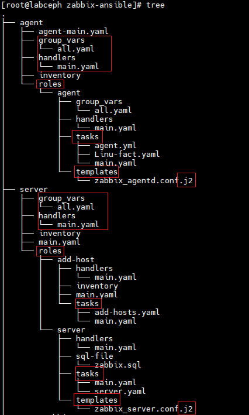

_Tại bài viết này ta sẽ tìm hiểu kỹ hơn về cách thực thế mà Ansible được sử dụng_

Trong nhiều bài viết, từ giới thiệu đến thực hành trên mạng. Đa phần ta đều thấy các file `.yaml` hay `.yml` của họ dùng để chạy việc tự động hoá đều nằm trong cùng 1 file duy nhất. Từ việc khai báo biến, điều khiển các dịch vụ, chỉnh sửa các cấu hình,...

Về cơ bản thì điều này không sai, nhưng trong thực thế khi cần tự động hoá thì đó đã là một hệ thống khá lớn. Nó sẽ sinh ra nhiều biến khác nhau hoặc chỉ là cùng 1 biến nhưng sẽ rất nhiều, ví dụ như: địa chỉ ip, hostname,...Hay chỉ đơn giản là việc thay đổi phiên bản của ứng dụng cần cài đặt.

Vì thế ta cần phải chuẩn hoá việc tổ chức file cho việc tự động hoá sử dụng Ansible. Ở đây sẽ lấy việc cài đặt và cấu hình Zabbix làm ví dụ.

 

Như trên hình có thể thấy file lưu trữ 2 thư mục lớn đó là:

- `agent`: dùng cho việc cài đặt và cấu hình cơ bản zabbix agent trên các máy chạy CentOS 7 cần được giám sát.
- `server`: dùng cho việc cài đặt và cấu hình, lưu trữ database cơ bản phục vụ cho việc cài zabbix server, triển khai zabbix trên giao diện web.

Bên trong cả 2 thư mục đều có file cơ bản giống nhau như:

- `group_vars`: nơi lưu các biến chung toàn cục như số hiệu phiên bản, địa chỉ IP,...Để khi cần thay đổi ta không cần phải tìm vào tận sâu bên trong, đến đúng dòng cần thay đổi để nhập dữ liệu mới. Mà chỉ cần thay đổi tại ngay group_vars này. Ngoài ra còn một cách khác đó là `default`, ngoài lưu trữ các biến thì nó lưu trữ cả các thông số cấu hình cơ bản, các [fact](https://docs.ansible.com/ansible/latest/collections/ansible/builtin/set_fact_module.html). Tuy nhiên tại bài viết này chỉ dừng lại ở `group_vars` đủ để dùng cho những người mới bắt đầu tìm hiểu.
- `handlers`: nơi lưu trữ các file `yaml` chứa các câu lệnh điều khiển các service như: khởi động, dừng, kích hoạt,...Sinh ra file này là để ta không cần phải khai báo lại việc này quá nhiều lần. Nếu bạn từng thực hành Ansible thì biết việc này mất ít nhất 3 dòng lệnh. Khi đã khai báo trong đây thì ta chỉ cần khai báo ra một dòng để kích hoạt câu lệnh.
- `invetory` hoăc `hosts`: nơi lưu trữ các host name hoặc địa chỉ ip của các máy được điều khiển để tự động hoá. Có thể phân nhóm để dễ dàng gọi đến khi cần.
- `roles`: lưu trữ các file cần thiết cho việc tự động hoá để cài đặt dịch vụ. Bên trong roles này ta có thể tạo ra nhiều thư mục con lưu trữ các file phục vụ cho các công việc khác nhau. Ví dụ như trong server/roles ta có 2 thư mục con là:
  
  - `Server`: ta có thể đặt tên nó là bất kỳ cho phù hợp với hệ thống và cá nhân của mình, thư mục này lưu trữ các file phục vụ việc cài đặt zabbix-server. Có một số file mặc định cho tất cả các trường hợp đó là `tasks` - lưu trữ các hành động cho việc tự động hoá. `templates` - lưu trữ file cấu hình cho zabbix-server với định dạng file là `.j2`. Và một vài file khác sao cho phù hợp với yêu cầu của hệ thống của bạn, như với zabbix-server ta sẽ có thêm thư mục `sql-file` lưu database, schema ban đầu của database.
  - `add-host`: thực ra thì chỉ cần thư mục `tasks` để lưu trữ các file `yaml` phục vụ cho việc thêm host vào danh sách giám sát một cách tự đông.

> Các mục được khoanh đỏ yêu cầu đặt tên chính xác để Ansible có thể tìm và đọc được file `.yaml`. Và trong các thư mục đó, Ansible chỉ làm việc với file `main.yaml`, tức là dù bạn có bao nhiêu file bên trong đi chăng nữa (đặc biệt là bên trong thư mục `roles`) thì muốn sử dụng chúng bạn bắt buộc phải gọi đến chúng trong file `main.yaml` rồi thực thi chúng bằng việc thực thi file `main.yaml` bằng Ansible. Thường được sử dụng nhiều nhất là trong thư mục `roles`, hãy đọc tài liệu về roles tại đây: <https://docs.ansible.com/ansible/latest/playbook_guide/playbooks_reuse_roles.html>

> Khi chạy tiến trình, Ansible sẽ bắt đầu kiểm tra từ ngoài vào trong, ví dụ như trên hình khi `chạy server/roles/add-host` thì Ansible sẽ kiểm tra trong, từ `server/group_vars` để lấy các biến, các `group_vars` được tìm thấy phía sau sẽ bị bỏ qua, tương tự với các thư mục `handlers`, `tasks`, `templates`,...