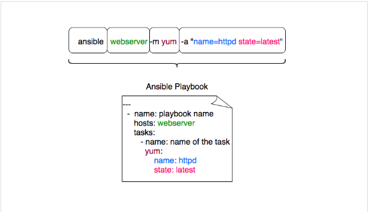

### Các bài hướng dẫn thực hành Ansible của nhóm cloud365s

[1. Dựng LAB để thực hành ansible](https://news.cloud365.vn/10-phut-ansible-co-ban-phan-2-dung-lab-de-thuc-hanh-ansible/)

[2. Hướng dẫn sử dụng ad-hoc command trong ansible](https://news.cloud365.vn/10-phut-ansible-co-ban-phan-3-huong-dan-su-dung-ad-hoc-command-trong-ansible/)

Hình ảnh tóm tắt giải thích cho AD HOC Command

 

[3. Viết Playbook trên Ansible](https://news.cloud365.vn/10-phut-ansible-co-ban-phan-4-viet-playbook-tren-ansible/)

[4. Viết Playbook cài đặt WordPress trên CentOS 7](https://news.cloud365.vn/10-phut-ansible-co-ban-phan-5-viet-playbook-cai-dat-wordpress-tren-centos-7/)

### Các cấu hình cơ bản và nâng cao cho việc cài đặt Zabbix-server, Zabbix-agent, add-host-to-zabbix trên CentOS 7

#### 1. Các cấu hình cơ bản

[Bài tham khảo trên GitLab - zabbix server](https://gitlab.com/ranjandas/fl-004/-/tree/master/)

[Install zabbix agent with ansible - web:codesie](https://www.codesie.ch/en/wiki/ansible/install-zabbix-agent)

#### 2. Các cấu hình nâng cao

[GitHub dj-wasabi/ansible-zabbix-server](https://github.com/dj-wasabi/ansible-zabbix-server)

[GitHub dj-wasabi/ansible-zabbix-agent](https://github.com/dj-wasabi/ansible-zabbix-agent)
