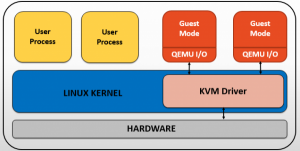
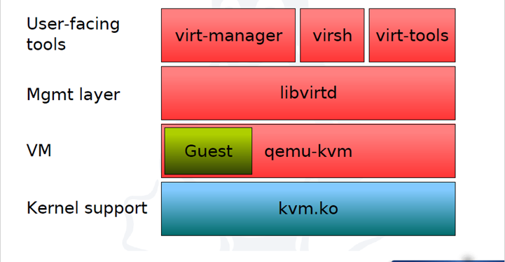
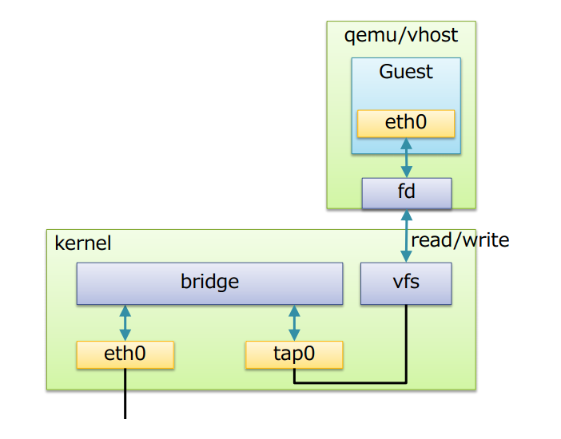
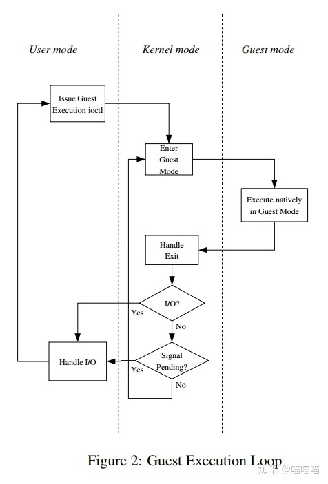
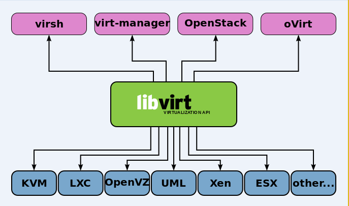

## Nội dung chính

[1. Kiến trúc của hệ thống KVM](#1-kiến-trúc-của-hệ-thống-kvm)

[2. Cấu trúc ảo hóa KVM kết hợp QEMU](#2-cấu-trúc-ảo-hóa-kvm-kết-hợp-qemu)

[3. KVM-QEMU kết hợp với Linux-bridge](#3-kvm-qemu-kết-hợp-với-linux-bridge)

[4. Execution-Model - Quy trình vận hành KVM](#4-execution-model---quy-trình-vận-hành-kvm)

[5. Các chế dộ mạng trong KVM](#5-các-chế-dộ-mạng-trong-kvm)

[6. Các file cấu hình của KVM](#6-các-file-cấu-hình-của-kvm)

[7. LibVirtd - 1 số trình điều khiển KVM-QEMU](#7-libvirtd---1-số-trình-điều-khiển-kvm-qemu)

[Tài liệu tham khảo](#tài-liệu-tham-khảo)

___

## 1. Kiến trúc của hệ thống KVM

Trong kiến trúc KVM, máy ảo là 1 tiến trình Linux, được lập lịch bởi chuẩn Linux schduler. Trong thực tế mỗi CPU ảo xuất hiện như là 1 tiến trình Linux. Điều này cho phép KVM sử dụng tất cả tính năng của Linux kernel

Linux có tất cả các cơ chế của một VMM cần thiết để vận hành các máy ảo. Chính vì vậy, các nhà phát triển không xây dựng lại mà chỉ thêm vào đó 1 vài thành phần hỗ trợ ảo hóa. KVM được triển khai như 1 module hạt nhân có thể được nạp vào để mở rộng Linux bởi những khả năng này

Trong 1 môi trường Linux thông thường, mỗi process chạy hoặc sử dụng user-mode hoặc kernel-mode. KVM đưa ra một chế độ thứ 3 đó là guest-mode. Nó dựa trên CPU có khả năng ảo hóa với kiến trúc Intel VT hoặc AMD SVM, một process trong guest-mode bao gồm cả kernel-mode và user-mode

Kiến trúc của KVM bao gồm 3 thành phần chính:

1. KVM kernel module:

- Là 1 phần của Linux Kernel, được tích hợp luôn trong mã code từ phiên bản 2.6.20.
- Cung cấp giao diện chung cho Intel VMX và AMD SVM (thành phần hỗ trợ ảo hóa phần cứng)
- Chứa những mô phỏng cho các instruction và CPU modes không được hỗ trợ bởi Intel VMX và AMD SVM

2. Qemu-kvm: là chương trình dòng lệnh để tạo ra các máy ảo, thường được vận chuyển dưới dạng các package kvm hoặc qemu-kvm. Có 3 chức năng chính:

- Thiết lập VM và các thiết bị vào/ra (Input/Output)
- Thực thi các yêu cầu xử lý của VMs thông qua KVM kernel module
- Mô phỏng các thiết bị vào/ra và di chuyển các Guest từ Host này sang Host khác

3. Libvirt management stack:

- Cung cấp API để các tool như virsh có thể gioa tiếp và quản lý các VM
- Cung cấp chế độ quản lý từ xa an toàn

 

## 2. Cấu trúc ảo hóa KVM kết hợp QEMU

Hệ thống ảo hóa KVM hay đi liền với QEMU. Về mặt bản chất, QEMU đã là một hypervisor hoàn chỉnh và là hypervisor loại 2. QEMU có khả năng giả lập tài nguyên phần cứng, trong đó bao gồm một CPU ảo. Các chỉ dẫn của hệ điều hành tác động lên CPU ảo này sẽ được QEMU chuyển đổi thành chỉ dẫn lên CPU vật lý nhờ một translator là TCG (Tiny Core Generator). Các hypervisor loại 2 khác như VMWare cũng có các bộ chuyển đổi tương tự, và bản thân các bộ dịch này hiệu suất không lớn.
Do KVM hỗ trợ ánh xạ CPU vật lý sang CPU ảo, cung cấp khả năng tăng tốc phần cứng cho máy ảo và hiệu suất của nó nên QEMU sử dụng KVM làm accelerator tận dụng tính năng này của KVM thay vì sử dụng TCG.

Hình sau mô tả cấu trúc KVM stack làm việc chung với QEMU:

 

Trong đó:

\- **User-facing tools**: Là các công cụ quản lý máy ảo hỗ trợ KVM. Các công cụ có giao diện đồ họa (như virt-manager) hoặc giao diện dòng lệnh như (virsh) và virt-tool (Các công cụ này được quản lý bởi thư viện libvirt).

\- Các công cụ quản lý KVM do libivrt cung cấp tham khảo thêm tại: <http://www.linux-kvm.org/page/Management_Tools>

\- **Management layer**: Lớp này là thư viện libvirt cung cấp API để các công cụ quản lý máy ảo hoặc các hypervisor tương tác với KVM thực hiện các thao tác quản lý tài nguyên ảo hóa, bởi vì KVM chỉ là một module của nhân hỗ trợ cơ chế mapping các chỉ dẫn của CPU ảo để thực hiện trên CPU thật, nên tự thân KVM không hề có khả năng giả lập và quản lý tài nguyên ảo hóa. Mà phải dùng nhờ các công nghệ hypervisor khác, thường là QEMU.

\- **Virtual machine**: Chính là các máy ảo người dùng tạo ra. Thông thường, nếu không sử dụng các công cụ như virsh hay virt-manager, KVM sẽ sử được sử dụng phối hợp với một hypervisor khác điển hình là QEMU.

\- **Kernel support**: Chính là KVM, cung cấp một module làm hạt nhân cho hạ tầng ảo hóa (kvm.ko) và một module kernel đặc biệt chỉ hỗ trợ các vi xử lý VT-x hoặc AMD-V (kvm-intel.ko hoặc kvm-amd.ko) để nâng cao hiệu suất ảo hóa.

***Một số lưu ý về KVM và QEMU***:

  - *Có thể hình dung KVM giống như driver cho hypervisor để sử dụng được virtualization extension của physical CPU nhằm boost performance cho guest VM. KVM như định nghĩa trên trang chủ thì là core virtualization infrastructure mà thôi, nó được các hypervisor khác lợi dụng làm back-end để tiếp cận được các công nghệ hardware acceleration (Dịch code để mô phỏng phần cứng)*

  -	*QEMU là một Emulator nên nó có bộ dịch của nó là TCG (Tiny Code Generate) để xử lý các yêu cầu trên CPU ảo và giả lập kiến trúc của máy ảo. Nên có thể coi, QEMU như là một hypervisor type 2 (hypervisor chỉ chung cho chức năng ảo hóa). Nhằm nâng cao hiệu suất của VM. Cụ thể, lúc tạo VM bằng QEMU có VirtType là KVM thì khi đó các instruction có nghĩa đối với virtual CPU sẽ được QEMU sử dụng KVM để mapping thành các instruction có nghĩa đối với physical CPU. Làm như vậy sẽ nhanh hơn là chỉ chạy độc lập QEMU, vì nếu không có KVM thì QEMU sẽ phải quay về (fall-back) sử dụng translator của riêng nó là TCG để chuyển dịch các instruction của virtual CPU rồi đem thực thi trên physical CPU.*

=> Khi QEMU/KVM kết hợp nhau thì tạo thành type-1 hypervisor.
  
  - ***QEMU cần KVM để boost performance và ngược lại KVM cần QEMU (modified version) để cung cấp giải pháp full virtualization hoàn chỉnh.***

  - ***Do KVM kết hợp QEMU nên các máy ảo và mạng ảo có file cấu hình xml sẽ được lưu lại tại thư mục `/etc/libvirt/qemu/`***
  

## 3. KVM-QEMU kết hợp với Linux-bridge

- Để các máy ảo giao tiếp được với nhau, KVM sử dụng Linux Bridge và OpenVSwitch, đây là 2 phần mềm cung cấp các giải pháp ảo hóa network
- Linux Bridge là 1 phần mềm được tích hợp vào trong nhân của Linux để giải quyết các vấn đề ảo hóa phần network trong máy vật lý. Về mặt logic Linux bridge sẽ tạo ra 1 con switch ảo để cho các VM kết nối được vào và có thể nói chuyện được với nhau cũng như sử dụng để kết nối ra bên ngoài
- Cấu trúc của Linux Bridge khi kết hợp với KVM-QEMU:

 

Trong đó:

- Bridge: tương đương với switch ở layer 2
- Port: tương đương với port của switch thật
- Tap (tap interface): có thể hiểu là giao diện mạng để các VM kết nối với bridge do linux bridge tạo ra
fd (forward data): vận chuyển dữ liệu

Các tính năng chính:

- STP: Spanning Tree Protocol – giao thức chống lặp gói tin trong mạng
- VLAN: chia switch (do Linux Bridge tạo ra) thành các mạng LAN ảo, cô lập traffic giữa các VM trên các VLAN khác nhau của cùng 1 switch
- FDB (forwarding database): chuyển tiếp các gói tin theo database để nâng cao hiệu năng switch. Database lưu các địa chỉ MAC mà nó học được. Khi gói tin Ethernet đến, bridge sẽ tìm kiếm trong database có chứa MAC address không. Nếu không, nó sẽ gửi gói tin đến tất cả các cổng (broadcast)

## 4. Execution-Model - Quy trình vận hành KVM

Hình dưới đây mô tả mô hình thực hiện của KVM. Đây là một vòng lặp của các hành động diễn ra để vận hành các máy ảo. Những hành động này được phân cách bằng 3 phương thức: user-mode, kernel-mode, guest-mode.

 

Như ta thấy:

- User-mode: Các modul KVM gọi đến sử dụng ioclt() để thực thi mã khách (guest code) cho đến khi hoạt động I/O khởi xướng bởi guest hoặc một sự kiện nào đó bên ngoài xảy ra. Sự kiện này có thể là sự xuất hiện của một gói tin mạng, cũng có thể là trả lời của một gói tin mạng được gửi bởi các may chủ trước đó. Những sự kiện như vậy được biểu diễn như là tín hiệu.
- Kernel-mode: Kernel làm phần cứng thực thi các mã khách (guest code). Nếu bộ xử lý thoát khỏi guest do cấp phát bộ nhớ hay các hoạt động I/O, thì kernel sẽ thực hiện các nhiệm vụ cần thiết và tiếp nhận xử lý các tiến trình. Nếu lý do thoát là do một lệnh I/O hoặc một tín hiệu được xếp vào hàng đợi cho tiến trình, thì kernel sẽ thoát ra không gian người dùng.
- Guest-mode: Ở cấp độ phần cứng, bộ xử lý thực thi mã khách (guest code) cho đến khi gặp lệnh cần hỗ trợ, lỗi hoặc ngắt bên ngoài.

Khi một máy ảo chạy, có rất nhiều chuyển đổi giữa các chế độ. Từ kernel-mode tới guest-mode và ngược lại rất nhanh, bởi vì chỉ có mã nguồn gốc được thực hiện trên phần cứng cơ bản. Khi I/O hoạt động diễn ra các luồng thực thi tới user-mode, rất nhiều thiết bị ảo I/O được tạo ra, do vậy rất nhiều I/O thoát ra và chuyển sang chế độ user-mode chờ. Hãy tưởng tượng mô phỏng một đĩa cứng và 1 guest đang đọc các block từ nó. Sau đó QEMU mô phỏng các hoạt động bằng cách giả lập các hoạt động bằng các mô phỏng hành vi của các ổ đĩa cứng và bộ điều khiển nó được kết nối. Để thực hiện các hoạt động đọc, nó đọc các khối tương ứng từ một tập tin lớp và trả về dữ liệu cho guest. Vì vậy, user-mode giả lập I/O có xu hướng xuất hiện một nút cổ chai làm chậm việc thực hiện máy ảo.

## 5. Các chế dộ mạng trong KVM

Trong KVM có 3 chế độ card mạng là NAT (routing with iptables), Public Bridge và Private Bridge.

### 5.1. Private Bridge

Trường hợp sử dụng:
Để tạo một mạng nội bộ giữa 2 hay nhiều máy ảo. Mạng này sẽ không thấy được từ các máy ảo khác cũng như mạng bên ngoài.

### 5.2. Public Bridge

Trường hợp sử dụng:
Gán bridge với một card mạng để giúp các máy ảo kết nối với public bridge có thể giao tiếp trực tiếp với mạng như một thiết bị trong mạng.

### 5.3. NAT (routing with iptables)

Đây là chế độ mạng mặc định của KVM. Các máy ảo được cấp phát ip và sẽ được định tuyến để có thể ra được mạng ngoài bằng iptables.

## 6. Các file cấu hình của KVM

### Thư mục chưa máy ảo

Thông tin cấu hình của máy ảo nằm ở thư mục /etc/libvirt/qemu/. Trong thư mục này sẽ chứa tất cả các file cấu hình của từng máy ảo hiện có trong KVM dưới dạng file xml. Chúng ta có thể chỉnh sửa thông tin của máy ảo trực tiếp từ file này hoặc bằng lệnh `virsh edit <tên máy ảo>`

Thư mục chứ các file storage của máy ảo như image thường sẽ được để ở  `/var/lib/libvirt/image`

### File log của KVM

Các file log của KVM nằm trong `/var/log/libvirt/`

Log ghi lại hoạt động của từng máy ảo nằm trong thư mục /var/log/libvirt/qemu/. Khi một máy ảo được tạo thì sẽ tự động tạo một file log cho máy ảo đó và được lưu trong thư mục này

Thư mục chứa image /var/lib/libvirt/image

## 7. LibVirtd - 1 số trình điều khiển KVM-QEMU

1 số trình điều khiển tiêu biểu như:

- virsh
- virt-manager
- Openstack
- ovirt
- ...

Các trình này cần API để có thể quản trị cũng như điều khiển các máy ảo. Thứ cung cấp API và các thư viện cần thiết chính là `LibVirt`. Nó hỗ trợ tốt nhất trên nền Linux và hầu hết các trình quản trị nổi bật hiện nay.

## Tài liệu tham khảo

[Sach-KVM](Mastering%20KVM%20Virtualization-GEEKBOY-IR.pdf)

<https://ductam.info/tong-quan-ve-kvm/>

<https://wiki.nhanhoa.com/kb/kvm-ao-hoa-kvm-phan-1/>

<https://github.com/hocchudong/thuctap012017/blob/master/TamNT/Virtualization/docs/KVM/1.Tim_hieu_KVM.md>

<https://github.com/thaihust/Thuc-tap-thang-03-2016/tree/master/ThaiPH/KVM>

<https://github.com/lamth/Report-MDT/tree/master/KVM>

Date accessed: 28/02/2023

