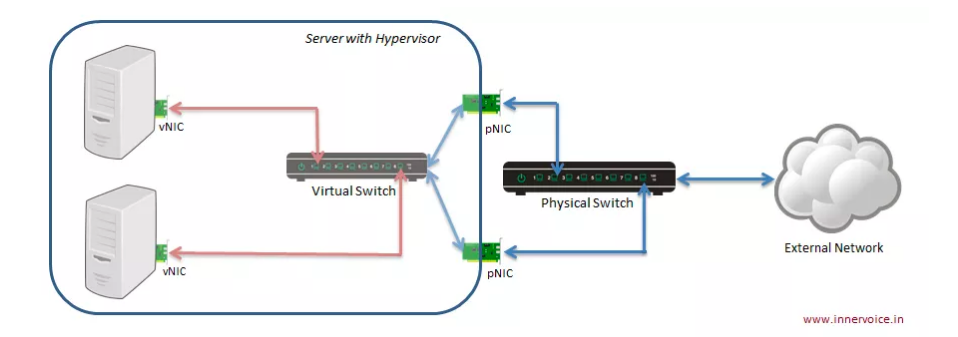
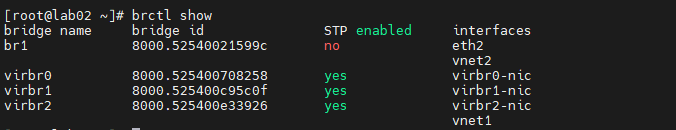
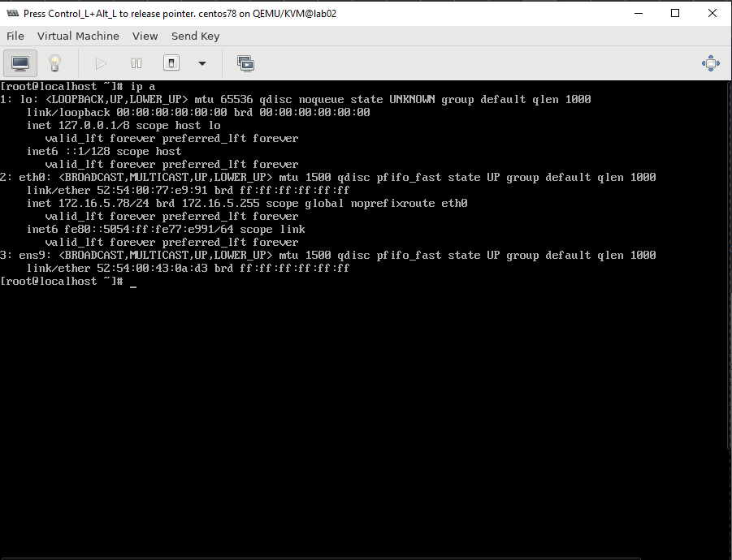
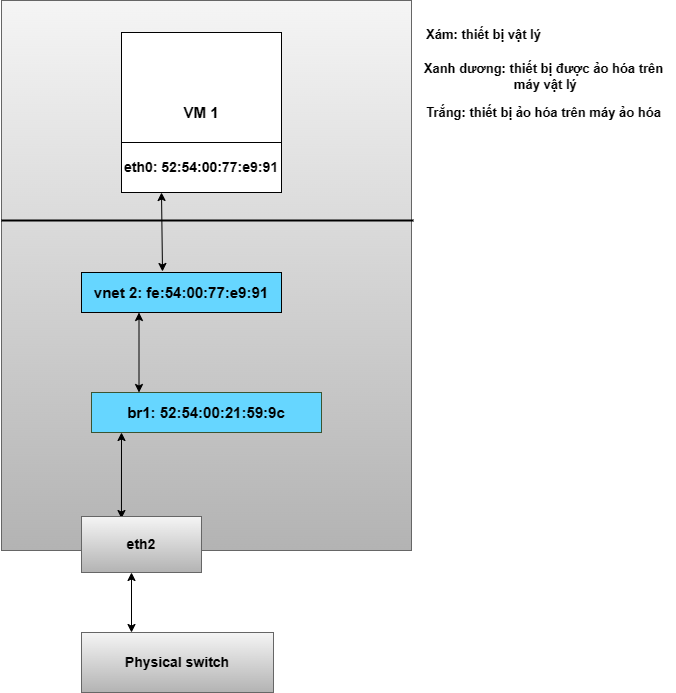
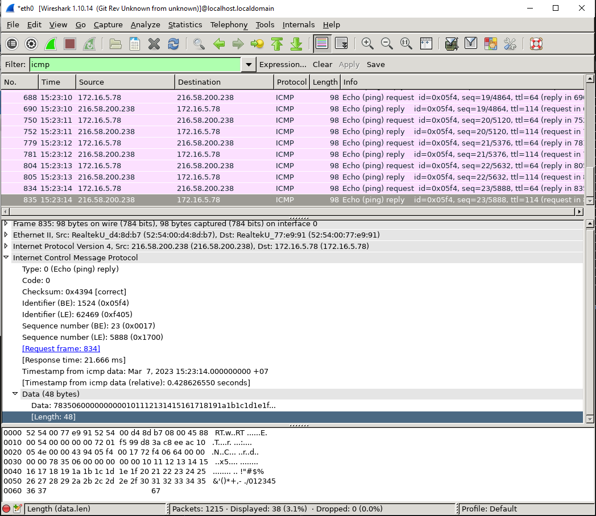
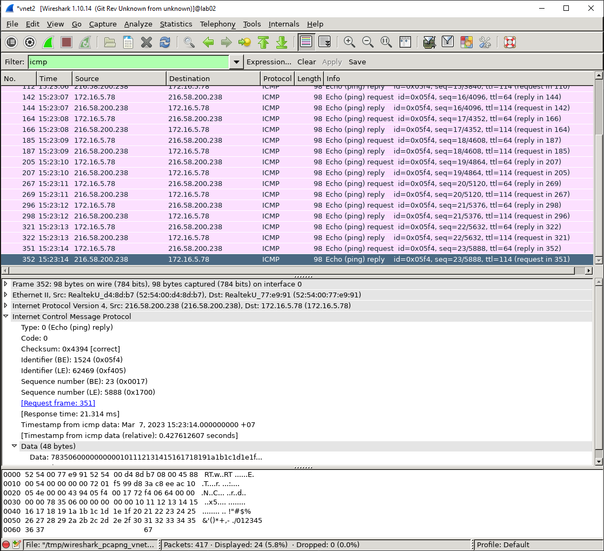

## Thực hành về công nghệ Linux-bridge

_Các câu lệnh được thực hiện trong môi trường labs và đăng nhập với quyền của người dùng root_

[1. Chuẩn bị](#1-chuẩn-bị)

[2. Ôn lại lý thuyết](#2-ôn-lại-lý-thuyết)

[3. Tạo bridge ảo và tiến hành kết nối](#3-tạo-bridge-ảo-và-tiến-hành-kết-nối)

[4. Chứng thực kết nối](#4-chứng-thực-kết-nối)

[Tài liệu tham khảo](Tài liệu tham khảo)

___

### 1. Chuẩn bị

- 01 máy vật lý để làm host ảo hóa, có ít nhất 2 card mạng, và có kết nối với internet.
- Khởi tạo ít nhất 01 máy ảo có kiểu kết nối là bridge.

### 2. Ôn lại lý thuyết



Chúng ta có thể thấy rằng có một con switch được tạo ra nằm bên trong của máy vật lý. Các VM kết nối đến đây để có thể liên lạc được với nhau. Nếu muốn liên lạc ra bên ngoài ta có thể kết nối con switch này với card mạng trên máy vật lý của ta (giống như ta dùng dây kết nối switch với router). Ta có thể kết nối switch ảo này với 1 hoặc nhiều card mạng vật lý.

_Chú ý ta không thể kết nối switch ảo với card wireless do HĐH không hỗ trợ._

Và bây giờ trên các VM muốn giao tiếp với nhau hoặc ra ngoài internet ta chỉ cần kết nối VM đó với switch ảo. Lúc này card mạng trên VM sẽ được gắn với 1 cổng của switch ảo thông qua tap interface và cổng này thường có tên là `vnet`. Khi một bridge được đấu nối thì một vnet sẽ được khởi tạo tự động tương ứng cho bridge đó.
Ví dụ như hình dưới: br1 có một máy kết nối đến thông qua vnet2

<p align="center">
 
</p>

Khi ta kết nối vào switch ảo các VM sẽ nhận địa chỉ IP cùng với dải địa chỉ IP của card mà ta add và switch và các địa chỉ IP này sẽ được cấp bởi dịch vụ DHCP trên router. Nếu config manual thì ta cũng cần phải config chuẩn với dải IP.

### 3. Tạo bridge ảo và tiến hành kết nối

_Tại đây sẽ tiến hành tạo bridge ảo bằng giao diện dòng lệnh (CLI)_

**Bước 1:** Tiến hành tải các gói cần thiết

  ```sh
  yum install bridge-utils
  ```

**Bước 2:** Tạo switch ảo br1

  ```sh
  brctl addbr br1
  ```

**Bước 3:** Gán interface eth2 vào swicth br1

  ```sh
  brctl addif br1 eth2
  ```
  
  nếu cần dùng STP
  
  ```sh
  brctl stp br1 on
  ```

**Bước 4:** Cấu hình cho Bridge và Interface Bridge

- Tạo một file `ifcfg-br1` trong thư mục `/etc/sysconfig/network-scripts`

  ```sh
  DEVICE=br1
  BOOTPROTO=static
  IPADDR=172.16.5.70
  NETMASK=255.255.255.0
  GATEWAY=172.16.0.1
  DNS1=8.8.8.8
  ONBOOT=yes
  TYPE=Bridge
  ```

- Cấu trình trên interface được dùng làm bridge cho `br1`, ở đây là `eth2`:

  ```sh
  DEVICE=eth2
  TYPE=Ethernet
  BOOTPROTO=none
  ONBOOT=yes
  NM_CONTROLLED=yes
  BRIDGE=br1
  ```

**Bước 5**. Áp dụng cấu hình

  ```sh
  systemctl restart network
  ```

**Bước 6:** Để kiểm tra, hãy tạo 1 máy ảo rồi gắn vào `br1`


Kết nối thành công thì TAP interface vnet2 sẽ được khởi tạo để VM kết nối vào mạng. Như vậy là thành công kết nối đến bridge ảo đã tạo ra. Hãy tiến hành config manual cho card mạng của VM.



Mô hình kết nối như sau:



### 4. Chứng thực kết nối

- Từ máy VM hãy `ping` tới các máy cùng dải mạng với card vật lý hoặc
- Hãy cài đặt `WireShark` lên host và VM cần chứng thực. Khởi chạy chúng với giao diện đồ họa để bắt gói tin. Nhớ hãy chọn đúng card cần bắt gới tin để có kết quả đúng. Bắt gói tin với bộ lọc là `icmp`
- Trên VM, dùng lệnh `ping` để kiểm tra kết nối đến một web site bất kỳ. Tại đây sẽ ping đến `google.com`
- Trên máy VM, truy cập vào `WireShark`, thu được kết quả tương tự như hình dưới:



- Trên Host, thu được kết quả như hình dưới:



**Kết luận**

- Dễ dàng nhận thấy các gói tin thu được trên máy VM và máy Host là tương đồng (nơi gửi, nơi nhận, thời gian, nội dung, số lượng,...), mặc dù ta chỉ thực hiện lệnh ping trên máy VM.
- Từ đó có thể khẳng định, card mạng `eth2` của máy Host đã trở thành `cầu nối` cho VM đi ra ngoài internet, và sử dụng chung 1 dải mạng với máy Host.

## Tài liệu tham khảo

<https://github.com/nhanhoadocs/thuctapsinh/blob/master/NiemDT/KVM/docs/Linux-bridge.md>

<https://github.com/lamth/Report-MDT/blob/master/KVM/docs/14.Linux-Bridge.md>

<https://github.com/hocchudong/thuctap012017/blob/master/TamNT/Virtualization/docs/Virtual_Switch/1.Linux-Bridge.md#5.1>

Date accessed: 07/03/2023


