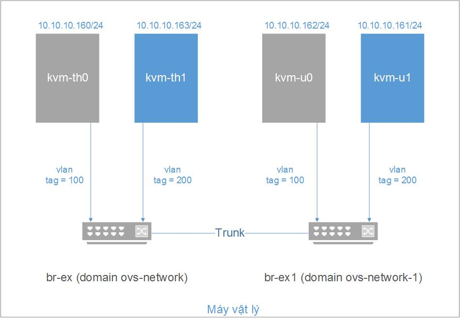
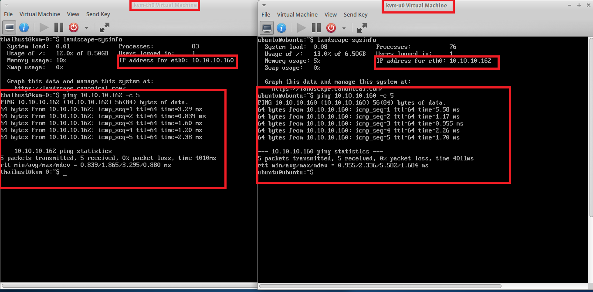
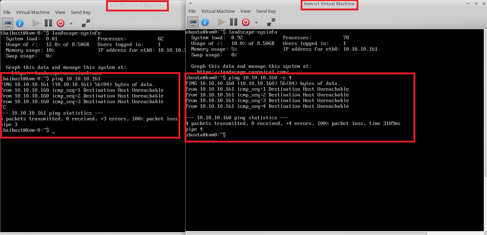

# VLAN với OpenvSwitch

## Mục lục

## [1. Topology](#topo)

## [2. Cài đặt và cấu hình VLAN](#config)

- ### [2.1. Cài các gói phụ thuộc và phần mềm cần thiết](#required)

- ### [2.2. Cấu hình VLAN](#cfg)

## [3. Tham khảo](#ref)

---

## <a name="topo"></a> 1. Topology

- Đồ hình:



- Chuẩn bị:
    - Máy vật lý: cài Ubuntu, kvm, openvswitch.
    - Sử dụng OpenvSwitch tạo 2 switch ảo br-ex, br-ex1 kết nối với nhau bằng một đường trunk, thiết lập các vlan tag 100 và 200.
    - Tạo 4 máy ảo gán vào các vlan tương ứng với các tab interface của 2 switch ảo trên:
        - __kvm-th0__ và __kvm-th1__: gán vào switch __br-ex__
        - __kvm-u0__ và __kvm-u1__: gàn vào switch __br-ex1__
        - Gán các máy ảo vào các vlan: __kvm-th0__ và __kvm-u0__ gán vào vlan 100, __kvm-th1__ và __kvm-u1__ gán vào vlan 200.
    - Tiến hành ping giữa các máy ảo kiểm tra hoạt động của vlan.

## <a name="config"></a> 2. Cài đặt và cấu hình VLAN

### <a name="required"></a> 2.1. Cài các gói phụ thuộc và phần mềm cần thiết

- Chuẩn bị cài đặt các gói phần mềm phụ thuộc sau:

    - __KVM:__ Tham khảo bài viết sau: [Install-va-tao-may-ao-voi-KVM](https://github.com/nhanhoadocs/thuctapsinh/blob/master/NiemDT/KVM/docs/Install-va-tao-may-ao-voi-KVM.md)
    - __OpenvSwitch:__ phiên bản cài đặt tối thiểu là 2.0.

### <a name="cfg"></a> 2.2. Cấu hình VLAN

- Tạo các switch ảo và cấu hình vlan tag

    - Tạo switch ảo:

    ```sh
    ovs-vsctl add-br br-ex
    ovs-vsctl add-br br-ex1 
    ```

    - Tạo các trunk port trên các switch ảo:

    ```sh
    ovs-vsctl add-port br-ex trk
    ovs-vsctl add-port br-ex1 trk1
    ```

    - tạo đường trunk kết nối hai switch:

    ```sh
    ovs-vsctl set interface trk type=patch options:peer=trk1
    ovs-vsctl set interface trk1 type=patch options:peer=trk
    ```

    - Kiểm tra lại cấu hình các switch:

    ```sh
    ovs-vsctl show
    ...
    Bridge "br-ex1"
        Port "br-ex1"
            Interface "br-ex1"
                type: internal
        Port "trk1"
            Interface "trk1"
                type: patch
                options: {peer=trk}
    Bridge br-ex
        Port br-ex
            Interface br-ex
                type: internal
        Port trk
            Interface trk
                type: patch
                options: {peer="trk1"}
    ovs_version: "2.17.5"
    ```

- Tạo network interface cho các máy ảo kết hợp OpenvSwitch với libvirt: Để khai báo network mới với libvirt, ta tạo một file định dạng _*.xml_ và sử dụng công cụ __virsh__ (thường cài đặt cùng với kvm-qemu) để áp dụng cấu hình trong file đó.
- Đồng thời ta cũng sẽ khởi tạo luôn vlan tag cho network với khai báo cơ bản như sau:

    ```xml
    <portgroup name='<name-group>'>
        <vlan>
          <tag id='<ID of vlan (2-4094)>'/>
        </vlan>
    </portgroup>
    ```

Ở đây, ta khai báo 2 file xml cấu hình 2 network tương ứng với hai switch ảo ở trên:
    - Cấu hình network tương ứng br-ex: `vi ovs-vlan.xml`:

    ```xml
    <network>
      <name>br-ex</name>
      <uuid></uuid>
      <forward mode='bridge'/>
      <bridge name='br-ex'/>
      <virtualport type='openvswitch'/>
      <portgroup name='vlan-00' default='yes'>
      </portgroup>
      <portgroup name='vlan-100'>
        <vlan>
          <tag id='100'/>
        </vlan>
      </portgroup>
      <portgroup name='vlan-200'>
        <vlan>
          <tag id='200'/>
        </vlan>
      </portgroup>
      <portgroup name='vlan-all'>
        <vlan trunk='yes'>
          <tag id='100'/>
          <tag id='200'/>
        </vlan>
      </portgroup>
    </network>
    ```
>Thẻ <vlan trunk='yes'> là thẻ khai báo sử dụng trunk port cho switch. Ta phải tự thêm các vlan nào được trunk bằng id của chúng.


    - Cấu hình network tương ứng với br-ex1: `vi ovs-vlan_br-ex1.xml`

    ```xml
    <network>
      <name>br-ex1</name>
      <forward mode='bridge'/>
      <bridge name='br-ex1'/>
      <virtualport type='openvswitch'/>
      <portgroup name='vlan-00' default='yes'>
      </portgroup>
      <portgroup name='vlan-100'>
        <vlan>
          <tag id='100'/>
        </vlan>
      </portgroup>
      <portgroup name='vlan-200'>
        <vlan>
          <tag id='200'/>
        </vlan>
      </portgroup>
      <portgroup name='vlan-all'>
        <vlan trunk='yes'>
          <tag id='100'/>
          <tag id='200'/>
        </vlan>
      </portgroup>
    </network>
    ```

    - Áp dụng cấu hình network mới:

    ```sh
    # define new networks
    virsh net-define ovs-vlan.xml
    virsh net-define ovs-vlan_br-ex1.xml

    # start new networks
    virsh net-start ovs-network
    virsh net-start ovs-network-1
    
    # auto start networks when turning on
    virsh net-autostart ovs-network
    virsh net-autostart ovs-network-1
    ```
    - Kiểm tra lại:

    ```sh
    virsh net-list --all
    ```

    ```sh
    [root@client networks]# virsh net-list --all
    Name                 State      Autostart     Persistent
    ----------------------------------------------------------
    default              active     yes           yes
    br-ex                active     yes           yes
    br-ex-1              active     yes           yes
    ```

- Tạo các máy ảo và thiết lập network cho các máy ảo. Có thể sử dụng file xml để tạo. Hoặc sử dụng công cụ đồ họa`virt-manager`.

- Tiến hành cấu hình tương tự cho các máy ảo khác theo đúng topology.

- Kiểm tra lại sau khi kết nối các máy vào các con bridge:

```sh
ovs-vsctl show
```

```sh
[root@client networks]# ovs-vsctl show
a4717025-164d-45c7-804f-cecdb38fe110
    Bridge br-ex1
        Port trk1
            Interface trk1
                type: patch
                options: {peer=trk}
        Port br-ex1
            Interface br-ex1
                type: internal
        Port vnet5
            tag: 200
            Interface vnet5
        Port vnet2
            tag: 200
            Interface vnet2
    Bridge br-ex
        Port trk
            Interface trk
                type: patch
                options: {peer=trk1}
        Port vnet1
            tag: 100
            Interface vnet1
        Port vnet4
            tag: 100
            Interface vnet4
        Port br-ex
            Interface br-ex
                type: internal
    ovs_version: "2.17.5"
[root@client networks]#
```

- Sinh ra đủ 4 vnet kết nối từ 4 máy, với các tag rõ ràng.

- Kiểm tra kết nối các máy tính trên các vlan:
    - Cấu hình ip tĩnh cho các máy ảo như topology.
    - Tiến hành ping giữa các máy trong cùng vlan: kvm-th0 với kvm-u0(vlan-100), kvm-th1 với kvm-u1 (vlan-200). Kết quả ping thành công.
    - Tiến hành ping giữa các máy khác vlan: kvm-th0 với kvm-th1 hoặc kvm-u1 (cũng có thể kiểm tra ping kvm-u0 với kvm-th1 hoặc kvm-u1). Kết quả ping không thành công.
    - Demo:
        - ping giữa hai máy cùng vlan __vlan-100__ là __kvm-th0__ và __kvm-u0__:

        

        - ping giữa hai máy khác vlan __kvm-th0__ và __kvm-u1__:

        


## <a name="ref"></a> 3. Tham khảo

- tham khảo cách cài trên ubuntu 14.04 theo hướng dẫn của [howtoforge](https://www.howtoforge.com/tutorial/kvm-on-ubuntu-14.04)

- [1] - [http://openvswitch.org/support/config-cookbooks/vlan-configuration-cookbook/](http://openvswitch.org/support/config-cookbooks/vlan-configuration-cookbook/)

- [2] - [http://blog.scottlowe.org/2012/11/07/using-vlans-with-ovs-and-libvirt/](http://blog.scottlowe.org/2012/11/07/using-vlans-with-ovs-and-libvirt/)

- [3] - [http://blog.scottlowe.org/2013/05/28/vlan-trunking-to-guest-domains-with-open-vswitch/](http://blog.scottlowe.org/2013/05/28/vlan-trunking-to-guest-domains-with-open-vswitch/)

- [4] - <https://github.com/hocchudong/ghichep-openvswitch/blob/master/2-ovs-vlan-lab.md>
