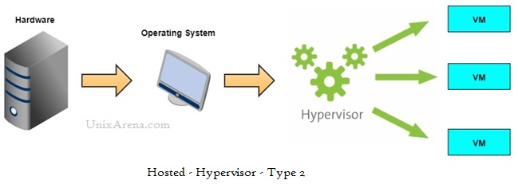

## Nội dung chính

[Ảo hoá là gì](#ảo-hoá-là-gì)

[Tại sao ảo hóa lại quan trọng?](#tại-sao-ảo-hóa-lại-quan-trọng)

[Lợi ích của ảo hóa là gì?](#lợi-ích-của-ảo-hóa-là-gì)

- [Sử dụng tài nguyên hiệu quả](#sử-dụng-tài-nguyên-hiệu-quả)
- [Quản lý CNTT tự động](#quản-lý-cntt-tự-động)
- [Phục hồi sau thảm họa nhanh hơn](#phục-hồi-sau-thảm-họa-nhanh-hơn)

[Ảo hóa hoạt động như thế nào?](#ảo-hóa-hoạt-động-như-thế-nào)

[Ảo hóa có những loại khác nhau nào?](#ảo-hóa-có-những-loại-khác-nhau-nào)

[Ảo hóa khác với điện toán đám mây như thế nào?](#ảo-hóa-khác-với-điện-toán-đám-mây-như-thế-nào-virtualization-vs-cloud-computing)

[Ảo hóa máy chủ khác với bộ chứa hóa như thế nào?](#ảo-hóa-máy-chủ-khác-với-bộ-chứa-hóa-như-thế-nào-virtualization-vs-containerization)

___

## Ảo hoá là gì

Ảo hóa là công nghệ mà bạn có thể sử dụng để tạo các dạng ảo của máy chủ, kho lưu trữ, mạng,...và nhiều máy vật lý khác. Phần mềm ảo hoá mô phỏng các chức năng của phần cứng vật lý để chạy đồng thời nhiều máy ảo trên một máy vật lý duy nhất. Các doanh nghiệp ứng dụng công nghệ ảo hóa để sử dụng hiệu quả tài nguyên phần cứng của họ và thu về lợi nhuận lớn hơn trên cùng một vốn đầu tư.

## Tại sao ảo hóa lại quan trọng?

Bằng cách sử dụng ảo hóa, bạn có thể tương tác với bất kỳ tài nguyên phần cứng nào với độ linh hoạt cao hơn.

Về cơ bản các máy chủ vật lý tiêu thụ điện, chiếm không gian lưu trữ và cần được bảo trì. Bạn thường bị giới hạn về khoảng cách vật lý và thiết kế mạng nếu muốn tiếp cận máy chủ vật lý. Ảo hóa sẽ loại bỏ tất cả những giới hạn này bằng cách trừu tượng hóa chức năng của phần cứng vật lý thành phần mềm. Bạn có thể quản lý, bảo trì và sử dụng cơ sở hạ tầng phần cứng của mình như một ứng dụng trên web.

- Ví dụ về ảo hóa - Xét tình huống một công ty cần máy chủ cho ba chức năng:

1. Lưu trữ email của doanh nghiệp một cách bảo mật
2. Chạy ứng dụng tương tác trực tiếp với khách hàng
3. Chạy các ứng dụng nội bộ của doanh nghiệp

- Mỗi chức năng này có những yêu cầu cấu hình khác nhau:

1. Ứng dụng email cần có nhiều dung lượng lưu trữ hơn và hệ điều hành Windows.
2. Ứng dụng tương tác trực tiếp với khách hàng cần có hệ điều hành Linux và năng lực xử lý cao để xử lý lượng lớn lưu lượng truy cập trang web.
3. Ứng dụng nội bộ của doanh nghiệp cần có iOS và bộ nhớ trong (RAM) có dung lượng lớn hơn.

- Để đáp ứng những yêu cầu này, công ty sẽ thiết lập ba máy chủ vật lý chuyên dụng khác nhau cho từng ứng dụng. Công ty phải tốn một khoản đầu tư ban đầu lớn và thực hiện bảo trì cũng như nâng cấp liên tục cho từng máy một. Công ty cũng không thể tối ưu hóa năng lực điện toán. Công ty luôn phải thanh toán 100% chi phí bảo trì hay nâng cấp máy chủ nhưng chỉ sử dụng một phần dung lượng lưu trữ và năng lực xử lý.

- Nhờ ảo hóa, công ty tạo ra ba máy chủ kỹ thuật số hoặc máy ảo trên một máy chủ vật lý duy nhất. Công ty chỉ định các yêu cầu về hệ điều hành cho các máy ảo và có thể sử dụng máy ảo như máy chủ vật lý. Tuy nhiên, công ty ít phải đầu tư phần cứng hơn cũng như ít khoản chi phí liên quan hơn. Mà vẫn tận dụng tốt phần cơ sở hạ tầng đã đầu tư.

## Lợi ích của ảo hóa là gì?

### Sử dụng tài nguyên hiệu quả

Ảo hóa cải thiện tài nguyên phần cứng được sử dụng tại các trung tâm máy chủ. Ví dụ: thay vì chạy một máy chủ trên một hệ thống máy vật lý, bạn có thể tạo ra một nhóm máy chủ ảo trên cùng một hệ thống máy vật lý bằng cách sử dụng ảo hoá và trả máy chủ về cho các nhóm theo yêu cầu. Nếu có ít máy chủ vật lý cơ sở hơn, không gian của trung tâm sẽ được giải phóng, đồng thời tiết kiệm tiền điện, máy phát điện và thiết bị làm mát, đồng thời tận dụng tối đa hiệu năng của máy vật lý.

### Quản lý CNTT tự động

Giờ đây, các máy chủ ở dạng ảo, bạn có thể quản lý chúng bằng cách sử dụng các công cụ phần mềm. Quản trị viên tạo ra các chương trình triển khai và cấu hình để xác định các mẫu máy ảo. Bạn có thể sao chép các máy chủ ảo của mình lặp lại nhiều lần và nhất quán cũng như tránh các cấu hình thủ công dễ xảy ra lỗi.

### Phục hồi sau thảm họa nhanh hơn

Khi các sự kiện như thảm họa thiên nhiên hoặc tấn công mạng ảnh hưởng tiêu cực tới hoạt động kinh doanh, việc lấy lại quyền truy cập cơ sở hạ tầng CNTT và thay thế hoặc sửa chữa máy chủ vật lý có thể mất hàng giờ hoặc thậm chí vài ngày. Ngược lại, quá trình này mất vài phút nếu sử dụng môi trường được ảo hóa. Phản ứng kịp thời này cải thiện đáng kể khả năng phục hồi và tạo điều kiện để hoạt động kinh doanh diễn ra liên tục, qua đó các hoạt động có thể tiếp tục theo lịch trình.

## Ảo hóa hoạt động như thế nào?

Ảo hóa sử dụng phần mềm chuyên dụng gọi là phần mềm giám sát máy ảo (called a hypervisor) để tạo ra một số phiên bản đám mây (cloud instances) hoặc máy ảo (virtual machines) trên một máy tính vật lý.

### Các phiên bản đám mây hoặc máy ảo (Cloud instances or virtual machines)

Sau khi cài đặt phần mềm ảo hóa trên máy tính vật lý, bạn có thể tạo ra một hoặc nhiều máy ảo. Bạn có thể truy cập máy ảo giống như cách truy cập những ứng dụng khác trên máy tính vật lý của mình. Máy vật lý của bạn được gọi là máy chủ (the host) và máy ảo được gọi là máy khách (the guest). Nhiều máy khách có thể chạy trên một máy chủ đó. Mỗi máy khách có hệ điều hành riêng, có thể giống hoặc khác với hệ điều hành của máy chủ.

Từ góc nhìn của người dùng, máy ảo vận hành giống như một máy chủ điển hình. Máy ảo có cài đặt, cấu hình và ứng dụng đã cài đặt. Những tài nguyên điện toán, chẳng hạn như bộ xử lý trung tâm (CPU), Bộ nhớ truy cập ngẫu nhiên (RAM) và kho lưu trữ, xuất hiện giống như trên máy chủ vật lý. Bạn cũng có thể cấu hình và cập nhật hệ điều hành máy khách và ứng dụng của chúng khi cần thiết mà không ảnh hưởng tới hệ điều hành của máy chủ.

### Phần mềm giám sát máy ảo (Hypervisors)

Phần mềm giám sát máy ảo là phần mềm ảo hóa mà bạn cài đặt trên máy vật lý. Đó là lớp phần mềm đóng vai trò trung gian giữa các máy ảo và phần cứng cơ sở hoặc hệ điều hành của máy chủ. Phần mềm giám sát máy ảo điều phối quyền truy cập vào môi trường vật lý để một số máy ảo có quyền truy cập vào phần tài nguyên vật lý của riêng chúng.

Ví dụ: nếu máy ảo cần có các tài nguyên điện toán, chẳng hạn như năng lực xử lý của máy tính, trước tiên, yêu cầu sẽ được chuyển đến phần mềm giám sát máy ảo. Sau đó, phần mềm giám sát máy ảo sẽ chuyển yêu cầu sang phần cứng cơ sở có nhiệm vụ thực hiện tác vụ.

Sau đây là hai loại phần mềm giám sát máy ảo chính.

#### Phần mềm giám sát máy ảo loại 1

Phần mềm giám sát máy ảo loại 1 – cũng được gọi là phần mềm giám sát máy ảo bare metal (called a bare-metal hypervisor) – chạy trực tiếp trên phần cứng của máy tính vật lý. Loại phần mềm giám sát máy ảo này có một số khả năng của hệ điều hành và mang lại hiệu quả cao nhờ tương tác trực tiếp với các tài nguyên vật lý. Ví dụ: VMware ESXi, Microsoft Hyper-V và Apple Boot Camp.

 

#### Phần mềm giám sát máy ảo loại 2

Phần mềm giám sát máy ảo loại 2 chạy như một ứng dụng trên phần cứng của máy tính với hệ điều hành hiện có. Sử dụng loại phần mềm giám sát máy ảo này khi chạy nhiều hệ điều hành trên một máy duy nhất. Ví dụ: VMware Workstation, VMware Fusion, Oracle VM Virtualbox,...

 

## Ảo hóa có những loại khác nhau nào?

Bạn có thể sử dụng công nghệ ảo hóa để có được các chức năng của nhiều loại cơ sở hạ tầng vật lý khác nhau và hưởng tất cả lợi ích của môi trường ảo hóa. Bạn có thể vượt ra ngoài máy ảo để tạo một tập hợp tài nguyên ảo trong môi trường ảo của mình.

### Ảo hóa máy chủ

Ảo hóa máy chủ là quy trình phân vùng một máy chủ vật lý thành nhiều máy chủ ảo. Đây là cách sử dụng tài nguyên máy chủ và triển khai dịch vụ CNTT hữu hiệu, hiệu quả về chi phí trong tổ chức. Nếu không có ảo hóa máy chủ, các máy chủ vật lý sẽ chỉ sử dụng một phần nhỏ năng lực xử lý, khiến các thiết bị rơi vào tình trạng để không (nhàn rỗi phần cứng).

### Ảo hóa kho lưu trữ (Storage)

Ảo hóa kho lưu trữ kết hợp các chức năng của thiết bị lưu trữ vật lý như thiết bị lưu trữ gắn vào mạng (network attached storage - NAS) và mạng khu vực lưu trữ (storage area network - SAN). Bạn có thể gộp phần cứng lưu trữ vào trung tâm dữ liệu của mình, ngay cả khi ổ cứng lưu trữ đó đến từ các nhà cung cấp khác nhau hoặc thuộc các loại khác nhau. Ảo hóa kho lưu trữ sử dụng tất cả kho lưu trữ dữ liệu vật lý của bạn và tạo ra một đơn vị lưu trữ ảo lớn mà bạn có thể chỉ định và kiểm soát bằng phần mềm quản lý. Quản trị viên CNTT có thể hợp lý hóa các hoạt động lưu trữ, chẳng hạn như lưu trữ, sao lưu và phục hồi vì họ có thể kết hợp nhiều thiết bị lưu trữ mạng gần như vào một thiết bị lưu trữ duy nhất.

### Ảo hóa mạng (Network virtualization)

Bất kỳ mạng máy tính nào cũng có những yếu tố phần cứng như bộ chuyển mạch (switches), bộ định tuyến (routers) và tường lửa (firewalls). Một tổ chức có văn phòng ở nhiều vị trí địa lý có thể sử dụng phối hợp một số công nghệ mạng khác nhau để tạo ra mạng doanh nghiệp của mình. Ảo hóa mạng là quá trình kết hợp tất cả những tài nguyên mạng này để tập trung các tác vụ quản trị. Các quản trị viên có thể điều chỉnh và kiểm soát những yếu tố này mà gần như không cần tiếp xúc với các thành phần vật lý, giúp đơn giản hóa quá trình quản lý mạng.

Sau đây là hai cách tiếp cận ảo hóa mạng.

#### Kết nối mạng do phần mềm xác định

Kết nối mạng do phần mềm xác định (Software-defined networking - SDN) kiểm soát lưu lượng được định tuyến ưu tiên bằng cách tiếp quản việc định tuyến từ lượng dữ liệu được định tuyến từ tầng vật lý. Ví dụ: bạn có thể lập trình hệ thống để ưu tiên lưu lượng truy cập qua cuộc gọi video hơn là lưu lượng truy cập qua việc xem video để đảm bảo chất lượng cuộc gọi đồng nhất trong mọi cuộc gọi trực tuyến.

#### Ảo hóa chức năng mạng (Network function virtualization )

Công nghệ ảo hóa chức năng mạng kết hợp chức năng của các thiết bị mạng cùng hoạt động phối hợp, chẳng hạn như tường lửa, bộ cân bằng tải và trình phân tích lưu lượng truy cập để cải thiện hiệu suất mạng.

### Ảo hóa dữ liệu

Các tổ chức, công ty,...thu thập dữ liệu từ một số nguồn và lưu trữ dữ liệu đó ở những định dạng khác nhau. Họ cũng có thể lưu trữ dữ liệu tại những địa điểm khác nhau, chẳng hạn như ở cơ sở hạ tầng đám mây và trung tâm dữ liệu tại chỗ. Hoạt động ảo hóa dữ liệu tạo ra một lớp phần mềm giữa dữ liệu này và ứng dụng cần dữ liệu đó. Các công cụ ảo hóa dữ liệu xử lý yêu cầu dữ liệu của ứng dụng và trả về kết quả ở định dạng phù hợp. Do đó, các tổ chức sử dụng những giải pháp ảo hóa dữ liệu để tăng độ linh hoạt cho quá trình tích hợp dữ liệu cũng như hỗ trợ phân tích dữ liệu liên chức năng.

### Ảo hóa ứng dụng (Application virtualization)

Hoạt động ảo hóa ứng dụng rút ra các chức năng của ứng dụng để chạy trên hệ điều khác với hệ điều hành vốn dĩ dành cho những chức năng đó. Ví dụ: người dùng có thể chạy ứng dụng Microsoft Windows trên máy Linux mà không cần thay đổi cấu hình máy. Để ảo hóa ứng dụng thành công, hãy làm theo những phương pháp thực hành sau:

1. Truyền phát trực tuyến ứng dụng (Application streaming) – Người dùng truyền phát trực tuyến ứng dụng từ một máy chủ từ xa, vì vậy ứng dụng chỉ chạy trên thiết bị của người dùng cuối khi cần thiết.
2. Ảo hóa ứng dụng dựa trên máy chủ (Server-based application virtualization) – Người dùng có thể truy cập ứng dụng từ xa thông qua trình duyệt hoặc giao diện máy khách của họ mà không cần cài đặt ứng dụng.
3. Ảo hóa ứng dụng cục bộ (Local application virtualization) – Code của ứng dụng được xuất bản kèm với môi trường của ứng dụng đó để chạy trên tất cả các hệ điều hành mà không cần thay đổi. Với sự hỗ trợ của các công cụ như: Docker, Podman,...

### Ảo hóa máy tính cá nhân (Desktop virtualization)

Hầu hết các tổ chức có những nhân viên không chuyên về kỹ thuật sử dụng hệ điều hành cho máy tính cá nhân để chạy các ứng dụng doanh nghiệp phổ biến. Ví dụ: nhân viên của bạn có thể thuộc những trường hợp sau:

1. Đội ngũ dịch vụ khách hàng cần có máy tính để bàn chạy Windows 10 và phần mềm quản lý quan hệ khách hàng
2. Đội ngũ tiếp thị cần có Windows Vista cho các ứng dụng bán hàng

Bạn có thể ảo hóa máy tính để chạy những hệ điều hành dành cho máy tính cá nhân khác nhau này trên máy ảo, mà đội ngũ nhân lực của bạn có thể truy cập từ xa. Loại hình ảo hóa này giúp hoạt động quản lý máy tính cá nhân đạt hiệu quả và bảo mật, tiết kiệm chi phí cho phần cứng máy tính. Sau đây là những loại hình ảo hóa máy tính.

#### Cơ sở hạ tầng máy tính ảo (Virtual desktop infrastructure)

Cơ sở hạ tầng máy tính ảo chạy các máy tính ảo trên máy chủ từ xa. Người dùng của bạn có thể truy cập chúng bằng cách sử dụng thiết bị khách.

#### Ảo hóa máy tính cục bộ (Local desktop virtualization)

Đối với ảo hóa máy tính cục bộ, bạn sẽ chạy phần mềm giám sát máy ảo trên một máy tính cục bộ và tạo ra một máy tính ảo chạy một hệ điều hành khác. Bạn có thể chuyển đổi giữa môi trường cục bộ và môi trường ảo giống như cách chuyển đổi giữa các ứng dụng. Ví dụ như tạo thêm một máy ảo chạy Linux thông qua VMware Workstation trên Windows 10.

## Ảo hóa khác với điện toán đám mây như thế nào? (virtualization VS cloud computing)

Điện toán đám mây là việc phân phối các tài nguyên theo nhu cầu qua Internet với cách định giá theo mức sử dụng. Thay vì mua, sở hữu và duy trì một trung tâm dữ liệu vật lý (a physical data center), bạn có thể tiếp cận các dịch vụ công nghệ như các sức mạnh điện toán (computing power) - ví dụ như tính toán, phân tích dữ liệu,...; kho lưu trữ (storage) và cơ sở dữ liệu (databases),... từ nhà cung cấp đám mây khi cần.

Công nghệ ảo hóa giúp điện toán đám mây trở nên khả thi. Nhà cung cấp "đám mây" thiết lập và duy trì các trung tâm dữ liệu của riêng họ. Những môi trường ảo khác nhau được tạo ra sẽ sử dụng tài nguyên phần cứng cơ sở. Sau đó, bạn có thể lập trình hệ thống của mình để truy cập những tài nguyên đám mây này bằng [các API](https://aws.amazon.com/what-is/api/). Các nhu cầu về cơ sở hạ tầng của bạn có thể được đáp ứng dưới dạng các dịch vụ được quản lý toàn phần.

## Ảo hóa máy chủ khác với bộ chứa hóa như thế nào? (virtualization VS containerization)

Bộ chứa hóa (containerization) là một hướng triển khai code của ứng dụng để chạy trên môi trường vật lý hoặc môi trường ảo hoá bất kỳ mà không cần thay đổi. Các nhà phát triển đóng gói ứng dụng cùng với các thư viện, tệp cấu hình và những thành phần phụ thuộc khác liên quan cần có để chạy ứng dụng. Gói phần mềm đơn lẻ này được gọi là bộ chứa (container), có thể chạy độc lập trên bất kỳ nền tảng nào. Bộ chứa hóa là một loại ảo hóa ứng dụng.

Bạn có thể coi ảo hóa máy chủ giống như việc xây dựng một con đường kết nối hai địa điểm. Bạn phải tạo lại toàn bộ môi trường ảo và sau đó chạy ứng dụng của mình trên đó. Để so sánh, bộ chứa hóa giống như việc chế tạo một con tàu chở các ứng dụng đã được đóng gói (container) có thể di chuyển đến một trong hai địa điểm đó.

Ứng dụng của bạn nằm trong bộ chứa và có thể chạy trên tất cả các loại môi trường vật lý hoặc môi trường ảo. Các công cụ hỗ trợ tiêu biểu như: Docker, Podman,...

## Tài liệu tham khảo

<https://aws.amazon.com/what-is/virtualization/?nc1=h_ls>

<https://www.techtarget.com/searchitoperations/definition/bare-metal-hypervisor#:~:text=A%20bare%2Dmetal%20hypervisor%2C%20also,guest%20operating%20systems%20(OSes).>

<https://www.viettelidc.com.vn/tin-tuc/cong-nghe-ao-hoa-la-gi-mot-so-dang-cong-nghe-ao-hoa-hien-nay>

<https://vietnix.vn/ao-hoa-la-gi/>

<https://nhanhoa.com/tin-tuc/may-chu-ao-hoa-la-gi.html>

<https://bizflycloud.vn/tin-tuc/ao-hoa-la-gi-loi-ich-cua-ao-hoa-20181207145636729.htm>

Date accessed: 27/02/2023

