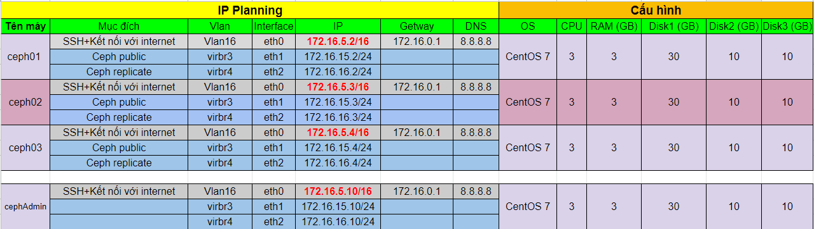
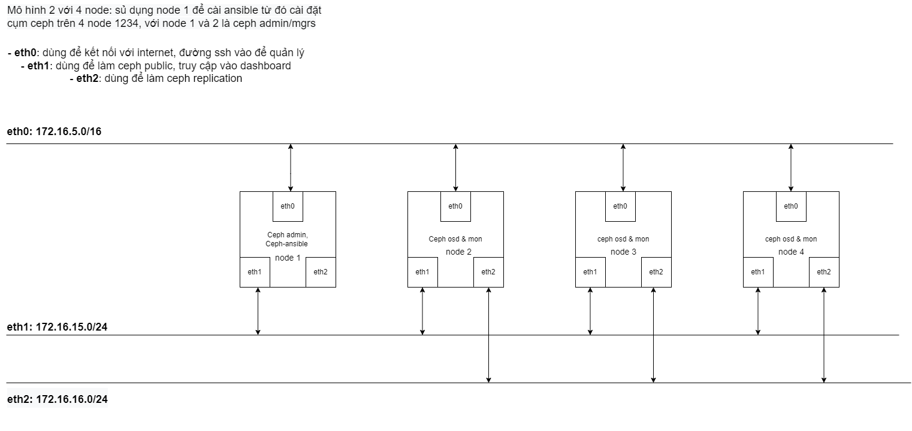

## Nội dung chính

_Triển khai RADOS block device trên môi trường thử nghiệm. Không nên sử dụng cho môi trường thực tế_

[I. Chuẩn bị](#i-chuẩn-bị)
[II. Thực hành](#thực-hành)

- [1. Cài đặt các gói cần thiết](#1-cài-đặt-các-gói-cần-thiết)
- [2-cài-đặt-ceph-iscsi-từ-github](#2-cài-đặt-ceph-iscsi-từ-github)
- [3-cấu-hình-iscsi-và-sử-dụng](#3-cấu-hình-iscsi-và-sử-dụng)
  
  - [3.1-cấu-hình-iscsi](#31-cấu-hình-iscsi)
  - [3.2-sử-dụng](#32-sử-dụng)

[tài-liệu-tham-khảo](#tài-liệu-tham-khảo)

___


<a name="I" ></a>

## I. Chuẩn bị

- Tài khoản sử dụng trong bài labs là tài khoản `root`.
- Trong bài sử dụng môi trường labs có IPPlanning và cấu hình cơ bản như sau:



- Cài đặt Python 3 lên tất cả các máy và gói bổ trợ `pip`
- Yêu cầu sử dụng Kernel từ 4.16 trở lên. Hãy kiểm tra và update kernel linux - có thể tham khảo câu lệnh sau [update-kernel](update-kernel-centos7.sh). Đối với các máy chạy CentOS yêu cầu phiên bản CentOS lớn hơn 7.5.
- Vì đây là môi trường lab nên sẽ tắt filewalld và SElinux. Trong môi trường thực tế ta cần phải khai báo để thông port. Bắt buộc phải dùng ít nhất 1 biện pháp an toàn. Recommend IPtable.

- Mô hình triển khai:



- Có thể cài cụm Ceph bằng các phương pháp như: CephAdmin, Ceph-ansible, Ceph-deploy. Trong bài này sử dụng Ceph-ansible từ nguồn Github để cài đặt.

- Các bước cài đặt ceph sử dụng ansible tham khảo tại đây:
  - [Hướng dẫn cài đặt CEPH sử dụng ceph-ansible từ Gitsource](https://github.com/uncelvel/tutorial-ceph/blob/master/docs/setup/ceph-ansible-nautilus-gitsource.md).
  - [How to install ceph with ceph-ansible](https://www.marksei.com/how-to-install-ceph-with-ceph-ansible/)
  - [Ceph-Ansible for a quick and error-free installation of Ceph Storage Clusters](https://kruschecompany.com/ceph-ansible/)

- Sau khi cài đặt xong hãy kiểm tra tình trạng của cụm với câu lệnh:

    ```sh
    ceph -s
    ```

    hoặc

    ```sh
    ceph health detail
    ```

- Sử dụng lệnh, sau để tìm nhận các địa chỉ truy cập vào ceph dashboard:

    ```sh
    ceph mgr services
    ```

<a name="II" ></a>

## Thực hành

- Ceph RBD, hỗ trợ rất nhiều trong việc cung cấp storage cho các máy và hệ thống khác nhau ví dụ như: [QEMU](https://docs.ceph.com/en/latest/rbd/qemu-rbd/), [Kubernetes](https://docs.ceph.com/en/latest/rbd/rbd-kubernetes/), [OpenStack](https://docs.ceph.com/en/latest/rbd/rbd-openstack/), [CloudStack](https://docs.ceph.com/en/latest/rbd/rbd-cloudstack/),...

- Trong bài thực hành này sẽ sử dụng nó ở mức cơ bản nhất với khả năng [LIO iSCSI Gateway](https://docs.ceph.com/en/latest/rbd/iscsi-overview/). Hiểu cơ bản đây là khả năng cung cấp iSCSI của Ceph thông qua môi trường Linux.

- Ngoài ra còn có 1 cách đơn giản hơn nữa là sử dụng các ceph-client (các máy đã cài đặt ceph hoặc ceph-common, có thể đã kết nối vào cụm hoặc không). Xem chi tiết tại: [BLOCK DEVICE QUICK START](https://docs.ceph.com/en/latest/start/quick-rbd/#install-ceph)

- [File bash to install](install-ceph-iscsi.sh). Các bước chi tiết bên dưới. Nếu cài đặt lần đầu thì lên thực hiện theo từng bước để còn debug khi có lỗi.

### <a name="2.1" >1. Cài đặt các gói cần thiết</a>

_Thực hiện trên tất cả các node dự dịnh làm iSCSI gateway_

- Cài python3 từ yum repo:

```sh
yum install -y python3
```

- Cài đặt OpenSSL cho python3:

```sh
yum install python3-devel openssl-devel libffi-devel -y
pip3 install pyOpenSSL
```

- Cài đặt các thư viện cần thiết:

```sh
sudo yum install -y libnl-xfrm-3-200 libnl-route-3-200 libnl-3-200 libnl-utils libkmod2 python-kmodpy librbd1 python3-pyparsing python3-pydotplus python-kmodpy python3-pyudev python3-ibus-1.0 python3-urwid-utils python3-urwidtrees python3-urwid python3-pyparsing python3-pydotplus python3-rados python3-rbd python3-rbd-dbg python3-netifaces python3-crypto python3-requests python3-responses python3-flask python3-openssl python3-aioopenssl python3-ndg-httpsclient python3-service-identity gcc-c++
```

- Từ node admin, tạo file config cho ceph-iscsi rồi copy file ra tất cả các node. File cấu hình lưu tại:

```sh
/etc/ceph/iscsi-gateway.cfg
```

Có cấu hình cơ bản như sau và cấu hình tại tất cả các node là đồng nhất:

```sh
[config]
# Name of the Ceph storage cluster. A suitable Ceph configuration file allowing
# access to the Ceph storage cluster from the gateway node is required, if not
# colocated on an OSD node.
cluster_name = ceph
pool = rbd

# Place a copy of the ceph cluster's admin keyring in the gateway's /etc/ceph
# drectory and reference the filename here
gateway_keyring = ceph.client.admin.keyring

# API settings.
# The API supports a number of options that allow you to tailor it to your
# local environment. If you want to run the API under https, you will need to
# create cert/key files that are compatible for each iSCSI gateway node, that is
# not locked to a specific node. SSL cert and key files *must* be called
# 'iscsi-gateway.crt' and 'iscsi-gateway.key' and placed in the '/etc/ceph/' directory
# on *each* gateway node. With the SSL files in place, you can use 'api_secure = true'
# to switch to https mode.

# To support the API, the bear minimum settings are:
api_secure = false

# Them cau hinh sau neu gap loi _gateway change on localhost failed with 500
# api_host = 0.0.0.0

# Additional API configuration options are as follows, defaults shown.
# api_user = admin
# api_password = admin
# api_port = 5001
trusted_ip_list =172.16.5.2,172.16.5.3,172.16.5.4,172.16.5.10

```

### <a name="2.2" >2. Cài đặt ceph-iscsi từ github</a>

_Thực hiện trên tất cả các node dự dịnh làm iSCSI gateway_

- Cài đặt TCMU-RUNNER

  ```sh
  cd 
  git clone https://github.com/open-iscsi/tcmu-runner
  cd tcmu-runner
  ./extra/install_dep.sh
  cmake -Dwith-glfs=false -Dwith-qcow=false -DSUPPORT_SYSTEMD=ON -DCMAKE_INSTALL_PREFIX=/usr
  make install
  systemctl daemon-reload
  systemctl enable tcmu-runner
  systemctl start tcmu-runner
  ```

- Cài đặt RTSLIB-FB:

  ```sh
  cd
  git clone https://github.com/open-iscsi/rtslib-fb.git
  cd rtslib-fb
  python3 setup.py install
  ```

- Cài đặt CONFIGSHELL-FB:

  ```sh
  cd
  git clone https://github.com/open-iscsi/configshell-fb.git
  cd configshell-fb
  python3 setup.py install
  ```

- Cài đặt TARGETCLI-FB:

  ```sh
  cd
  git clone https://github.com/open-iscsi/targetcli-fb.git
  cd targetcli-fb
  python3 setup.py install
  mkdir /etc/target
  mkdir /var/target
  ```

- Cài đặt CEPH-ISCSI, tính đến thời điểm viết bài này thì phiên bản mới nhất là 3.6 (02/2023)

  ```sh
  cd
  git clone https://github.com/ceph/ceph-iscsi.git
  cd ceph-iscsi
  python3 setup.py install --install-scripts=/usr/bin
  cp usr/lib/systemd/system/rbd-target-gw.service /lib/systemd/system
  cp usr/lib/systemd/system/rbd-target-api.service /lib/systemd/system
  pip3 install -r requirements.txt
  ```

- Nếu không xuất hiện bất kỳ lỗi nào hãy khởi động dịch vụ:

  ```sh
  systemctl daemon-reload
  systemctl enable rbd-target-gw
  systemctl start rbd-target-gw
  ceph dashboard set-iscsi-api-ssl-verification false
  systemctl enable rbd-target-api
  systemctl start rbd-target-api
  ```

- Kiểm tra trạng thái của dịch vụ, nếu nhận được kết quả tương tự như bên dưới tức là cài đặt thành công:


_Nếu cài đặt thành công có thể di chuyển sang bước tiếp theo. Cấu hình và sử dụng._

### <a name="2.3" >3. Cấu hình iSCSI và sử dụng</a>

#### <a name="2.31" >3.1. Cấu hình iSCSI</a>

- Về cơ bản với dashboard của Ceph phiên bản Nautilus thì có hỗ trợ tạo và quản lý iSCSI nhưng vẫn còn khá nhiều lỗi vì thế ta nên sử dụng dashboard để theo dõi kết quả và monitor cho trực quan.

- Để sử dụng được `gwcli` thì cụm ceph đã phải có pool tên `rbd`. Nếu chưa có hãy tạo pool theo hướng dẫn: [RADOS pool operations page](http://docs.ceph.com/docs/master/rados/operations/pools/). Hoặc thao tác trên Dashboard. Sử dụng câu lệnh sau để kiểm tra.

  ```sh
  ceph osd lspools
  ```

- Khởi chạy `gwcli` với người dùng `root`:

  ```sh
  gwcli
  ```

- Di chuyển đến `iscsi-targets`, và tạo tên cho target là `iqn.2003-01.com.redhat.iscsi-gw:iscsi-igw`:

  ```sh
  /> cd /iscsi-target
  /iscsi-target>  create iqn.2003-01.com.redhat.iscsi-gw:iscsi-igw
  ```

- Tạo các cổng truy cập. Chúng được sử dụng để vận chuyển dữ liệu, nên ưu tiên sử dụng ip khác với ip dùng dể quản lý được khai báo trong file config. Khởi tạo với câu lệnh có định dạng: `create <host-name> <ip>`:

  ```sh
  /iscsi-target> cd iqn.2003-01.com.redhat.iscsi-gw:iscsi-igw/gateways
  /iscsi-target...-igw/gateways>  create ceph01 172.16.15.2
  /iscsi-target...-igw/gateways>  create ceph02 172.16.15.4
  ```

>Nếu không sử dụng RHEL/CentOS thì hãy thêm `skipchecks=true` vào sau câu lệnh.
>Với IP đầu tiên thì bắt buộc phải là IP thuộc máy đang thực hiện cấu hình.

- Tạo disk có tên là disk_1 với pool quản lý là rbd:

  ```sh
  /iscsi-target...-igw/gateways> cd /disks
  /disks> create pool=rbd image=disk_1 size=9G
  ```

- Thêm client là máy CentOS 7 có iqn là `iqn.1994-05.com.redhat:rh7-client`:

  ```sh
  /disks> cd /iscsi-target/iqn.2003-01.com.redhat.iscsi-gw:iscsi-igw/hosts
  /iscsi-target...eph-igw/hosts>  create iqn.1994-05.com.redhat:rh7-client
  ```

- Add disk cho client:

  ```sh
  /iscsi-target...at:rh7-client> disk add rbd/disk_1
  ```

### <a name="2.32" >3.2. Sử dụng</a>

#### Sử dụng trên máy chạy CentOS 7

- Yêu cầu cài đặt gói hỗ trợ cho máy để có thể sử dụng:

 ```sh
 yum install iscsi-initiator-utils -y
 ```

- Cài gói bổ trợ thành công thì chỉnh sửa iqn của máy cho chính xác với tên đã khai báo trong target hoặc cập nhật tên mặc định của máy cho target. iqn của máy được lưu tại:

 ```sh
 vi /etc/iscsi/initiatorname.iscsi
 ```

- Thao tác xong với iqn của máy, ta sẽ tiến hành dò tìm target bằng câu lệnh:

 ```sh
 iscsiadm --mode discovery --type sendtargets --portal <IP server> --discover
 ```

Ví dụ như hình dưới:


- Nhận được chính xác 02 ip mà ta đã khai báo ở trên. Tiến hành kết nối bằng câu lệnh:

 ```sh
 iscsiadm --mode node --targetname <iqn name server> --portal <IP server>:<port> --login
 ```

Ví dụ như hình dưới:


- Nhận được thành ổ cứng với dung lượng 9GiB như đã khai báo ở trên. Tới đây ta có thể hoàn toàn định dạng lại kiểu dữ liệu và mount vào hệ thống để sử dụng.
- Tốc độ đọc ghi phụ thuộc khá nhiều chất lượng đường truyền mạng. Có thể cải thiện với tính năng MPIO. Xem thêm về MPIO tại đây: <https://docs.ceph.com/en/nautilus/rbd/iscsi-initiator-linux/>

#### Sử dụng trên máy chạy Windows 10 (bản home và personal không được hỗ trợ)

- Trên windows 10 pro đã cài đặt ứng dụng hỗ trợ cho iSCSI chỉ cần khởi chạy là có thể sử dụng.
- Thực hành kết nối theo bài hướng dẫn sau: [Target là Centos - Initiator là windows](https://github.com/Phuc-gif051/ThucTap2022/blob/main/L%C3%BD%20Thuy%E1%BA%BFt%20c%C6%A1%20b%E1%BA%A3n/iSCSI/Docs/Lab%20v%E1%BB%9Bi%20Centos%207.md#3-target-l%C3%A0-centos---initiator-l%C3%A0-windows)
- Thu được kết quả tương tự như hình dưới:


- Kiểm tra trên ceph-dashboard:


- Thành công khởi tạo trên cụm ceph, kết nối thành công trên cả CentOS 7 và windows 10

<a name="0" ></a>

## Tài liệu tham khảo

- [docs ceph - CEPH ISCSI GATEWAY](https://docs.ceph.com/en/nautilus/rbd/iscsi-overview/)
- [youtube - Setting up iSCSI in Ceph](https://www.youtube.com/watch?v=Qx6lxotzI0k)
- [github - tutorial-ceph](https://github.com/uncelvel/tutorial-ceph)
