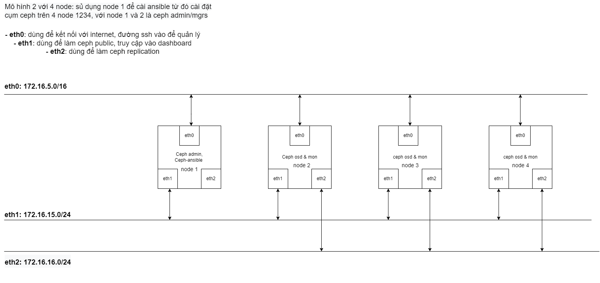
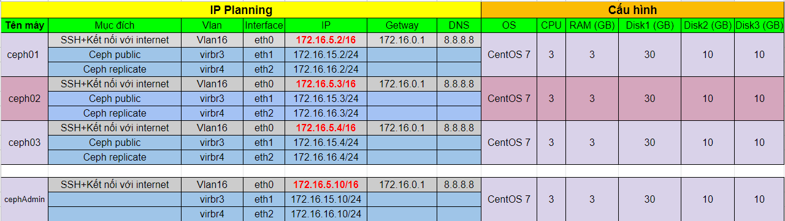
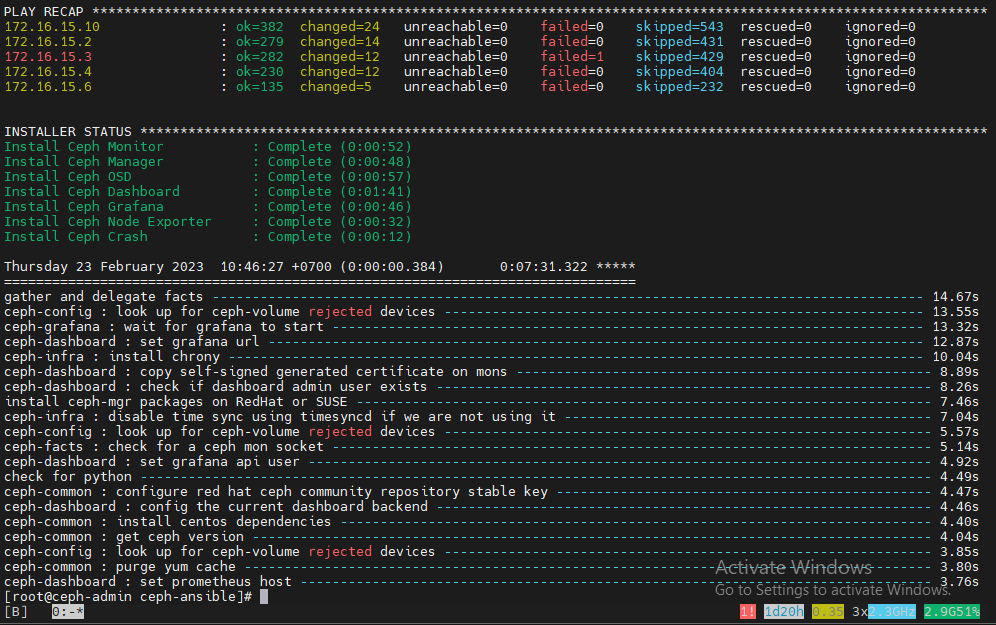

## Nội dung chính

_Cài đặt ceph nautilus sử dụng ceph-ansible từ git source_

[chuẩn-bị](#i-chuẩn-bị)

[chuẩn-bị-tất-cả-server](#chuẩn-bị-tất-cả-server)

[cài-đặt-trên-node-admin](#cài-đặt-trên-node-admin)

- [cấu-hình-ceph-ansible](#cấu-hình-ceph-ansible)
- [cài-đặt](#cài-đặt)

[Tài liệu tham khảo](#0)


___

## <a name="I" >I. Chuẩn bị</a>

- Tài khoản đăng nhập để thao tác là tài khoản: root
- Mô hình triển khai:



- IPplanning:



## Chuẩn bị tất cả server

- Cài đặt CMD_log

 ```sh
 curl -Lso- https://raw.githubusercontent.com/nhanhoadocs/scripts/master/Utilities/cmdlog.sh | bash
 ```

- Cài đặt python3

 ```sh
 yum install centos-release-scl 
 yum install python36 -y
 ```

- Cài đặt NTPD

 ```sh
 yum install chrony -y 
 ```

- Enable NTPD

 ```sh
 systemctl start chronyd 
 systemctl enable chronyd 
 ```

- Cấu hình timezone

 ```sh
 timedatectl set-timezone Asia/Ho_Chi_Minh
 ```

- Kiểm tra chronyd hoạt động

 ```sh
 chronyc sources -v 
 timedatectl
 ```

- Set hwclock

 ```sh
 hwclock --systohc
 ```

- Vì thực hiện trên môi trường labs nên sẽ tắt SElinux và firewalld. Trên môi trường thực tế phải có ít nhất 1 biện pháp an minh mạng.

- Vô hiệu hóa Selinux

 ```sh
 sed -i 's/SELINUX=enforcing/SELINUX=disabled/g' /etc/sysconfig/selinux
 sed -i 's/SELINUX=enforcing/SELINUX=disabled/g' /etc/selinux/config
 ```

- disable firewall

 ```sh
 sudo systemctl disable firewalld
 sudo systemctl stop firewalld
 ```

- Nếu không tắt firewalld hãy tiến hành mở port:

```sh
# start enable
systemctl start firewalld
systemctl enable firewalld

# ceph-ansible
sudo firewall-cmd --zone=public --add-port=80/tcp --permanent
sudo firewall-cmd --zone=public --add-port=2003/tcp --permanent
sudo firewall-cmd --zone=public --add-port=4505-4506/tcp --permanent
sudo firewall-cmd --reload

# mon
sudo firewall-cmd --zone=public --add-port=6789/tcp --permanent
sudo firewall-cmd --reload

# osd
sudo firewall-cmd --zone=public --add-port=6800-7300/tcp --permanent
sudo firewall-cmd --reload

# rgw
sudo firewall-cmd --zone=public --add-port=7480/tcp --permanent
sudo firewall-cmd --reload

# mds
sudo firewall-cmd --zone=public --add-port=6800/tcp --permanent
sudo firewall-cmd --reload
```

## Cài đặt trên node admin

- Cài đặt pip hoặc pip3 và update lên phiên bản mới nhất

 ```sh
 pip3 --version
 pip3 install --upgrade pip
 ```

- Cài đặt ansible (nên dùng ansile phiên bản 2.9)

 ```sh
 yum install ansible -y
 ```

- Cài đặt công cụ byobu

 ```sh
 yum install byobu -y
 ```

### Cấu hình ceph-ansible

- Clone repo

 ```sh
 yum install git -y 
 git clone https://github.com/ceph/ceph-ansible.git
 ```

- Di chuyển sang bản ceph-ansible hỗ trợ.

 ```sh
 cd ceph-ansible 
 git checkout stable-4.0
 cd ..
 mv ceph-ansible /usr/share/ceph-ansible
 ln -s /usr/share/ceph-ansible/group_vars /etc/ansible/group_vars
 ```

Các bản hỗ trợ bao gồm

- Stable 3.0 Jewel và Luminous yêu cầu Ansible 2.4
- Stable 3.1 Luminous và Mimic yêu cầu Ansible 2.4
- Stable 3.2 Luminous và Mimic yêu cầu Ansible 2.6
- Stable 4.0 Nautilus yêu cầu Ansible 2.8: hỗ trợ tối đa đến CentOS 7
- Stable 5.0 Octopus yêu cầu Ansible 2.9: chỉ hỗ trợ từ CentOS 8 trở lên.

- Tạo file inventory `/usr/share/ceph-ansible/inventory_hosts` để description tất cả các server:

  ```sh
  [mons]
  172.16.15.2
  172.16.15.3
  172.16.15.4
  172.16.15.10

  [osds]
  172.16.15.2
  172.16.15.3
  172.16.15.4
  172.16.15.10

  [mgrs]
  172.16.15.10
  172.16.15.3

  ```

- Tạo ssh-key

 ```sh
 ssh-keygen
 ```

- Copy ssh key qua các node

 ```sh
 ssh-copy-id <ip-node-in-inventory-file>
 ```

- Kiểm tra

 ```sh
 cd /usr/share/ceph-ansible
 ansible -m ping -i inventory_hosts all 
 ```

- Kết quả chả về tương tụ là cấu hình bước đầu thành công:

 ```sh
 172.16.15.6 | SUCCESS => {
    "ansible_facts": {
        "discovered_interpreter_python": "/usr/bin/python"
    },
    "changed": false,
    "ping": "pong"
 }
 172.16.15.2 | SUCCESS => {
    "ansible_facts": {
        "discovered_interpreter_python": "/usr/bin/python"
    },
    "changed": false,
    "ping": "pong"
 }
 172.16.15.4 | SUCCESS => {
    "ansible_facts": {
        "discovered_interpreter_python": "/usr/bin/python"
    },
    "changed": false,
    "ping": "pong"
 }
 172.16.15.10 | SUCCESS => {
    "ansible_facts": {
        "discovered_interpreter_python": "/usr/bin/python"
    },
    "changed": false,
    "ping": "pong"
 }
 172.16.15.3 | SUCCESS => {
    "ansible_facts": {
        "discovered_interpreter_python": "/usr/bin/python"
    },
    "changed": false,
    "ping": "pong"
 }
 ```

- Cấu hình file all.yaml:

 ```sh
 cp group_vars/{all.yml.sample,all.yml}
 vi group_vars/all.yml
 ```

 Cấu hình cơ bản như sau:

 ```sh
 ## General
 configure_firewall: False

 ## Packages

 ## Install
 ceph_origin: repository
 ceph_repository: community
 ceph_stable_release: nautilus
 monitor_interface: eth1
 public_network: 172.16.15.0/24
 cluster_network: 172.16.16.0/24
 ip_version: ipv4

 ## Ceph config

 ## CephFS

 ## NFS-Ganesha

 ## Multisite -RGW

 ## Config override

 ## OS turning

 ## Docker

 ## Openstack

 ## Dashboard - Grafana
 dashboard_admin_password: admin
 

 ## iSCSI

 #ceph_iscsi_config_dev: true

 ```

- Cấu hình các osds:

 ```sh
 cp group_vars/{osds.yml.sample,osds.yml}
 vi group_vars/osds.yml
 ```

 Cấu hình cơ bản như sau

 ```sh
 osd_scenario: non-collocated
 osd_objectstore: bluestore
 devices:
   - /dev/vdb
   - /dev/vdc
 ```

- Lấy file site.yml:

 ```sh
 cp {site.yml.sample,site.yml}
 ```

### Cài đặt

- Khởi chạy byobu, Cài đặt các requirement trong python

 ```sh
 byobu
 pip3 install -r requirements.txt
 ```

- Tiến hành cài đặt ceph

 ```sh
 ansible-playbook site.yml -i inventory_hosts
 ```

 >Nếu cài đặt lần đầu nên thêm các đối số `-vvvv` để theo dõi quá trình cài đặt. Và fix lỗi phát sinh.

- Kết quả thu được có thể tương tự như sau:



- Kiểm tra kết quả với `ceph -s` và `ceph -v`

- Kiểm tra cổng truy cập dashboard:

 ```sh
 ceph mgr services
 ```

 Thu được kết quả tương tự như sau thì tiến hành truy cập vào dashboard với user name là: admin, mật khẩu là mật khẩu đã đặt trong file cấu hình:

 ```sh
 {
    "dashboard": "https://ceph02:8443/"
 }
 ```

## <a name="0" >Tài liệu tham khảo</a>

[github - ceph-ansible-nautilus-gitsource](https://github.com/uncelvel/tutorial-ceph/blob/master/docs/setup/ceph-ansible-nautilus-gitsource.md)

[docs ceph](https://docs.ceph.com/ceph-ansible/master/)

<https://www.marksei.com/how-to-install-ceph-with-ceph-ansible/>

<https://kruschecompany.com/ceph-ansible/>


