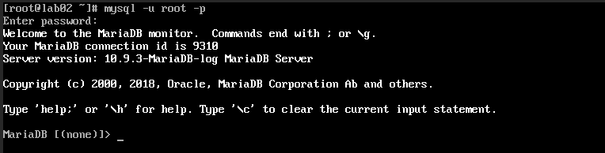
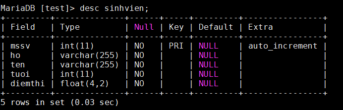

## Nội dung chính

_Một vài thao tác cơ bản để quản lý database với MariaDB trên CentOS 7_

[Chuẩn bị](#1)

[Thực hành](#2)

- [Tạo cơ sở dữ liệu và tạo bảng](#21)
- [Các thao tác với bảng](#22)
- [Quản lý user](#23)
- [Thay đổi password cho user root](#24)

[Tài liệu tham khảo](#0)
___

## <a name="1" >Chuẩn bị</a>

- Máy cài hệ điều hành CentOS 7.
- Đã cài đặt MariaDB, mặc định hệ thống đã được cài đặt sẵn phiên bản 5.5.68 có thể sử dụng luôn.
- Tài khoản có thể đăng nhập vào hệ thống và có quyền sudo. Hướng dẫn dưới đây sử dụng tài khoản root.
- Thao tác hoàn toàn trên CLI, gần như sẽ không có giao diện nên cần phải nhớ và gõ đúng các lệnh.
- Các lệnh điều khiển, các câu truy vấn sẽ được kết thúc với dấu `;`
- có sự phân biệt chữ hoa và chữ thường.

## <a name="2" >Thực hành</a>

<a name="21" >Tạo cơ sở dữ liệu và tạo bảng</a>

- Đăng nhập với tài khoản root đã tạo:

    ```sh
    mysql -u root -p
    ```

- 
- Kiểm tra các database hiện có:

    ```sh
    show databases;
    ```

- Tạo 1 database mới

    ```sh
    create database [database_name];
    ```

    Ví dụ tạo mới 1 database với tên là test:

    ```sh
    create database test;
    ```

- Truy cập vào database:

    ```sh
    use [database_name];
    ```

    Ví dụ:

    ```sh
     use test;
    ```

- Tiến hành tạo 1 bảng mới sau khi truy cập thành công:

    ```sh
    create  table [tên bảng](các trường trong bảng);
    ```

    Ví dụ: tạo bảng có tên là sinhvien với các trường mssv,ho,ten,tuoi,diemthi trong database test

    ```sh
    create table sinhvien(
     mssv int not null auto_increment,
     ho varchar(255) not null,
     ten varchar(255) not null,
     tuoi int not null,
     diemthi float(4,2) not null,
     primary key (mssv)
     );
    ```

- Kiểm tra bảng hiện có trong database:

    ```sh
    show tables;
    ```

    Out put:

    ```sh
    +----------------+
    | Tables_in_test |
    +----------------+
    | sinhvien       |
    +----------------+
    ```

<a name="22" >Các thao tác với bảng</a>

- Đầu tiên phải truy cập vào database để có thể quản lý bảng trong database đó:

    ```sh
    use [database_name];
    ```

    Ví dụ:

    ```sh
     use test;
    ```

- Hiện các bảng hiện có trong database để biết đúng tên bảng muốn truy cập và có thể thao tác chính xác:

    ```sh
    show tables;
    ```

    Out put:

    ```sh
    +----------------+
    | Tables_in_test |
    +----------------+
    | sinhvien       |
    +----------------+
    ```

- Show các trường hiện có trong bảng:

    ```sh
    desc [table_name]; 
    ```

    ví dụ:

    ```sh
    desc sinhvien;
    ```

    Out put:

    

- Chèn dữ liệu vào bảng:

    ```sh
    INSERT INTO TABLE_NAME (cot1, cot2, cot3,...cotN) VALUES (giatri1, giatri2, giatri3,...giatriN);
    ```

    hoặc

    ```sh
    INSERT INTO TABLE_NAME VALUES (giatri1,giatri2,giatri3,...giatriN); 
    ```

    >Lưu ý: thứ tự các giá trị chèn vào phải đúng thứ tự với các cột để không bị sai lệch dữ liệu.

    Ví dụ:

    ```sh
    insert into sinhvien
    values (1,'Nguyen','Hien',19,9),
    (2,'Phung','Ngoc',19,10),
    (3,'Nguyen','Hung',19,9);
    ```

- Show toàn bộ các dữ liệu trong bảng:

    ```sh
    select * from [tên bảng];
    ```

    Ví dụ:

    ```sh
    select * from sinhvien; 
    ```

    Output:

    ```sh
    +------+--------+------+------+---------+
    | mssv | ho     | ten  | tuoi | diemthi |
    +------+--------+------+------+---------+
    |    1 | Nguyen | Hien |   19 |    9.00 |
    |    2 | Phung  | Ngoc |   19 |   10.00 |
    |    3 | Nguyen | Hung |   19 |    9.00 |
    +------+--------+------+------+---------+ 
    ```

- Đổi tên bảng:

    ```sh
    rename table first_name to second_name;
    ```

    Ví dụ:

    ```sh
    rename table sinhvien to sinh_vien; 
    ```

- Xoá dữ liệu trong bảng:

    ```sh
    delete from [tên bảng] where [tên_cột=gia_tri]; 
    ```

    ví dụ:

    ```sh
    delete from sinh_vien where mssv=3; 
    ```

- Xoá cột trong bảng:

    ```sh
    alter table [tên bảng] drop column [tên cột];
    ```

    ví dụ:

    ```sh
    alter table sinh_vien drop column tuoi; 
    ```

- Thêm cột mới vào bảng:

    ```sh
    alter table [tên bảng] add [tên cột] [Kieu_du_kieu];
    ```

    ví dụ:

    ```sh
    alter table sinh_vien add quequan varchar(255) not null;
    ```

- Thêm/sửa dữ liệu cho cột với điều kiện nhất định

    ```sh
    update [table_name] set [column_name]="new_data" where [column_name]="data";
    ```

    ví dụ:

    ```sh
    update sinh_vien
    set quequan="VinhPhuc"
    where (MSSV=1);
    ```

    Kết quả:

    ```sh
    +------+--------+------+---------+----------+
    | mssv | ho     | ten  | diemthi | quequan  |
    +------+--------+------+---------+----------+
    |    1 | Nguyen | Hien |    9.00 | VinhPhuc |
    |    2 | Phung  | Ngoc |   10.00 |          |
    +------+--------+------+---------+----------+
    ```

- Truy vấn thông tin theo điều kiện nhất định

    ```sh
    SELECT [column_name] FROM table WHERE column [option] value;
    ```

    trong đó:

  - column_name: tên cột muốn truy vấn, sử dụng `*` để truy vấn toàn bộ bảng
  - các option:

        = : lọc giá trị là
        != hoặc <> : lọc giá trị không phải là
        > : lọc các dữ liệu lớn hơn một giá trị bất kì tùy chọn
        < : lọc các dữ liệu nhỏ hơn một giá trị bất kì tùy chọn
        >= : lọc các dữ liệu lớn hơn hoặc bằng một giá trị bất kì tùy chọn
        <= : lọc các dữ liệu nhỏ hơn hoặc bằng một giá trị bất kì tùy chọn
        between x and y : lọc các giá trị trong khoảng, x và y là các giá trị bất kì tùy chọn
  
  - ví dụ:

    ```sh
    SELECT * FROM sinh_vien WHERE diemthi = 10;
    ```

    Output:

    ```sh
    +------+--------+------+---------+----------+
    | mssv | ho     | ten  | diemthi | quequan  |
    +------+--------+------+---------+----------+
    |    2 | Phung  | Ngoc |   10.00 |          |
    +------+--------+------+---------+----------+
    ```

- Xoá bảng:

    ```sh
    drop table [table_name];
    ```

Xem chi tiết hơn và cả các thao tác nâng cao tại đây: <https://mariadb.com/kb/en/training-tutorials/>

<a name="23" >Quản lý user</a>

- Show các user hiện có:

    ```sh
    select User, Host from mysql.user;
    ```

    >Chỉ có thể xem khi đăng nhập với người dùng root.

- Tạo user mới:

    ```sh
    create user 'user'@'hostname' identified by 'password';
    ```

    Ví dụ: tạo user test với password là abc@123

    ```sh
    create user 'test'@'%' identified by 'abc@123';
    ```

  - Các tuỳ chọn `hostname`:

        [localhost] – chỉ cho phép kết nối trên máy chạy máy chủ MariaDB.
        [IP] – cho phép một thiết bị/một dải IP cụ thể có thể truy cập từ xa.
        [%] – cho phép truy cập từ xa từ tất cả các địa điểm .

- Phân quyền cho user, thường các quyền sau được sử dụng:

        ALL PRIVILEGES – cấp cho user tất cả các đặc quyền.
        CREATE – user có quyền tạo CSDL và bảng.
        DROP – user xóa CSDL và bảng.
        DELETE – user được phép xóa các hàng khỏi một bảng cụ thể.
        INSERT – user được phép chèn các hàng vào bảng cụ thể.
        SELECT – user được phép đọc CSDL.
        UPDATE – user được phép cập nhật các hàng của bảng.

  - Cú pháp cụ thể:

    ```sh
    GRANT [type of permission] ON [database name].[table name] TO 'database_user_name'@'hostname';
    ```

    Ví dụ 1: Cấp tất cả quyền cho user test trên database test

    ```sh
    grant all privileges on test.* to 'test'@'%'; 
    ```

    Ví dụ 2: Cấp tất cả quyền cho user test thực hiện trên bảng sinh_vien

    ```sh
    grant all privileges on test.sinh_vien to 'test'@'%'; 
    ```

    Ví dụ 3: Cấp nhiều quyền cụ thể cho user test trên database test

    ```sh
    grant SELECT, INSERT on test.* to 'test'@'%';
    ```

- Hiển thị các quyền của user

    ```sh
    SHOW GRANTS FOR 'database_user'@'hostname';
    ```

    Ví dụ: SHOW GRANTS FOR ‘test’@’%’;

- Đổi tên user:

    ```sh
    RENAME USER old_user TO new_user
        [, old_user TO new_user] ...
    ```

    Ví dụ:

    ```sh
    CREATE USER 'donald', 'mickey';
    RENAME USER 'donald' TO 'duck'@'localhost', 'mickey' TO 'mouse'@'localhost';
    ```

- Thu hồi tất cả quyền từ user

    ```sh
    REVOKE ALL PRIVILEGES ON database_name.* TO 'database_user'@'hostname';
    ```

- Xoá user

    ```sh
    DROP USER 'user'@'hostname';
    ```

- Xem chi tiết các thao tác và nâng cao tại đây: <https://mariadb.com/kb/en/account-management-sql-commands/>


<a name="24" >Thay đổi password cho user root</a>

- Từ phiên bản 10.4, MariaDB có rất nhiều thay đổi trong quản lý user root. Một trong số đó là có thể thêm nhiều hơn 1 phương thức bảo mật cho tài khoản root và có thể đăng nhập dưới quyền root mà không cần mật khẩu.

- MariaDB 10.4 có khả năng sử dụng nhiều hơn một plugin xác thực cho mỗi tài khoản. Khi cài đặt MariaDB, mặc định sẽ tạo ra 1 root@localhost user và cũng sẽ có 2 plugin xác thực cho user root được bật mặc định là [unix_socket](https://mariadb.com/kb/en/authentication-plugin-unix-socket/) và [mysql_native_password](https://mariadb.com/kb/en/authentication-plugin-mysql_native_password/).

  - [unix_socket](https://mariadb.com/kb/en/authentication-plugin-unix-socket/) cho phép root@localhost user đăng nhập mà không cần mật khẩu thông qua local Unix socket file được xác định bởi [socket](https://mariadb.com/kb/en/server-system-variables/#socket) biến hệ thống, miễn là root user của OS đang đăng nhập.

  - [mysql_native_password](https://mariadb.com/kb/en/authentication-plugin-mysql_native_password/) được khuyến khích sử dụng khi xác thực thất bại với [unix_socket](https://mariadb.com/kb/en/authentication-plugin-unix-socket/). Plugin này sử dụng password để xác thực nên bạn sẽ cần [SET PASSWORD](https://mariadb.com/kb/en/set-password/) cho root@localhost.

- Tất cả user, password, privileges được lưu trữ, chỉnh sửa trong bảng [mysql.global_priv](https://mariadb.com/kb/en/mysqlglobal_priv-table/). Bảng [mysql.user](https://mariadb.com/kb/en/mysqluser-table/) vẫn tồn tại với đủ các cột như trước nhưng bạn không thể thực hiện các thao tác chỉnh sửa trên bảng mysql.user.

- MariaDB hỗ trợ thiết lập thời gian hết hạn password của người dùng.

- Theo mặc định khi khởi chạy lần đầu tiên thì unix_socket sẽ được sử dụng cho root user. Lúc này có thể truy cập trực tiếp vào database mà không cần nhập mật khẩu. Ví dụ đơn giản là, khi bạn sử dụng lệnh

    ```sh
    mysql -u root -p 
    ```

    để đăng nhập thì dù có nhập sai mật khẩu thì vẫn truy cập thành công.

- Reset/Set password cho user root

  - Truy cập vào MariaDB với user root:
  
  ```sh
  mysql -u root
  ```

  - Đặt mật khẩu:
  
  ```sh
  SET PASSWORD FOR 'user_name'@'hostname' = PASSWORD('new_pass');
  ```

  - Ví dụ:

  ```sh
  SET PASSWORD FOR 'root'@'localhost' = PASSWORD('newpass'); 
  ```

  - Để xoá password:

  ```sh
  SET PASSWORD FOR 'user_name'@'localhost' = PASSWORD(""); 
  ```

  - Để không sử dụng unix_socket nữa thì cần tắt nó đi trong file config:

  ```sh
  vi /etc/my.cnf.d/server.cnf
  ```

  - Thêm dòng khai báo trong khối config `[mariadb]`:

  ```sh
    [mariadb]
    ...
    unix_socket=OFF
  ```

  Hoặc

  ```sh
    [mariadb]
    ...
    disable_unix_socket
  ```

  - Lưu lại và thoát
  - Khởi đông lại MariaDB để nhận cấu hình mới.

  ```sh
  systemctl restart mariadb
  ```

  - Khởi động lại và không gặp bất kỳ lỗi nào là đã thành công. Bây giờ khi đăng nhập với user root thì ta bắt buộc phải nhập mật khẩu.

  ```sh
  mysql -u root -p
  ```

- Xem chi tiết hơn về SET PASSWORD: <https://mariadb.com/kb/en/set-password/>

- Tuy nhiên trong một vài trường hợp thì đặt pass cho user root là không cần thiết vì khi backup thì MariaDB sẽ backup tất cả mọi thứ. Tuy đã được mã hoá mật khẩu nhưng nó hoàn toàn có thể bị bẻ khoá. Vì thế nếu không quá cần thiết thì nên sử dụng unix_socket.

- Xem thêm về hướng dẫn bảo mật cho user root: <https://mariadb.com/kb/en/authentication-from-mariadb-104/>


## <a name="0" >Tài liệu tham khảo</a>

<https://mariadb.com/kb/en/user-account-management/>

<https://news.cloud365.vn/quan-ly-co-so-du-lieu-mariadb-tren-centos-7/#4>

<https://news.cloud365.vn/thay-doi-mat-khau-tai-khoan-root-mariadb/>

<https://mariadb.com/kb/en/authentication-plugin-unix-socket/>

_Sau khi đã quen với cách thức hoạt động của MariaDB thì có thể cài thêm 1 số công cụ hỗ trợ cho việc quản lý. Có thể cài thêm PhpMyAdmin theo bài viết sau: [Install PhpMyAdmin](https://github.com/Phuc-gif051/ThucTap2022/blob/main/L%C3%BD%20Thuy%E1%BA%BFt%20c%C6%A1%20b%E1%BA%A3n/Network%20basic/Service%20network/Web-server/LEMP-stack/c%C3%A0i-%C4%91%E1%BA%B7t-phpmyadmin-qu%E1%BA%A3n-l%C3%BD-database.md)_

Date accessed: 07/11/2022
