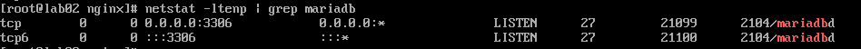
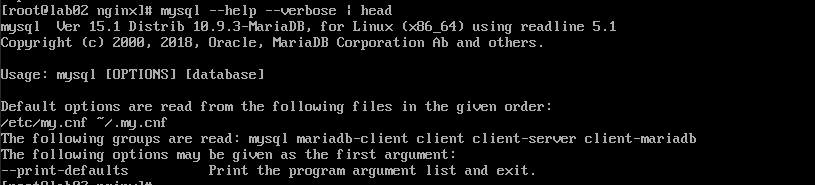
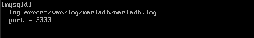
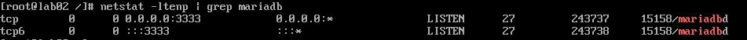
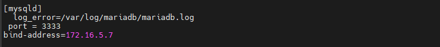

## Nội dung chính

_Các điều khiển MariaDB cơ bản trên môi trường CentOS 7_

[Chuẩn bị](#1)

[Các câu lệnh quản lý cơ bản](#2)

[File cấu hình trên CentOS 7](#3)

[Đổi port, bind-address](#4)

[Tài liệu tham khảo](#0)


___

### <a name="1" >Chuẩn bị</a>

- Đăng nhập vào thiết bị với người dùng có quyền sudo. Trong bài này sử dụng luôn tài khoản root để thực hiện.
- Thiết bi đã được cài đặt MariaDB, mặc định đã được cài đặt sẵn phiên bản 5.5.68.

### <a name="2" >Các câu lệnh quản lý cơ bản</a>

- Vì MariaDB cũng là một service được cài trên thiết bị, nên các câu lệnh quản lý nó cũng tương tự như các service khác:

    ```sh
    systemctl <option> mariadb
    ```

    trong đó, option thường dùng gồm:

  - start: khởi động dịch vụ
  - stop: dừng dịch vụ
  - restart: khởi động lại, thường được dùng sau khi chỉnh sửa file cấu hình.
  - status: trạng thái dịch vụ, dùng khi dịch vụ chạy sai. Thêm tuỳ chọn `-l` để có thể xem chi tiết.
  - enable: khởi chạy cùng hệ thống, tức là khi hệ thống khởi động thì service cũng được khởi chạy cùng.

- Khi bạn cài đặt MariaDB lên máy CentOS 7 có 1 tài khoản mặc định đã được tạo ra giúp bạn quản lý MariaDB. Tài khoản này là tài khoản root có tên là mysql, group là MariaDB Server. Bạn có thể kiểm tra cụ thể hơn với câu lệnh sau đây:

    ```sh
    cat /etc/passwd | grep mysql
    ```

    output

    ```sh
    mysql:x:27:27:MariaDB Server:/var/lib/mysql:/sbin/nologin
    ```

- Kiểm tra cổng mà MariaDB đang sử dụng

    ```sh
    netstat -ltenp | grep mariadb
    ```

    output

    

    Port mặc định là 3306, có thể thay đổi được.

### <a name="3" >File cấu hình trên CentOS 7</a>

- Thường là được lưu tại đường dẫn `/etc/my.cnf`. Nếu không thấy có thể kiểm tra với câu lệnh:

    ```sh
    mysqld --help --verbose | head
    ```

    Output tương tự:

    

    Sẽ thấy đường đẫn đến file config ở dòng `Default...`

- Thông thường thì các file cấu hình đều trống khi cài đặt lần đầu. Muốn Mariadb hoặt động theo yêu cầu thì cần thêm các cấu hình vào file.

- Ví dụ cấu hình cơ bản cho MariaDB

    ```sh
    [client]
    port = 3306
    socket = /tmp/mysql.sock

    [mysqld]
    port = 3306
    socket = /tmp/mysql.sock
    back_log = 50
    max_connections = 100
    wait_timeout = 256
    max_connect_errors = 10
    table_open_cache = 2048
    max_allowed_packet = 16M
    binlog_cache_size = 512M
    max_heap_table_size = 512M
    read_buffer_size = 64M
    read_rnd_buffer_size = 64M
    sort_buffer_size = 64M
    join_buffer_size = 64M
    thread_cache_size = 8
    thread_concurrency = 8
    thread_stack = 240K
    query_cache_size = 128M
    query_cache_limit = 2M
    ft_min_word_len = 4
    default-storage-engine = InnoDB
    transaction_isolation = REPEATABLE-READ
    tmp_table_size = 512M
    log-bin=mysql-bin
    binlog_format=mixed
    slow_query_log
    long_query_time = 2
    server-id = 1
    INNODB options
    innodb_buffer_pool_size = 4G
    innodb_buffer_pool_instances = 8
    innodb_data_file_path = ibdata1:10M:autoextend
    innodb_write_io_threads = 8
    innodb_read_io_threads = 8
    innodb_thread_concurrency = 16
    innodb_flush_log_at_trx_commit = 1
    innodb_log_buffer_size = 1GB
    innodb_change_buffering = all
    innodb_change_buffer_max_size = 25
    innodb_log_file_size = 512M
    innodb_log_files_in_group = 3
    innodb_max_dirty_pages_pct = 90
    innodb_lock_wait_timeout = 256

    [mysqldump]
    quick
    max_allowed_packet = 50M

    [mysql]
    no-auto-rehash

    [mysqlhotcopy]
    interactive-timeout

    [mysqld_safe]
    open-files-limit = 8192
    ```

- Các đối tượng được áp dụng cấu hình sẽ có các cấu hình nằm sau khai báo `[Đối tượng áp dụng]`

- Nhớm cấu hình dành cho đối tượng là Server:
  - server] : tùy chọn được đọc bởi MariaDB Server

  - [mysqld] : tùy chọn được đọc bởi mysqld, bao gồm cả MariaDB Server và MySQL Server

  - [mariadb] : tùy chọn được đọc bởi MariaDB Server

  - [mysqld-X.Y] : tùy chọn được đọc bởi một phiên bản cụ thể mysqld, bao gồm cả MariaDB Server và MySQL Server. Ví dụ:[mysqld-5.5]

  - [mariadb-X.Y] : tùy chọn được đọc bởi một phiên bản cụ thể của MariaDB Server. Ví dụ:[mariadb-10.3]

  - [galera] : tùy chọn được đọc bởi MariaDB Server, nhưng chỉ khi nó được biên dịch với sự hỗ trợ của Galera Cluster


- Nhóm cấu hình dành cho Client:
  - [client] : tùy chọn được đọc bởi tất cả máy MariaDB và MySQL Client . Ví dụ: mysqldump.
  - [client-server] : tùy chọn được đọc bởi MariaDB Client và MariaDB Server. Thường được dùng với cấu hình socket, port.
  - [client-mariadb] : tùy chọn được đọc bởi MariaDB Client

>Mỗi khi thay đổi cấu hình thì cần khởi động lại dịch vụ để nhận cấu hình mới.

Xem chi tiết các option config file đầy đủ: <https://mariadb.com/kb/en/library/configuring-mariadb-with-option-files/>

- Cấu hình file log:

  - Mặc định là:

  ```sh
  /var/log/mariadb
  ```

  - Nếu chưa tồn tại, bổ sung vào file cấu hình:

  ```sh
  log_error = /var/log/mariadb/mariadb.log 
  ```

  - Khởi động lại để nhận cấu hình mới:

  ```sh
  systemctl restart mariadb
  ```

  - Kiểm tra xem có file cấu hình chưa:

  ```sh
  find /var/log/mariadb
  ```

  output:

  

### <a name="4" >Đổi port, bind-address</a>

_Thường thì việc thay đổi các cấu hình này phục vụ cho việc kết nối từ xa đến máy đang chạy dịch vụ MariaDB. Thường là thông qua môi trường mạng._

_Ta sẽ dùng luôn file mặc định là `/etc/my.cnf`_

- **Đổi port mặc định 3306.**
  - Chỉ cần thêm khai báo số port vào bên dưới đối tượng bạn muốn áp dụng là được. Sử dụng trình duyệt `vi` để truy cập và thay đổi.

    ```sh
    vi /etc/my.cnf
    ```

  - 
  - Lưu lại và thoát
  - Nếu chưa tắt filewalld thì bạn cần khai báo về việc sử dụng port mới.

    ```sh
    firewall-cmd --add-port=3333tcp
    firewall-cmd --permanent --add-port=3333/tcp
    ```

  - Khởi động lại dịch vụ để áp dụng cấu hình mới

    ```sh
    systemctl restart mariadb
    ```

  - Kiểm tra lại xem cấu hình đã được áp dụng chưa

    ```sh
    netstat -ltenp | grep mysql
    ```

  - Đổi port thành công:

    

- **Bind-address**
  - Khai báo về cách thức mà client có thể kết nối đến MariaDB server thông qua các NIC (Network Interface Card) có trên máy server.
  - Thường thì có 3 kiểu chủ đạo:
    - bind-address=0.0.0.0 : cho phép client truy cập vào bằng bất kỳ NIC nào có trên máy

    - bind-address= IP : cho phép truy cập vào MariaDB server thông qua 1 NIC có địa chỉ IP nhất định.
    >VD: bind-address=192.168.100.57

    - bind-address=localhost/127.0.0.1 : chỉ chấp nhận các user trên máy server truy cập.
  
  - VD: khai báo sử dụng NIC có IP 172.16.5.7 để các user bên ngoài server truy cập vào.
  

  - Sau cấu hình xong trong file config thì ta cần khai báo trong MariaDB, giống như tạo thêm user để có thể truy cập vào database.

  - Sử dụng câu lệnh:

  ```sh
  GRANT ALL PRIVILEGES ON *.* TO 'client'@'IP' IDENTIFIED BY 'passwd' WITH GRANT OPTION;
  ```

  - Trong đó:
    - `*.*`: cho phép truy cập vào toàn bộ các database.
    - `client`: tên của user. Đặt tuỳ ý.
    - `IP`: IP từ máy đăng nhập, có thể là 1 IP xác định, 1 dải IP, hay toàn bộ các địa chỉ IP với tuỳ chọn `%`.
    - `passwd`: mật khẩu của user.
  >Lưu ý: đây là câu lệnh cho phép user có toàn quyền với database, giống như user root trên máy server. Để phân quyền cho user, hãy xem chi tiết tại đây: <https://mariadb.com/kb/en/grant/>

  - Trên máy có địa chỉ IP đã được tạo user, tiến hành truy cập với câu lệnh:

  ```sh
  mysql -h <IP-mariadb-server> -P <port-number> -u <user-name> -p <passwd>
  ```

  >Lưu ý: máy đã cài đặt MariaDB, kiểm tra với câu lệnh
  
  ```sh
  yum info mariadb-server
  ```

**Gỡ bỏ quyền của 1 user**

- Sử dụng lệnh sql revoke để gỡ bỏ quyền:

  ```sh
  REVOKE <permission> ON <database name>.<table name> FROM <user name>@<host name>;
  ```

  VD:

  ```sh
  REVOKE ALL PRIVILEGES ON *.* FROM 'root'@'%';
  ```

### <a name="0" >Tài liệu tham khảo</a>

<https://news.cloud365.vn/thao-tac-quan-tri-mariadb-tren-centos-7/>

<https://mariadb.com/kb/en/configuring-mariadb-for-remote-client-access/>

<https://mariadb.com/kb/en/revoke/>

