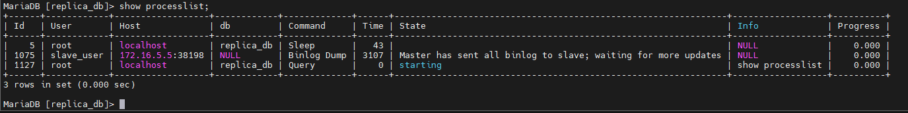
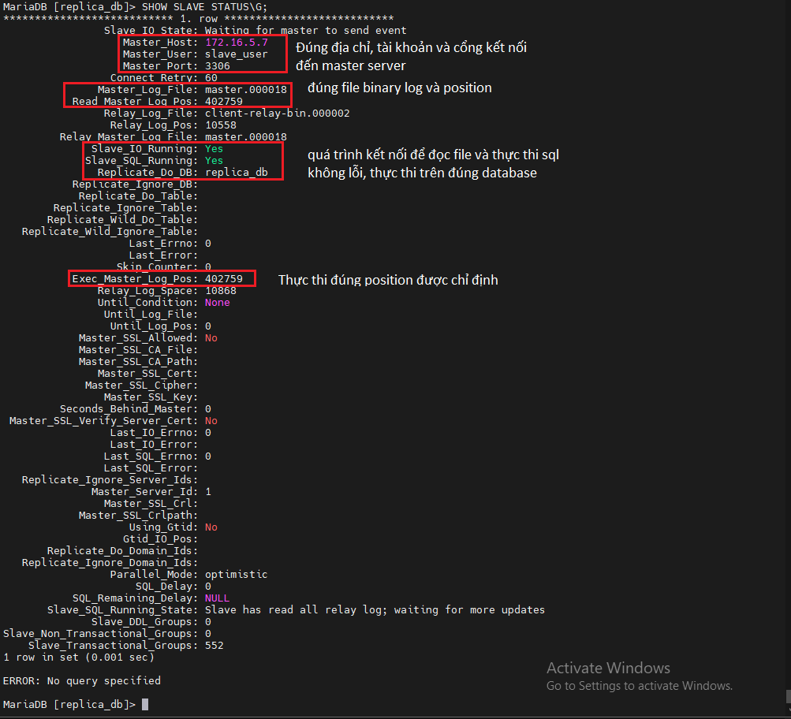
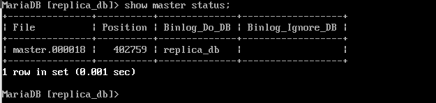
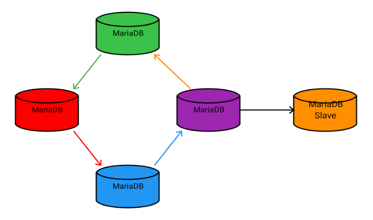
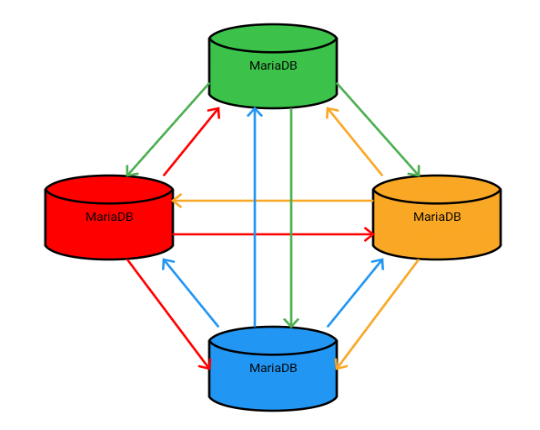
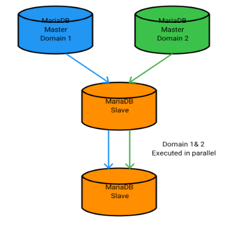

## Nội dung chính

_Giới thiệu về lưu trữ phân tán trong MariaDB nhằm bảo đảm về tính an toàn cho database_

[1. Cái nhìn tổng quan về lưu trữ phân tán](#1)

- [Ưu điểm của việc dùng replication](#1.1)
- [Nhược điểm của việc dùng replication](#1.2)

[2. Hoạt động của Master - Slave](#2)

- [Trên master server](#2.1)
- [Trên slave server](#2.2)

[3. Các mô hình master-slave tiêu biểu](#3)

[Tài liệu tham khảo](#0)


___


## <a name="1" >1. Cái nhìn tổng quan về lưu trữ phân tán</a>

Trong thời đại mà dữ liệu là tài nguyên như hiện nay thì tính toàn vẹn của dữ liệu được coi trọng hơn bao giờ hết, từ các cá nhân, cho đến các công ty, tổ chức bất kể quy mô. Đều rất quan tâm đến việc bảo đảm sự an toàn vẹn của dữ liệu.

Không nằm ngoài sự quan tâm đó thì các công cụ quản lý và lưu trữ database cũng có sự chuẩn bị, và đã sinh ra 1 khái niệm gọi là `replication` - sự nhân bản.

Đây là một tính năng cho phép ta tạo ra 1 cơ sở dữ liệu giống hệt với cơ sở dữ liệu ban đầu, được lưu trữ tại 1 một nơi khác nhằm đảm bảo tính toàn vẹn cho dữ liệu khi xảy ra sự cố.

Nơi chứa dữ liệu gốc được gọi là `Master`, nơi chứa dữ liệu nhân bản được gọi là `Slave`. Quá trình nhân bản dữ liệu từ Master về Slave được gọi là `Replication`.

Ta có thể sao chép toàn bộ cơ sở dữ liệu, hoặc 1 vài cơ sở dữ liệu riêng, hoặc 1 vài bảng trong cơ sở dữ liệu,... Sao chép có tính chọn lọc cao.

<a name="1.1" >Ưu điểm của việc dùng replication</a>

- Khả năng mở rộng - Scalability: Bằng cách có nhiều slave kết nối với 1 hoặc 2 master thì việc đọc có thể trải rộng ra nhiều slave, giảm tải cho master. Việc này cực kỳ phù hợp với kịch bản đọc nhiều ghi ít, đáp ứng được nhu cầu đọc cao đến từ phía khách hàng. Và khi dữ liệu đã đủ lớn thì các node slave ban đầu có khả năng trở thành 1 master mới, mở rộng hệ thống một cách dễ dàng.

- Phân tích dữ liệu - Data analysis: khi cần 1 một lượng dữ liệu nhất định không thay đổi để có thể phân tích thì ra có thể dừng quá trình Replication ở slave để lấy dữ liệu ra và phân tích. Việc ghi ở master hoàn toàn không bị ảnh hưởng và khi tiếp tục Replication thì dữ liệu vẫn được sao lưu 1 cách toàn vẹn, không có bất kỳ ảnh hưởng nào.

- Khả năng sao lưu - Backup: tối ưu nhất cho việc backup là khi dữ liệu không có thay đổi gì quá nhiều. Tuy nhiên với 1 cơ sở dữ liệu thì việc thay đổi liên tục là không thể tránh khỏi, ta không thể dừng việc đọc khi để tiến hành backup. Nhưng trong mô hình của replication thì ta hoàn toàn có thể dừng việc repli dữ liệu ở máy slave để backup, trong khi dữ liệu mới vẫn được ghi vào máy master, tránh tối da việc thất thoát dữ liệu.

- Phân phối dữ liệu – Distribution of data: chỉ cần 1 kết nối đến master lần đầu tiên. Sau đó muốn phân phối dữ liệu thì chỉ cần lấy từ máy slave là có thể phân phối không cần kết nối mới đến máy master.

<a name="1.2" >Nhược điểm của việc dùng replication</a>

- Nhược điểm lớn nhất là đầu tư kinh phí ban đầu khi cần nhiều hơn 1 máy để có thể replicate. Và cơ sở hạ tầng tốt để có thể hoạt động ổn định.

- Phải có nhân sự biết và hiểu rõ về hệ thống để có thể vận hành cũng như khắc phục sự cố.

- Vẫn có khả năng bị phá hoại khi bị phát hiện lỗ hổng bảo mật dù ở phía master hay slave.

## <a name="2" >2. Hoạt động của Master - Slave</a>

- Về cơ bản, mặc định chế độ được sử dụng là đọc/ghi nhật ký nhị phân: [binary log](https://mariadb.com/kb/en/overview-of-the-binary-log/) và [relay log](https://mariadb.com/kb/en/relay-log/) được lưu tại thư mục `/var/lib/mysql`

- Trong MariaDB thì các hoạt động có ảnh hưởng đến database như:  CREATE , ALTER , INSERT , UPDATE và DELETE sẽ được lưu lại dưới dạng nhị phân.

- Khi sử dụng replica thì nhật ký này sẽ được sử dụng:
  - Với master thì lưu lại các thay đổi của database
  - Với slave thì đọc các thay đổi trong file binary log để áp dụng trên máy slave.

- Nhật ký được ghi dưới dạng nhị phân, không thể đọc được bởi con người như 1 dạng văn bản thuần tuý. Trong MariaDB đã bao gồm [mysqlbinlog](https://mariadb.com/kb/en/mysqlbinlog/) hỗ trợ dịch từ dạng nhị phân sang dạng văn bản thuần tuý mà MariaDB có thể hiểu và áp dụng các thay đổi.

- Các binary log cũng là 1 dạng tài liệu nhạy cảm cần được bảo vệ vì nó lưu lại các thay đổi trong database, đôi khi là cả mật khẩu đăng nhập của các user.

- Slave server khi được kết nối nó sẽ không lưu lại toàn bộ binary log mà chỉ lưu lại 1 chỉ số gọi là `position` - đây là chỉ số mà lần cuối cùng database có sự thay đổi, được lưu lại trong binary log. Nó như 1 cách đánh dấu trang, để cho trường hợp mất kết nối giữa master - slave server, thì slave server biết nơi để bắt đầu tìm kiếm các sự thay đổi (nếu có) của database.

- Nhờ thế mà khi kết nối trở lại ta sẽ không quá lo lắng về việc sai lệch dữ liệu giữa master - slave server, miễn là binary log không bị thay đổi nội dung.

**<a name="2.1" >Trên master server</a>**

- Khi binary log được bật, bất kỳ sự thay đổi nào của database cũng sẽ được lưu lại. Slave server kết nối vào sẽ đọc các thay đổi đó để áp dụng cho database đã replicated

- Các tiến trình đang hoạt động trên MariaDB sẽ được lưu lại tạm thời và có thể truy xuất bởi câu lệnh

    ```sh
    show processlist;
    ```

  - Về cơ bản, ta có thể xem được các thông tin như: id, user, Host, db, Command, Time, State, Info, process
  >Xem chi tiết tại đây <https://mariadb.com/kb/en/show-processlist/>

- Khi slave server kết nối đến nó cũng tạo 1 kết nối mới và có thể xem bằng câu lệnh trên. Từ có thể thấy các hoạt động của slave trên master server.

- Và ở cột `Command` ta sẽ thấy giá trị là: `Binlog Dump` - nghĩa là master đang chuyền các nội dung trong binary log cho kết nối của slave.

>xem chi tiết các giá trị của cột Command tại đây: <https://mariadb.com/kb/en/thread-command-values/>

- Ví dụ về `Show processlist;`



- Có thể xem các slave server nào đang kết nối đến master server bằng câu lệnh

```sh
show slave hosts
```

- Trong trường hợp bị mất kết nối, với thời gian ngắn (thường là dưới 1 vào giờ) thì khi kết nối lại thì các slave server có thể đọc các thay đổi được lưu trong bộ nhớ cache của master. Thời gian dài (nhiều hơn 1h) thì sẽ đọc các thay đổi trong bộ nhớ vật lý, điều này làm chậm đi khá nhiều thời gian để đồng bộ, nhất là khi có thay đổi lớn.

- Và các master server khi sử dụng binary log thì cũng ảnh hưởng đôi chút đến hiệu năng.


**<a name="2.2" >Trên slave server</a>**

- Cũng như trên master có file binary log để lưu lại sự thay đổi trong database thì trên slave server có file [relay log](https://mariadb.com/kb/en/relay-log/) để thực hiện việc này.
- Khi quá trình replication được bắt đầu sẽ có 2 tiến trình chính được khởi động:
  - Tiến trình nhập xuất (I/O thread): đọc các sự kiện trong binary log và sao chép vào tệp relay log. xem chi tiết về [Slave I/O Thread States.](https://mariadb.com/kb/en/slave-io-thread-states/)
  - Tiến trình thực thi SQL (SQL thread):  đọc các sự kiện từ relay log được lưu trữ cục bộ trên slave (tập tin được ghi bởi luồng IO) và thực thi các sự kiện đó. Xem chi tiết về [Slave SQL Thread States.](https://mariadb.com/kb/en/slave-sql-thread-states/)

- Để xem thông về các tiến trình trên slave server sử dụng câu lệnh.

    ```sh
    SHOW SLAVE STATUS\G;
    ```

- Cơ bản chú ý tới những thông số sau:



- Để đối chiếu việc ta có chỉ định đúng file và đúng position hay không thì trên master server thực hiện câu lệnh.

```sh
show master status;
```



- Xem chi thiết thông tin các tiến trình hoặt động trên máy slave tại đây: <https://mariadb.com/kb/en/show-replica-status/>


## <a name="3" >Các mô hình master-slave tiêu biểu</a>

**Standard Replication**


- Cung cấp khả năng đọc vô vạn.
- Dễ dàng nâng cấp slave lên master.

**Ring Replication**



- Dễ dàng mở rộng quy mô đọc - ghi.
- Không tự động xử lý các xung đột dữ liệu.
- 1 master mất kết nối thì cụm dùng hoạt động.

**Star Replication**



- Dễ dàng mở rộng quy mô đọc - ghi.
- Không tự động xử lý các xung đột.
- Bắt buộc phải sử dụng các bộ lọc để lọc dữ liệu trùng lặp.

**Multi-Source Replication**



- Cung cấp khả năng sao chép từ nhiều nguồn khác nhau.
- Các nguồn khác nhau được thực thi song song độc lập trên các bản sao khác nhau.

>**Khi triển khai replication hãy ưu tiên sử dụng cùng 1 phiên bản MariaDB để tránh sinh ra các lỗi không tương thích.**


## <a name="0" >Tài liệu tham khảo</a>

<https://mariadb.com/kb/en/standard-replication/>

<https://mariadb.com/kb/en/replication-cluster-multi-master/>

<https://news.cloud365.vn/gioi-thieu-ve-mariadb-replication-master-slave/>

<https://mariadb.com/kb/en/overview-of-the-binary-log/>

Date accessed: 14/11/2022

