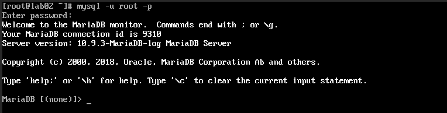

## Nội dung chính

_Cài đặt MariaDB trên CentOS 7_

[1. Chuẩn bị](#1)

[2. Tiến hành cài đặt](#2)

[Tài liệu tham khảo](#3)

___

## <a name="1" >1. Chuẩn bị</a>

- Bạn có thể tìm hiểu rõ hơn tại <https://mariadb.org/> , MariaDB có các phiên bản cho các hệ điều hành khác nhau: Windows, Linux,.. với các gói cài đặt tar, zip, MSI, rpm cho cả 32bit và 64bit. Hiện tại (11/2022) phiên bản mới nhất của MariaDB là 10.11.

- Khi cài đặt MariaDB từ kho lưu trữ mặc định của CentOS 7, mặc định version của MariaDB Server là 5.5.50 nhưng hiện tại version này đã cũ và không còn phù hợp để sử dụng. Bài viết này sẽ hướng dẫn bạn cách cài đặt MariaDB version 10.6 trên máy cài hệ điều hành CentOS 7 từ ​​kho lưu trữ chính thức của MariaDB. Bằng cách này, bạn có thể lựa chọn phiên bản gói MariaDB mà bạn muốn sử dụng.

- 1 máy ảo cài hệ điều hành CentOS 7, có kết nối Internet.
- Tài khoản có thể đăng nhập vào hệ thống và có quyền sudo. Hướng dẫn dưới đây sử dụng tài khoản root.
- Yêu cầu tối thiểu đối với các thông số: 1 GB RAM, 30 GB ROM, 1 CPU.
- Tìm kiếm phiên bản bạn muốn cài tại đây: <https://mariadb.org/mariadb/all-releases/>

## <a name="2" >2. Tiến hành cài đặt</a>

- Thêm kho lưu trữ yum cho MariaDB trên máy cài CentOS:

- ```sh
    vi /etc/yum.repos.d/MariaDB.repo
  ```

- ```sh
    [mariadb]
    name = MariaDB
    baseurl = http://yum.mariadb.org/10.6/centos7-amd64
    gpgkey=https://yum.mariadb.org/RPM-GPG-KEY-MariaDB
    gpgcheck=1 
    enable=1
  ```

- Trong đó:

        name – tên của kho lưu trữ
        baseurl – đường dẫn tới kho lưu trữ
        gpg – là viết tắt của GNU Private Guard, là một loại chữ kí số giúp bảo vệ quyền riêng tư. Nếu đặt giá trị gpgcheck=1 thì nó sẽ xác thực gói bằng cách kiểm tra chữ ký GPG. Đặt gpgcheck=0 để bỏ qua xác thực hoặc trong trường hợp gói không được đăng ký.
        gpgkey – đường dẫn của file key(nếu có)
        gpgcheck – cài đặt bảo mật(1=có,0=không)
        enable – trạng thái của kho lưu trữ(1=bật,0=tắt)

- Cập nhật bộ đệm:

    ```sh
    yum makecache fast
    ```

- Kiểm tra các phiên bản MariaDB đã cài đặt từ trước:

    ```sh
    yum info mariadb-server 
    ```

- 

- Mặc định trên CentOS 7 đã được cài dặt sẵn phiên bản 5.5.68. Có thể gỡ bỏ hoặc không.
- Để gỡ bỏ thì thực hiện các câu lệnh sau:

    ```sh
    yum erase mysql
    rm -rfv /var/lib/mysql
    rm -rfv /etc/my.cnf
    ```

- Cài đặt phiên bản 10.6:

    ```sh
    yum install -y MariaDB-server MariaDB-client
    ```

- Khởi động dịch vụ

    ```sh
    systemctl start mariadb
    ```

- Kiểm tra trạng thái của dịch vụ

    ```sh
    systemctl status mariadb
    ```

- Bật khởi động cùng hệ thống

    ```sh
    systemctl enable mariadb
    ```

- Tiến hành thiết lập bảo mật: tạo mật khẩu cho tài khoản root

    ```sh
    mysql_secure_installation
    ```

- 

- Chú thích:

        Switch to unix_socket authentication: xác thực bằng unix_socket, chọn Y để bật, n để tắt.
        Enter current password for root (enter for none): nếu đã từng đặt mật khẩu thì bạn nhập mật khẩu hiện tại đang sử dụng, nếu là lần đầu tiên thì bạn có thể để trống. Enter để tới bước tiếp theo.
        Remove anonymous users: Xóa tài khoản vô danh, Bạn chon Y (Yes).
        Disallow root login remotely: Tắt truy cập từ xa. Tùy bạn lựa chọn.
        Remove test database and access to it: Xóa database có tên là “test”. Nó chỉ dùng để test lúc ban đầu, bạn có thể xóa nó. Chon Y (Yes)
        Reload privilege tables now: reload lại các bảng liên quan đến quyền hạn.

- Tắt plugin [unix_socket](https://mariadb.com/kb/en/authentication-plugin-unix-socket/) trong file /etc/my.cnf.d/server.cnf

    ```sh
    [mariadb]
    ...
    unix_socket=OFF
    ```

    Hoặc

    ```sh
    [mariadb]
    ...
    disable_unix_socket
    ```

- Khởi động lại dịch vụ để nhận cấu hình mới:

    ```sh
    systemctl restart mariadb
    ```

- Đăng nhập để kiểm tra

    ```sh
    mysql -u root -p 
    ```

    trong đó:

  - u: tên đăng nhập
  - p: mật khẩu của tài khoản đăng nhập

- 

- Hoặc sử dụng

    ```sh
    mysql -v
    ```

    Kết quả tương tự như trên.

## <a name="3" >Tài liệu tham khảo</a>

<https://news.cloud365.vn/huong-dan-cai-dat-mariadb-server-phien-ban-10-4-7-tren-centos-7/>

<https://mariadb.com/kb/en/authentication-plugin-unix-socket/>
