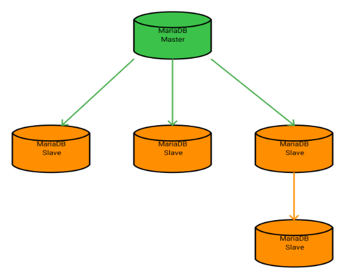
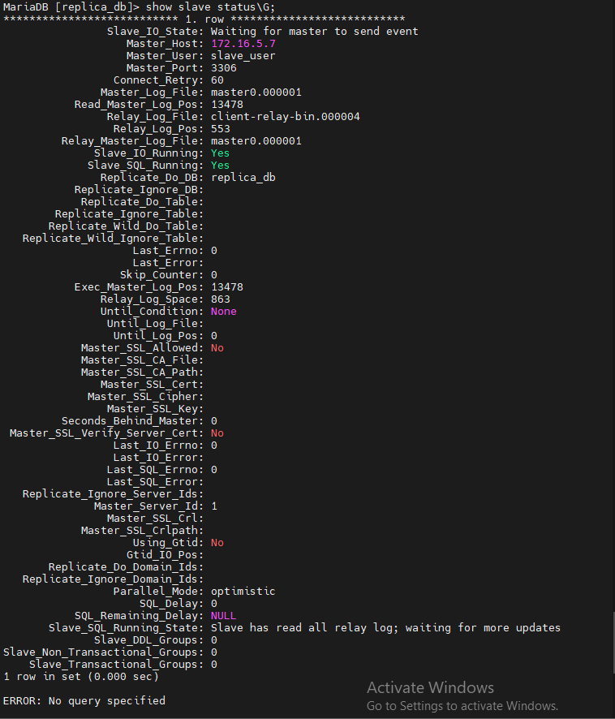

## Nội dung chinh

_Bài thực hành triển khai MariaDB Standard Replication trên môi trường CentOS 7_

[1. Mở đầu](#1)

[2. Tiến hành triển khai](#2)

- [2.1 Trên máy master](#2.1)
- [2.2 Trên máy slave](#2.2)

[#0](Tài liệu tham khảo)
___

## <a name="1" >1. Mở đầu</a>

- Đây là dạng cơ bản nhất của MariaDB replication, cung cấp khả năng đọc vô hạn, dễ dàng chuyển đổi máy slave thành master theo yêu cầu.

<p align="center">
 
</p>

- Chuẩn bị:

  - Ít nhất 2 máy, cấu hình tối thiểu: 1 CPU, 1GB RAM, 1 GB ROM.
  - Đã cài đặt CentOS 7, MariaDB 10.x trở lên.
  - User đăng nhập hệ thống có quyền sudo. Tại đây sử dụng tài khoản `root`.

## <a name="2" >2. Tiến hành triển khai</a>

### <a name="2.1" >2.1 Cấu hình trên máy Master</a>

- Khai báo port sẽ sử dụng với firewalld:

    ```sh
    firewall-cmd --add-port=3306/tcp --zone=public --permanent
    ```

- Reload để nhận cấu hình mới

    ```sh
    firewall-cmd --reload
    ```

- Sử dụng trình soạn thảo `vi` truy cập và chỉnh sửa file config:

    ```sh
    vi /etc/my.cnf
    ```

- Trong file config khai báo như sau tại khối `[mariadb]`:

    ```sh
    [mariadb]
    server-id=1
    log-bin=master
    binlog-format=row
    binlog-do-db=replica_db
    ```

  - Trong đó:

    - server_id là tùy chọn được sử dụng trong replication cho phép master server và slave server có thể nhận dạng lẫn nhau. Server_id với mỗi server là khác nhau, nhận giá trị từ 1 to (2^32)-1
    - log-bin hay log-basename là tên cơ sở để tạo tên tệp nhật ký nhị phân. Các tệp binary log sẽ có tên bắt đầu như thế.
    - binlog-format là định dạng dữ liệu được lưu trong file bin log. Có 3 dạng chính: Statement-Based Logging/Row-Based Logging/Mixed Logging
    - binlog-do-db là tùy chọn để nhận biết cơ sở dữ liệu nào sẽ được replication. Nếu muốn replication nhiều CSDL, bạn phải viết lại tùy chọn binlog-do-db nhiều lần ở cả máy master và máy slave. Hiện tại không có option cho phép chọn toàn bộ CSDL để replica mà bạn phải ghi tất cả CSDL muốn replica ra theo option này.

- Restart lại dịch vụ để nhận cấu hình mới:

    ```sh
    systemctl restart mariadb
    ```

- Tiến hành đăng nhập vào Mariadb để tạo database và user mới:

    ```sh
    mysql -u root -p
    ```

    >Đăng nhập vào mariadb

    ```sh
    create database replica_db;
    ```

    >Tạo database mới

  - Tạo user mới và gán quyền cho user đó:

    ```sh
    create user 'slave_user'@'%' identified by 'abc@123';
    ```

    >Tạo user mới

    ```sh
    GRANT REPLICATION SLAVE ON *.* TO 'slave_user'@'%' IDENTIFIED BY 'abc@123';
    ```

    >Gán quyền cho user

  - Xác nhận lại các thay đổi:

    ```sh
    FLUSH PRIVILEGES;
    ```

- Để có thể tiến hành replica với hạn chế tối đa việc sai lệch dữ liệu, ta cần tạm dừng tất cả các hành động ảnh hưởng đến database trên máy master:

    ```sh
    FLUSH TABLES WITH READ LOCK;
    ```

- Thoát khỏi Mariadb, tiến hành dump toàn bộ database:

    ```sh
    mysqldump --all-databases --user=root --password --master-data > masterdatabase.sql
    ```

    >Nhập password của user root khi được yêu cầu

  - Hoặc có thể dump 1 database nhất định, sử dụng cho việc replica:

  ```sh
  mysqldump -u root -p database_name > database_name.sql
  ```

- Sử dụng câu lệnh `scp` để copy file vừa dump sang máy slave:

    ```sh
    scp masterdatabase.sql root@<IP_slave_machine>:/root
    ```

- Truy cập trở lại Mariadb để unlock tables và lấy thông tin cần thiết của master
  
  - Unlock tables để có thể thao tác lại với database:

    ```sh
    UNLOCK TABLES;
    ```

  - Lấy thông tin cần thiết của master:

    ```sh
    SHOW MASTER STATUS:
    ```

  - Thông tin trả về cơ bản như sau:

    ```sh
      +----------------+----------+--------------+------------------+
      | File           | Position | Binlog_Do_DB | Binlog_Ignore_DB |
      +----------------+----------+--------------+------------------+
      | master.000001  |      326 | replica_db   |                  |
      +----------------+----------+--------------+------------------+
      1 row in set (0.001 sec)
    ```

  >Hãy lưu lại các thông tin này để cấu hình cho máy slave.

### <a name="2.2" >2.2 Cấu hình trên máy slave</a>

- Khai báo sử dụng port 3306 với firewalld:

    ```sh
    firewall-cmd --add-port=3306/tcp --zone=public --permanent
    ```

- Reload để nhận lại cấu hình:

    ```sh
    firewall-cmd --reload
    ```

- Sử dụng `vi` để truy cập và chỉnh sửa file config, thêm vào nội dung cơ bản sau:

  ```sh
  [mariadb]
    server-id = 2
    replicate-do-db=replica_db
  ```

- Tiến hành import database đã dump ở master vào máy slave:

  ```sh
  mysql -u root -p < /root/masterdatabase.sql
  ```

  >Nhập password cho user nếu có yêu cầu

- Restart Mariadb để nhận các thay đổi:

  ```sh
  systemctl restart mariadb
  ```

- Truy cập vào Mariadb để hướng dẫn máy slave tìm file Master log và master log position

  >Tạm dừng slave

  ```sh
  STOP SLAVE;
  ```
  
  >Chỉ ra các thông số cho slave biết để kết nối đến master

  ```sh
  CHANGE MASTER TO 
    MASTER_HOST='IP_or_Hostname', 
    MASTER_USER='slave_user', 
    MASTER_PASSWORD='abc@123', 
    MASTER_PORT=3306,
    MASTER_LOG_FILE='master.000001', 
    MASTER_LOG_POS=326;
  ```

  >Nếu không có bất kỳ lỗi nào có thể tiến hành khởi chạy slave.

  ```sh
  START SLAVE;
  ```

  >Để chắc chắn hệ thống hoạt động trơn chu hãy kiểm tra lại trạng thái hoạt động của slave

  ```sh
  SHOW SLAVE STATUS\G;
  ```

  - Nhận được output tương tự như sau tức là hệ thống đã kết nối thành công.

  

- Để thêm nhiều hơn 1 mấy slave vào hệ thống thì ta chỉ cần:

  - B1: tạm dừng các hành động có ảnh hưởng đến database

    ```sh
    stop slave;
    flush table with read lock;  
    ```

  - B2: dump database ở máy master và copy vào máy slave
  - B3: Cấu hình máy slave tương tự như ở máy đầu tiên, lưu ý ở phần server-id phải khác với các máy đã có trong hệ thống.
  - B4: Mở khoá cho các thao tác ảnh hưởng đến database

    ```sh
    UNLOCK TABLES;
    ```

## <a name="0" >Tài liệu tham khảo</a>

<https://mariadb.com/kb/en/setting-up-replication/>

<https://mariadb.com/kb/en/replication-commands/>

<https://news.cloud365.vn/mariadb-huong-dan-cau-hinh-mariadb-replication/>

Date accessed: 14/11/2022


