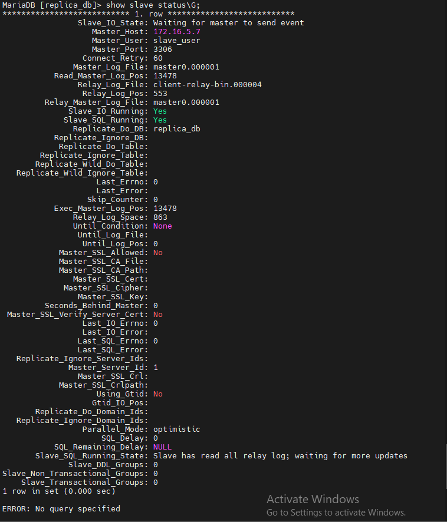

## Nội dung chính

_Thử nghiệm một vài trường hợp đơn giản có thể xảy ta trong quá trình vận hành replica._

[I. Các máy bị mất kết nối](#1)

- [1. Máy master mất kết nối](#1.1)
- [2. Máy slave mất kết nối](#1.2)

[II. Chuyển máy slave thành máy master](#2)

[III. Máy master bị lỗi](#3)

[Tài liệu tham khảo](#0)

___
## <a name="1" >I. Các máy bị mất kết nối</a>

### <a name="1.1" >1. Máy master mất kết nối</a>

- Giả lập trường hợp lỗi ở máy master bị mất kết nối nhưng vẫn có dữ liệu ghi vào trong lúc mất kết nối.
- Để tiến hành, đơn giản nhất hãy tắt hoạt động của card mạng tại máy master và tiến hành ghi 1 loạt dữ liệu vào.
- Thực thi ghi dữ liệu bằng 1 script đơn giản:

    ```sh
    for i in {1000..8050}; do
    mysql -uroot -pa -e "use replica_db; INSERT INTO test (id, hoten) VALUES ($i, 'hihihaha');"
    done
    ```

- Chuyển sang máy slave, kiểm tra trạng thái của máy với câu lệnh:

    ```sh
    show slave status\G;
    ```

- Nhận được kết quả như sau:

- 

>Máy slave đang cố kết nối đến máy master.

- Trên máy master, kiểm tra việc ghi data:
- 
- Dễ dàng nhận thấy tiến trình ghi dữ liệu vào database trên máy master vẫn hoạt động bình thường. Chuyển sang máy slave để kiểm tra.
- 
- Không có bất kỳ dữ liệu vào được ghi trên máy slave dù trên máy master đang được ghi.
- Tiến hành kết nối lại bằng cách kích hoạt lại card mạng của máy master.
- Kiểm tra lại trạng thái kết nối của máy slave:

- Kết nối lại thành công, không phát sinh bất kỳ lỗi nào. Kiểm tra lượng data sau khi kết nối
- 
- Đồng bộ thành công giữa 2 máy. Hệ thống hoạt động ổn định sau khi mất kết nối và được kết nối lại, gần như không bị thất thoát dữ liệu. Ngoài thêm, có thể thử với sửa, xoá, tạo mới.

### <a name="1.2" >2. Máy slave mất kết nối</a>

_Thực hiện tương tự_

- Tắt card mạng ở máy slave. Có thể tắt trước hoặc trong khi chỉnh sửa data trên máy master.
- Tiến hành chỉnh sửa dữ liệu trong database trên máy master.
- Mở lại card mạng và kiểm tra tính toàn vẹn của dữ liệu.

## <a name="2" >II. Chuyển máy slave thành máy master</a>

- Trong trường hợp cần nâng cấp máy slave thành máy master: vì bảo mật, hiệu suất, sự cố ở máy master,...
- Đăng nhập vào máy slave tiến hành chuyển đổi.
- Xoá cấu hình chỉ định làm slave cho máy:

    ```sh
    stop slave;
    reset slave all;
    ```

- Khởi động lại dịch vụ để nhận cấu hình mới:

    ```sh
    systemctl restart mariadb
    ```

- Khai báo cấu hình mới để máy trở thành new master với các bước thực hiện của việc cấu hình 1 master.

- **Chỉnh sửa các kết nối cần thiết đến máy master mới để hệ thống có thể hoạt động bình thường. Đây là chỉnh sửa mà cho phép các kết nối từ bên ngoài được phép truy cập vào database server, trên MariaDB có thể tham khảo tính năng [MariaDB for Remote Client Access.](https://mariadb.com/kb/en/configuring-mariadb-for-remote-client-access/)**

- Sau khi hệ thống mới hoạt động bình thường, nếu sử dụng máy master cũ ta cần dump database từ new master về old master và cấu hình lại các máy trong hệ thống.

## <a name="3" >III. Máy master bị lỗi</a>

- Trường hợp máy master bị lỗi, gây mất mát, hỏng dữ liệu. Đồng thời các lỗi đó cũng được truyền đến các máy slave gây ra hỏng dữ liệu cho toàn hệ thống.
- Lúc này ta cần restore lại database mà trước đây đã back-up trên máy master. Cần kiểm tra xem các restore có được áp dụng trên các máy slave để đảm bảo tính toàn vẹn của dữ liệu hay không.

**Tiến hành thử nghiệm**

- Tạo 1 file backup đơn giản với mysqldump:

    ```sh
    mysqldump -u [user_name] -p [dbname] > [backupfile.sql]
    ```

    Trong đó:
  - [user_name] : tên tài khoản sở hữu database.
  - p : yêu cầu nhập password cho user để xác thực và thực thi câu lệnh.
  - [dbname] : Tên của database.
  - [backupfile.sql] : Tên file backup muốn lưu.

- Tiến hành chỉnh sửa dữ liệu bất kỳ, để giả định trường hợp cần thử nghiệm.
- Chuyển sang máy slave, kiểm tra và nhận thấy dữ liệu được thêm vẫn xuất hiện trong máy slave.
- Tiến hành import lại database để restore database trước khi được thêm dữ liệu.

    ```sh
    mysql -u [user_name] -p [dbname] < [backupfile.sql]
    ```

- Dễ dàng nhận thấy các dữ liệu từ việc back-up đã được ghi lại trên máy master. Chuyển sang máy slave để kiểm tra việc replicate.
- Nếu không có bất kỳ sai sót nào trong quá trình thao tác hay hệ thống mạng lỗi thì ta sẽ nhận thấy database đã restore trên máy master được đồng bộ tại máy slave.
- Trong quá trình restore, có thể xảy ra khả năng master bị reboot không mong muốn, khi này quá trình restore sẽ bị dừng lại, cần phải restore lại đồng thời trên cả máy master và slave. Sau đó để hệ thống replica có thể hoạt động bình thường thì ta cần cấu hình lại trên máy slave về các thông số kết nối mới được sinh ra trên máy master.

## <a name="4" >4. Một số cách kiểm tra việc đồng bộ</a>

- Ngoài cách select dữ liệu trong bảng, thì còn 1 cách nữa mà mình biết để xem tính đúng đắn của việc đồng bộ. Đó là xem file binlog/relay log.
- Trên máy master, để xem file binlog thực hiện câu lệnh

    ```sh
    show binlog events in 'name_binlog'\G;
    ```

    Trong trường hợp không xác định được binlog mà slave đang đọc thì trên máy slave, hãy chạy câu lệnh

    ```sh
    show slave status\G;
    ```

    Ta sẽ thu được tên của binlog tại dòng: `Master_Log_File` và tên của file relay tại dòng: `Relay_Log_File`

- Trên máy slave chạy câu lệnh:

    ```sh
    show relaylog events in 'name_relay_log'\G;
    ```

- Sau khi hiện thông tin, trên cả 2 máy ta hãy so sánh chỉ số tại dòng: `End_log_pos` của các row xuất hiện. Chỉ số bằng nhau nghĩa là máy slave đọc đúng và áp dụng đủ các thay đổi từ máy master.

- Các file binlog và relay log được lưu tại: /var/lib/mysql
  - Trên máy master được lưu với định dạng được khai báo trong file cấu hình tại file `/etc/my.cnf`, tại dòng `log-bin=`
  - 
  - Lúc này file binlog sẽ có định dạng là: `master1.<number>` (với number bất đầu từ 000001)

  - Trên máy slave file relay được lưu với định dạng: `<hostname>-relay-bin.<number>`
  - 

  - Với mỗi lần thiết lập kết nối mới sẽ sinh ra file binlog/relay log mới.

## <a name="0" >Tài liệu tham khảo</a>

<https://news.cloud365.vn/mariadb-replication-cac-test-case-cho-mariadb-master-slave/>

_Đôi khi xảy ra lỗi bị trùng khoá chính trong bảng dữ liệu tại máy slave, tham khảo cách xử lý sau: <https://stackoverflow.com/questions/64658401/duplicate-key-error-after-mariadb-replication-setup>_

<https://mariadb.com/kb/en/show/>

<http://code.openark.org/blog/mysql/on-show-binlogrelaylog-events>

