## Nội dung chính

_Thêm 1 số thiết bị vào trong hệ thống giám sát_

## <a name="1" >I. Chuẩn bị</a>

- Máy 1: đã cài thành công Zabbix server, có thể tham khảo bài cài đặt sau: [Cài đặt Zabbix server trên CentOS 7](Install_Zabbix_CentOS7.md)
- Máy 2: chạy bất kỳ phiên bản nào của Linux, ở đây vẫn sử dụng CentOS 7. Để cài Zabbix agent hỗ trợ giám sát hệ thống.
- Máy 3: chạy Windows Server 2016, để cài [SNMP](https://en.wikipedia.org/wiki/Simple_Network_Management_Protocol), đồng thời sử dụng Zabbix trên nền web.
- Các máy kết nối trong cùng một dải mạng.
- 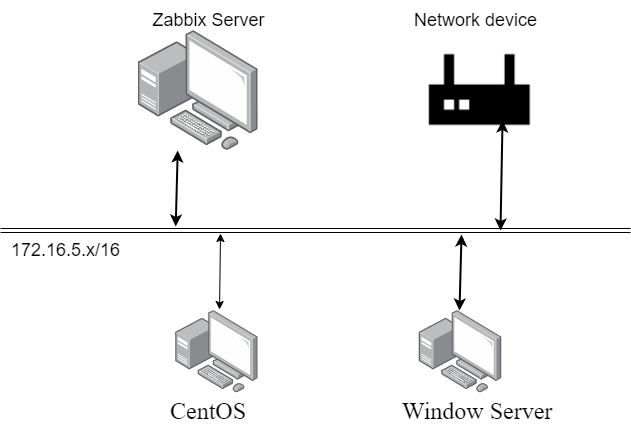

## <a name="2" >II. Tiến hành</a>

### <a name="2.1" >1. Cài Zabbix agent trên máy 2</a>

- Máy chạy OS CentOS 7, tiến hành cài zabbix agent lên máy để giám sát hiệu suất của máy.
- Thực hiện trong môi trường lab nên đã tắt Firewall và Security Linux. Trong trường hợp không tắt filewall thì cần phải khai báo mở port cho Zabbix agent:

    ```sh
    firewall-cmd --zone=public --add-port=10050/tcp --permanent
    firewall-cmd --reload
    ```

- B1: cài repo của Zabbix:

    ```sh
    rpm -Uvh https://repo.zabbix.com/zabbix/5.0/rhel/7/x86_64/zabbix-release-5.0-1.el7.noarch.rpm
    yum clean all
    ```

- B2: Cài Zabbix agent:

    ```sh
    yum install zabbix-agent
    ```

- B3: Khởi chạy Zabbix agent và bật khởi chạy cùng hệ thống

    ```sh
    systemctl restart zabbix-agent
    systemctl enable zabbix-agent
    ```

- B4: Chỉnh sửa các cấu hình cơ bản để nhận hệ thống mà ta cần thêm vào:
  - Sử dụng `vi` để truy cập vào file config và chỉnh sửa:

    ```sh
    vi /etc/zabbix/zabbix_agentd.conf
    ```

  - Tìm và chỉnh sửa các thông số cơ bản sau, sao cho phù hợp với hệ thống của bạn:

    ```sh
    Server=<IP_ZABBIX_SERVER>
    ServerActive=<IP_ZABBIX_SERVER>
    Hostname=<ZABBIX_SERVER_HOSTNAME>
    ```

    >Đây là bước quan trọng, dù thêm host từ bất kỳ hệ điều hành nào ta cũng cần phải chỉnh sửa lại file cấu hình để host có thể tham gia vào hệ thống.
  
  - Lưu lại và thoát

- B5: khởi động lại dịch vụ để nhận các cấu hình mới

    ```sh
    systemctl restart zabbix-agent
    ```

- B6: Chuyển sang máy server kiểm tra kết nối:

  - Cài đặt câu lệnh cần thiết:

  ```sh
  yum install zabbix-get -y
  ```

  - Thực hiện kiểm tra kết nối với câu lệnh:

  ```sh
  zabbix_get -s <ZABBIX_AGENT_IP> -k agent.version
  ```

  >Nếu trả về số phiên bản của zabbix tức là cài đặt thành công có thể tiến hành kết nối.

- B7: sau khi kiểm tra kết nối thành công, ta tiến hành đăng nhập vào dashboard của zabbix server để thêm máy.
  B7.1: Chọn Configuration -> Host
  - 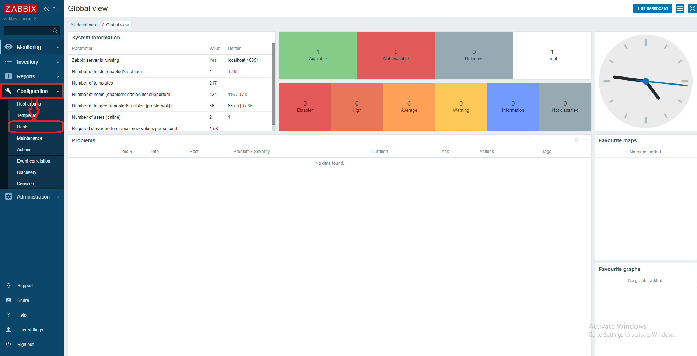

  B7.2: Trong màn Configuration, ta chọn Create Host
  - 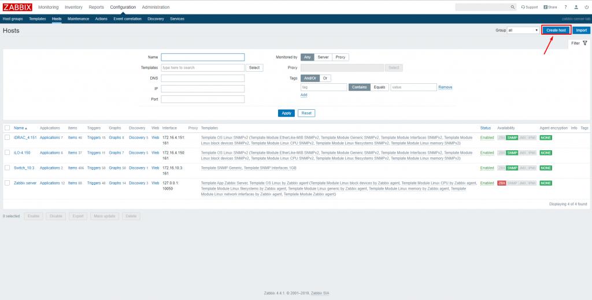
  B7.3: Trong màn Create Host, điền các thông số của host. Tối thiểu sẽ có Hostname, Group, địa chỉ IP.
  - 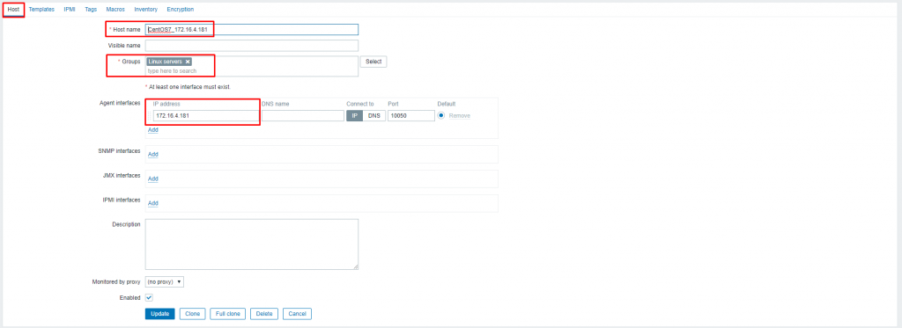
  B7.4: Trong tab Template, ta chọn template để gán cho host cần giám sát. Ở đây CentOS do vậy sẽ chọn Template OS Linux. Các bước thực hiện như sau:
  - 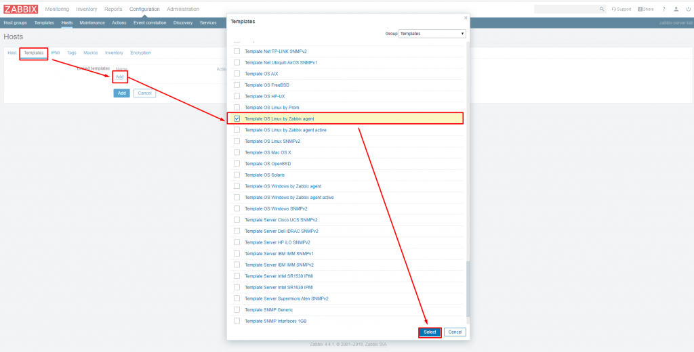
  B7.5: Sau đó chọn add để hoàn thành.
  - 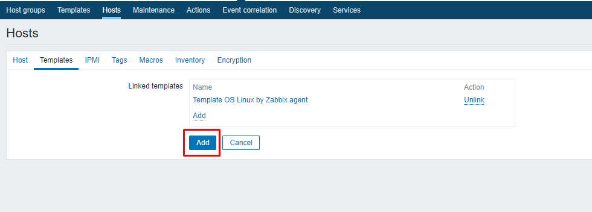
  B7.5: chờ 1 vài giây để có thể hiển thị lên dashboard.
  - 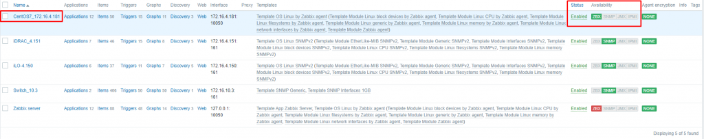

### <a name="2.2" >2. Cài SNMP trên máy 3</a>

_Giao thức SNMP là một trong những giao thức mạng được chấp nhận rộng rãi để quản lý và giám sát các phần tử mạng._

<https://en.wikipedia.org/wiki/Simple_Network_Management_Protocol>

B1: Cài đặt SNMP trên windows server 2016.

- Trong Server Manager ta chọn Add Roles and Features
- 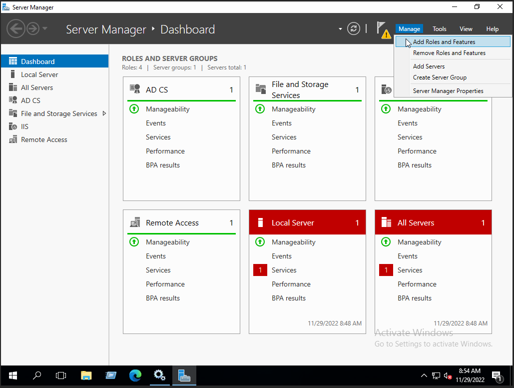

B2: Click next cho đến khi chuyển đến mục `Features`

- 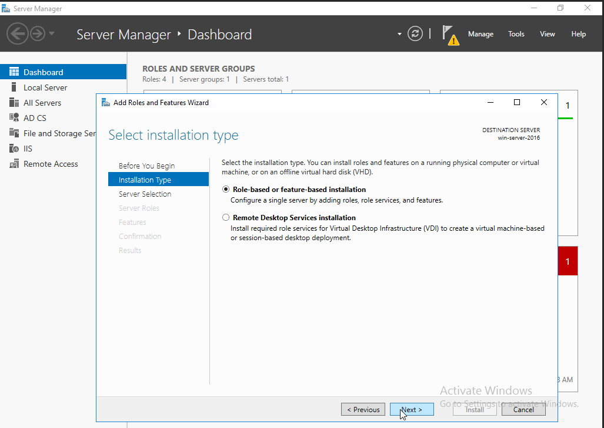

B3: tìm và tích chọn vào `SNMP Service`

- 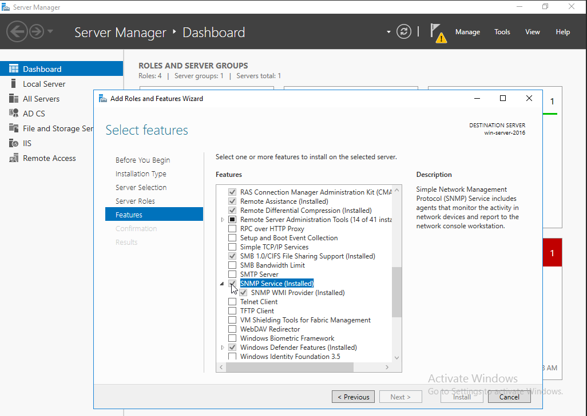
- Click vào `Install` và chờ đợi cài đặt hoàn tất.

B4: Sau khi cài đặt thành công, ta mở `Windows Services`. Tìm đến `SNMP Service`, chuột phải chọn `Properties` để tiến hành cấu hình.

- 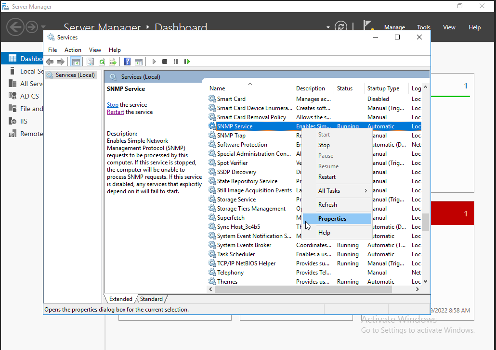

B5: trong thẻ `Agent` khai bao 1 số thông tin cơ bản và tích chọn các service cần thiết.

- 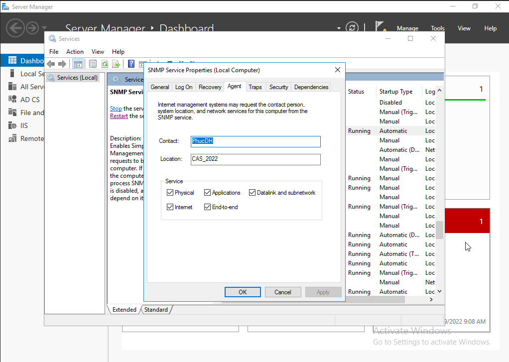

B6: Chuyển sang thẻ `Security`

- 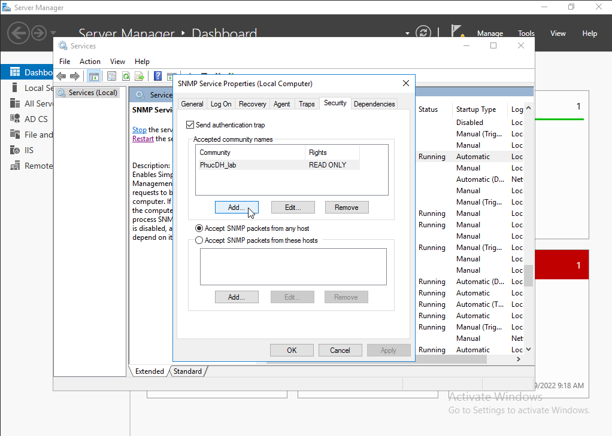

- Trong mục `Accepted community names` chọn `Add` thể thêm các kết nối được cho phép. Khai báo theo yêu cầu cá nhân rồi chọn `Add` để thêm

- 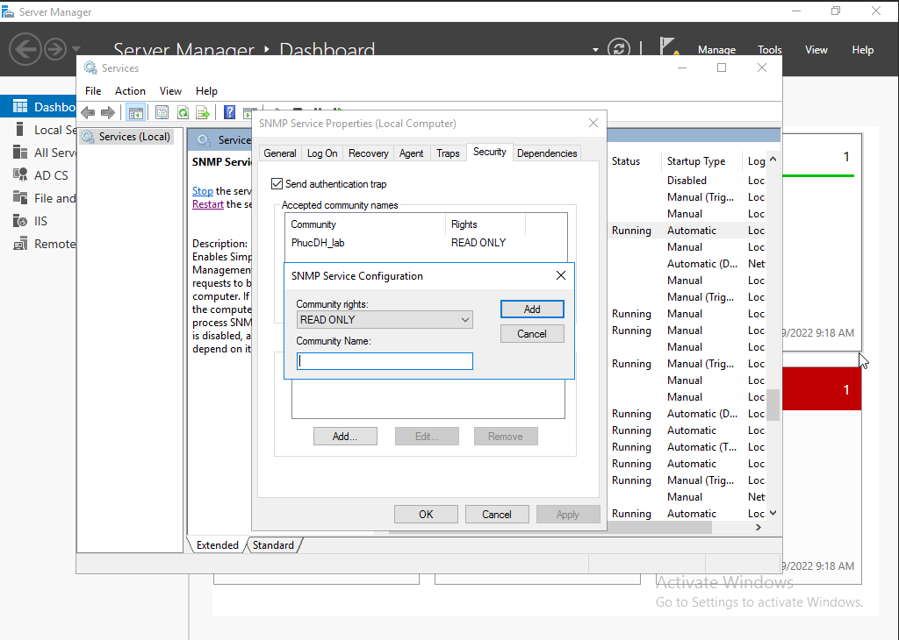

- Vẫn trong thẻ `Security` 2 tuỳ chọn bên dưới để

  - `Accept SNMP packets from any host`: cho phép tất cả các host bên ngoài sử dụng các gói tin SNMP để giao tiếp với máy.
  - `Accept SNMP packets from thses hosts`: chỉ cho phép các máy có địa chỉ IP trong danh sách bên dưới được phép giao tiếp. Click `Add` để thêm địa chỉ IP.

  >Trong bài lab này cho phép tất cả các host bên ngoài giao tiếp với máy.

_Cấu hình cơ bản xong, chọn `Restart` để nhận các cấu hình_

B7: Chuyển sang máy Zabbix server, kiểm thử kết nối bằng câu lệnh

    snmpwalk -v2c -c <CONTACT_NAME> <IP_WINDOWS_SERVER>

- Nếu giá trị trả về là 1 loạt các thông số kết nối và giá trị = true thì tức là đã cấu hình và kết nối thành công.

- Đăng nhập vào Zabbix server dashboard tiến hành cấu hình thêm host mới.
- B7.1: Vào mục `Configuration` chọn `Hosts`
  - 

- B7.2: trong mục `Host` tìm đến `Create host`
  - 

- B7.3: Trong mục `Interfaces` chon `Add` để thêm kiểu giám sát mới là `SNMP` để tiến hành cấu hình.
  - 

- B7.4: Thêm thành công thì có thể xoá kiểu `Agent` bằng nút `Remove`. Tiến hành khai báo cấu hình cơ bản của kết nối SNMP, với port mặc định là `161`.
  - 

- B7.5: Sau khi khai báo xong, chuyển sang thẻ `Templates` để chọn các mẫu áp dụng cho kết nối này.
  - 
  - Chọn `Add`
  - Chọn Template OS Windows SNMPv2 sau đó Select
  - 

- B7.6: Chuyển sang thẻ `Macros`. Tại mục:
  - `Macros` nhập giá trị: {$SNMP_COMMUNITY}
  - `Value` nhập giá trị là tên của `Community` mà ta cài đặt khi nãy ở WinServer 2016.
  - 

- Sau khi xong ở thẻ `Macros`, nhấn `Add` để thêm host mới. Chờ 1 vài giây để có thể hiển thị lên giao diện. Nếu đèn báo xanh tức là kết nối thành công.
- 

## <a name="0" >Tài liệu tham khảo</a>

<https://news.cloud365.vn/zabbix-giam-sat-server-centos-7-bang-zabbix-agent/>

<https://news.cloud365.vn/zabbix-giam-sat-windows-server-su-dung-smnp/>

<https://community.spiceworks.com/how_to/160256-how-install-zabbix-agent-for-windows-servers-basic>

<https://news.cloud365.vn/zabbix-giam-sat-windows-server-bang-zabbix-agent/>


