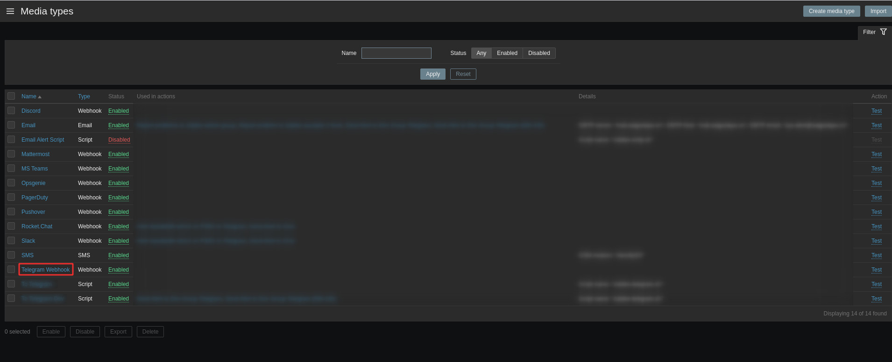
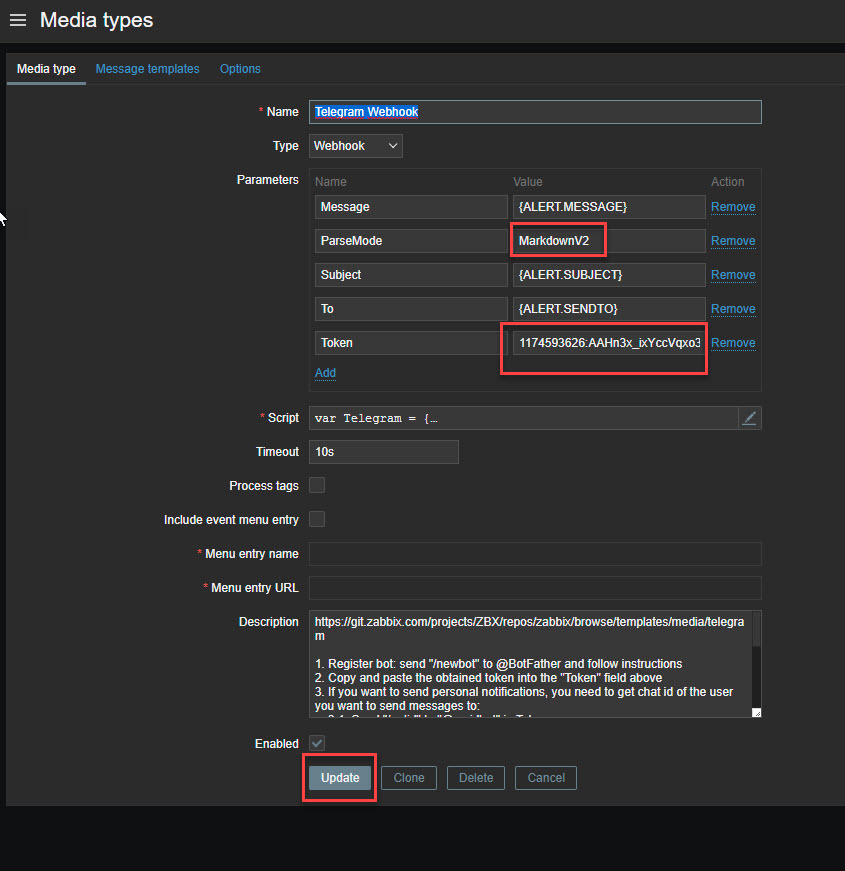

## Nội dung chính

_Gửi cảnh báo của hệ thống từ server thông qua các kênh phổ biến_

[I. Thông qua telegram](#1)

- [Tài liệu tham khảo 01](#01)

[II. Cảnh báo qua email](#2)

- [Tài liệu tham khảo 02](#02)

[III. Lặp lại cảnh báo trong Zabbix](#3)

- [Tài liệu tham khảo 02](#03)

[IV. Cảnh báo leo thang (notifications escalations)](#4)

___

## <a name="1" >I. Thông qua telegram</a>

>Chuẩn bị
>
> - Chuẩn bị ít nhất 1 tài khoản telegram
> - Một Zabbix server và 1 vài zabbix agent để kiểm thử cảnh báo có hoạt động hay không.

- B1: cần tạo bot chat trên tele để nhận các cảnh báo gửi về. Truy cập vào tele (có thể dùng trên nền web hoặc app), gõ vào thanh tìm kiếm `BotFather` để tiến hành tạo bot cho tài khoản.
  - 
  - Lần đầu gõ vào `/newbot`: để tạo bot mới
  - Tiếp tục tạo tên gọi của bot. Nhiều bot có thể trùng tên nhau.
  - Sau đó tạo ra username của bot để hệ thống của tele có thể phân biệt. Các username là khác nhau và bắt buộc kết thúc bởi `bot`.
  - Thành công thì ta sẽ được trả về đường dẫn tới box chat với bot và token để truy cập vào bot từ các ứng dụng khác. Kết quả tương tự trên hình.
  - Ta có thể thêm bot vào các nhóm chat theo yêu cầu với câu lệnh `@your-bot-name`. Tại bài viết này sẽ sử dụng khung chat với bot để nhận cảnh báo.
  - Lấy ID box chat với bot để sử dụng cho sau này. Bằng cách gửi 1 tin nhắn bất kỳ trong box chat với bot rồi truy cập vào đường link sau để lấy ID:
  - `https://api.telegram.org/bot<your-bot-token>/getMe`. Với: `<your-bot-token>` là access token bạn nhận được khi tạo Bot.

- B2: Di chuyển sang Zabbix server để cấu hình việc gửi cảnh báo bằng các sử dụng kênh khác. Ở đây sử dụng phiên bản 5.0 LTS.
  - Truy cập vào Zabbix server dashboard, truy cập `Administration >> Media types >> Telegram`.
  - 
  - double chuột vào `Telegram` ta sẽ đưuọc chuyển sang trang cấu hình tương tự như:
  - 
  - Cấu hình các thông số cơ bản như:
    - ParseMode – Markdown hoặc HTML
    - Token – Bot access token (nhận được ở bước tạo Bot)
  - Nhấn `Update` để lưu lại cấu hình.
  - Để có thể nhận được cảnh báo, ta cần gán `Media` cho tài khoản nhận cảnh báo. Ở đây sử dụng luôn tài khoản `Admin`
  - Truy cập `Administration >> Users >> nhấn chọn user cần cấu hình`, ta sẽ được chuyển sang cấu hình cho user tương tự như sau:
  - 
  - Chuyển sang tab Media và nhấn Add để thêm mới
  - 
  - Tại pop-up Media, bạn lần lượt chọn và tùy biến những thành phần sau:
    - Type: Telegram
    - Send to: thay thế bằng ID channel của bạn. Đã thu được ở trên.
    - When active: khoảng thời gian gửi cảnh báo trong ngày
    - Use if severity: chọn các mức sự cố gửi cảnh báo
  - 
  - Sau khi nhấn `Add` cấu hình sẽ được lưu lại
  - 
  - Để kiểm thử việc hoạt động. Truy cập `Administration >> Media types >> Test`, trên Telegram media type và lần lượt điền những trường thông tin sau:
    - Mesage: Nội dung tin nhắn test
    - Subject: tiêu đề tin nhắn test
    - To: Telegram group id
    - Token: Bot access token (nhận được ở bước tạo Bot)
    - 
    - Cấu hình thành công ta sẽ nhận được các thông báo với nội dung tin nhắn đã nhập ở trên trong box chat với bot.

- B3: có các cấu hình cơ bản, ta cần tạo hành động gửi cảnh báo cho Zabbix server.
  - Truy cập vào `Configuration >> Actions`. khi tạo thành công việc tạo các bước trên, ta sẽ thu được `Actions` mặc định như sau:
  - 
  - CHọn `Action` cần cấu hình, ở đây là `Report problems to Zabbix administrators` thu được trang cấu hình tương tự bên dưới. Trong tab `Action` hãy tích chọn vào `Enable`, rồi chuyển sang tab `Operation` để cấu hình
  - 
  - Click vào `Add` sẽ thu được popup như sau:
  - 

    - Cấu hình cơ bản như sau:
    - `Send to user groups >> Add` : chọn user group theo nhu cầu.
    - `Send to users >> Add`: chọn user được nhận thông báo.
    - `Send only to`: có thể để `All` hoặc click chọn vào menu đổ xuống, chọn con đường mà ta sử dụng. Ở đây sử dụng `Telegram`.
    - Nhấn `Add` để lưu lại cấu hình.
  - Hoàn tất cấu hình nhấn `Update` để cập nhật cấu hình mới.

- B4: tiến hành kiểm thử bằng cách:
  - tắt Zabbix agent bất kỳ nào đó trong hệ thống. Thường là trong 3p hệ thống Zabbix sẽ tự quét và nhận ra các agent down. Sau đó, gần như ngay lập ta sẽ nhận được cảnh báo trên bot tele ta đã thiết lập.
  - Hoặc có thể kiểm thử bằng cách đẩy hiệu năng với `Stress test`.
  - Bất kỳ thay đổi, hay ảnh hưởng xấu nào xuất hiện trên hệ thống cũng gần như đưuọc cảnh báo ngay lập tức qua bot tele đã thiết lập.

🎆 Trong trường hợp không nhận được cảnh báo thì hãy thử khởi động lại Zabbix server, Kiểm tra xem các cấu hình, các Actions đã được `Enable` hay chưa.

### <a name="01" >Tài liệu tham khảo 01</a>

<https://www.youtube.com/watch?v=TpP6NpS9jjg>

<https://hiepsharing.com/cau-hinh-zabbix-gui-canh-bao-den-telegram/>

<https://dotrungquan.info/huong-dan-thiet-lap-zabbix-canh-bao-qua-telegram/>

<https://www.networkworld.com/article/3563334/how-to-stress-test-your-linux-system.html#:~:text=1%20How%20to%20stress%20test%20your%20Linux%20system,system%20will%20help%20you%20anticipate%20how%20systems%20will>

Date accessed: 30/11/2020

___

## <a name="2" >II. Cảnh báo qua email</a>

- Mô hình triển khai, gần đúng với hầu hết các trường hợp muốn cài đặt thông báo thông qua các nguồn bên ngoài. Chỉ cần thay đối tượng nguồn bên ngoài trong sơ đồ.
- 

**B1: chuẩn bị gmail và thiết lập cơ bản trên zabbix**

- Đăng nhập vào google với tài khoản định sử dụng để gửi mail, truy cập vào đường dẫn sau <https://myaccount.google.com/lesssecureapps> bật tính năng cho phép các ứng dụng có bảo mật thấp truy cập vào gmail.
- 
- Khi đã bật tính năng này, ta cần tạo 1 mật khẩu cho phép các ứng dụng truy cập vào sử dụng tính năng mail của tài khoản google (đây không phải là mật khẩu của tài khoản google.)
- Theo hướng dẫn sau để tạo và lấy mật khẩu cho ứng dụng.
- <https://huongdan.azdigi.com/wp-content/uploads/2019/11/SMTP-GMAIl.mp4>
- File của video tại thư mục sau, phòng trường hợp server hết hạn: Monitor_Zabbix\Images\SMTP-GMAIl.mp4
- Theo hướng dẫn sau để thêm kênh cảnh báo qua gmail:
- 
- Trong mục 4 hiểu các thông số cơ bản như sau:
  - Name: Tên cho media type
  - Type: Email (Do đang sử dụng mail nên bạn sẽ chọn kiểu là Email)
  - SMTP Server: Nhập vào máy chủ email, do mình đang cấu hình với Gmail và máy chủ SMTP Gmail sẽ là: smtp.gmail.com
  - SMTP server port: Bạn nhập vào 465(SSL) hoặc 587(TLS)
  - SMTP  hello: mình nhập gmail.com luôn
  - SMTP email: Nhập vào tên địa chỉ email gửi
  - Connection security: Bạn chọn SSL/TLS nếu ở trên để port 465. Nếu ở trên để port 587 thì bạn phải chọn kiểu STARTTLS
  - Authentication: Username and password
  - Username: Nhập lại tài khoản email
  - Password: Nhập vào mật khẩu ứng dụng đã tạo ở bước trên vào
  - Sau khi nhập xong các thông số hoàn tất bạn click `Update` để thêm vào.
- Sau khi lưu thì nên thử lại cảnh báo:
- 
- Nhập địa chỉ mail nhận thông báo (nên gửi sang 1 mail khác)
- 
- Kết quả test nhận được như sau là thành công thiết lập mail để gửi cảnh báo:
- 

**B2: Tạo Action cảnh báo**

- Để nhanh nhất với người mới bắt đầu ta sẽ sử dụng luôn `Action` có sẵn của Zabbix:
- 
- Với `Action` này thì chỉ có người dùng Admin là được gửi cảnh báo. Có thể chỉnh sửa tuỳ ý Action này hoặc tạo mới tuỳ thích.
- Hiểu đơn giản là có hành động rồi, thì ta cần chỉ hướng cho hành động này sẽ ảnh hưởng đến ai.

**B3: Cung cấp email cho người dùng được cấu hình**

- Tại B2, sau khi chỉ định người dùng - ở đây là Admin nhận `Action` thì ta cần cung cấp địa chỉ email nhận cảnh báo của người dùng đó. Tại ví dụ này sử dụng luôn người dùng `Admin` nếu muốn có thể hoàn toàn tạo ra người dùng mới.
- 
- Sau khi thực hiện nút 2, thì sẽ nhận được danh sách người dùng trên hệ thống zabbix hiện tại. Click chọn người dùng `Admin` để chuyển tiếp sang giao diện config (bắt đàu từ nút 4) như nút 3 hướng dẫn.
- Phần quan trọng nhất là ta cần phải cung cấp đúng địa chỉ email nhận cảnh báo.
- Để kiểm thử hãy stop bất kỳ dịch vụ vào trên hệ thống Zabbix để có thể nhận cảnh báo qua mail.

### <a name="02" >Tài liệu tham khảo 02</a>

<https://www.zabbix.com/documentation/current/en/manual/config/notifications/action/operation>

<https://bestmonitoringtools.com/zabbix-alerts-setup-zabbix-email-notifications-escalations/>

[Bật SMTP trên account google](https://huongdan.azdigi.com/huong-dan-cau-hinh-smtp-gmail-gsuite-cho-website-wordpress/)

[Hỗ trợ của google về Tạo và sử dụng Mật khẩu ứng dụng](https://support.google.com/accounts/answer/185833)

Date access: 01/12/2022
___

## <a name="3" >III. Lặp lại cảnh báo trong Zabbix</a>

- Trong cách thức hoạt động cảnh báo của Zabbix, mặc định là chỉ có 1 lần thông báo cho tất cả các: sự cố, cảnh báo hệ thống, vấn đề về hiệu suất của hệ thống được giám sát.
Để có thể lặp lại cảnh báo ta cần thực hiện 1 số thay đổi trong cấu hình của `Action` cảnh báo đó.
- Truy cập vào `Configuration >> Actions` tuỳ chọn bất kỳ cảnh bảo nào mà bạn muốn nó được lặp lại. Sẽ thu được bảng cấu hình, chuyển qua tab `Operations` để cấu hình. Click vào `Edit` - nếu bạn muốn sử dụng cấu hình cảnh báo cũ hoặc `Add` - nếu bạn muốn cấu hình 1 thông báo mới.
- 
  
  - `Default operation step duration`: là thời gian cảnh báo này sẽ được khởi chạy sau khi vấn đề suất hiện trên hệ thống.

- Ở đây mình sẽ sử dụng cấu hình có sẵn, click vào `Edit` và thu được popup cấu hình như sau:
- 

  - `1`: Hãy để mặc định là `Send message`
  - `2`: `Steps` ở ô đầu tiên là thứ tự của thực hiện của cảnh báo, ô thứ 2 là số lượng lặp lại của cảnh báo. Có thể thực hiện lặp lại cảnh báo dù nó là ở bất kỳ bước nào.
  - `3`: `Steps duration` - thời gian lặp lại của cảnh báo
  - Vì ở đây sử dụng cấu hình có sẵn nên người nhận và nhóm người nhận cảnh báo đã được cấu hình từ trước. Nếu bạn tạo cảnh báo mới thì phải thêm ít nhất là nhóm người dùng hoặc người dùng nào nhận cảnh báo.
  - `4`: chọn kênh gửi cảnh báo. Hãy chọn kênh gửi cảnh bảo phù hợp với bạn.
  - Cơ bản hoàn thành, hãy click vào `Update` hoặc `Add` - nếu là tạo mới, để hoàn thành cấu hình.

- Popup được đóng, trả lại trang cấu hình `Operations` click vào `Update` hoặc `Add` - nếu là tạo mới, để lưu cấu hình.
- Có thể kiểm thử bằng cách tắt 1 trong các agent trong hệ thống. Rồi chờ cảnh báo đến, có thể tăng giảm thời gian để phù hợp với điều kiện của cá nhân.
- 
- Thành công thiết lập việc lặp lại cảnh báo trên Zabbix.

### <a name="03" >Tài liệu tham khảo 03</a>

<https://bestmonitoringtools.com/zabbix-alerts-setup-zabbix-email-notifications-escalations/>

<https://www.zabbix.com/documentation/current/en/manual/config/notifications/action/operation>

___

## <a name="4" >IV. Cảnh báo leo thang (notifications escalations)</a>

- Dịch thô thì nó là cảnh báo leo thang. Trong cách thức hoạt động cảnh báo của Zabbix, mặc định là chỉ có 1 lần thông báo cho tất cả các: sự cố, cảnh báo hệ thống, vấn đề về hiệu suất của hệ thống được giám sát. Dù có thể lặp lại các cảnh báo nhưng nó vẫn là các cảnh bảo chỉ gửi đến 1 đối tượng duy nhất. Vì thế khi ta muốn đưa ra nhiều cảnh báo cho nhiều đối tượng về các vấn đề (problems) của hệ thống được giám sát thì cần phải cấu hình thêm các `Action` (hành động) phục vụ cho việc này.
- Về cơ bản khái niệm này sinh ra phục vục cho việc cảnh báo tới nhiều kênh, và nhiều người khác nhau tham gia quản trị hệ thống giám sát. Tuỳ thuộc vào mức độ nghiêm trọng của vấn đề mà cách cảnh báo được tính đến việc gửi cho ai, qua kênh nào và lặp lại bao nhiêu lần.
- 
- Thử nghiệm điều này, ta sẽ tận dụng luôn cảnh báo qua email đã thiết lập ở trên. Với việc là tạo nhiều cảnh báo gửi đến cho 1 cá nhân nhất định. Việc gửi cảnh bảo leo thang sẽ tương tự, chỉ khác nơi nhận.
- Về cơ bản nó khác việc lặp lại cảnh báo ở chỗ là thay đổi người nhận hay nhóm người nhận.

B1: tạo các action mới phục vụ cho việc cảnh báo leo thang:

- 

  - Trong mục `*` mặc định là: `Trigger actions`, tuy nên cũng nên để ý tránh bị nhầm chế độ

- Sau khi click vào `Create action`, ta thu được trang cấu hình như sau, trong thẻ `Action` nhập vào tên cho action, và tích chọn vào `Enable`
- 
- Chuyển sang thẻ `Operations`, để tiếp tục cấu hình các hành động mà action này sẽ thực hiện.
- 
  
  - Mặc định `Operation type` sẽ là: `Send message`
  - `2`: Steps - số thứ tự thực hiện của cảnh báo

add this as the subject:

No one acknowledged problem in 24h: {EVENT.NAME}
And this as the message:

Problem started at {EVENT.TIME} on {EVENT.DATE}
Problem name: {EVENT.NAME}
Host: {HOST.NAME}
Severity: {EVENT.SEVERITY}
Operational data: {EVENT.OPDATA}
Original problem ID: {EVENT.ID}
{TRIGGER.URL}

Escalation info:
{ESC.HISTORY}

