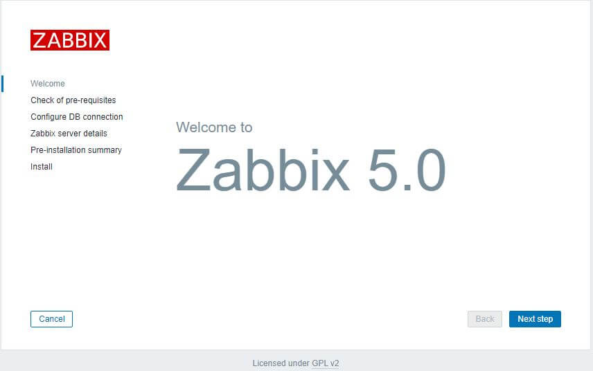
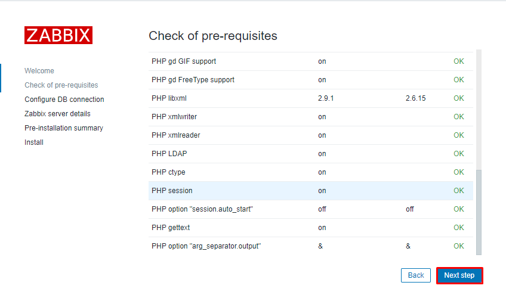
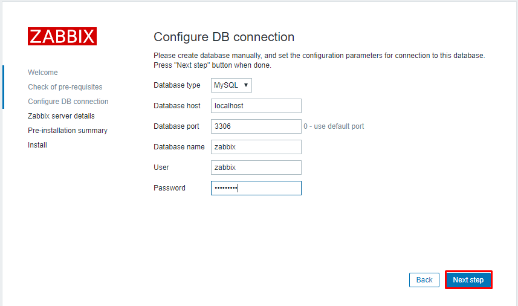
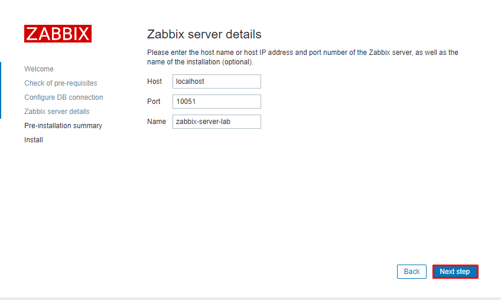
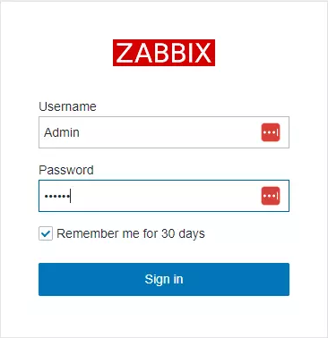
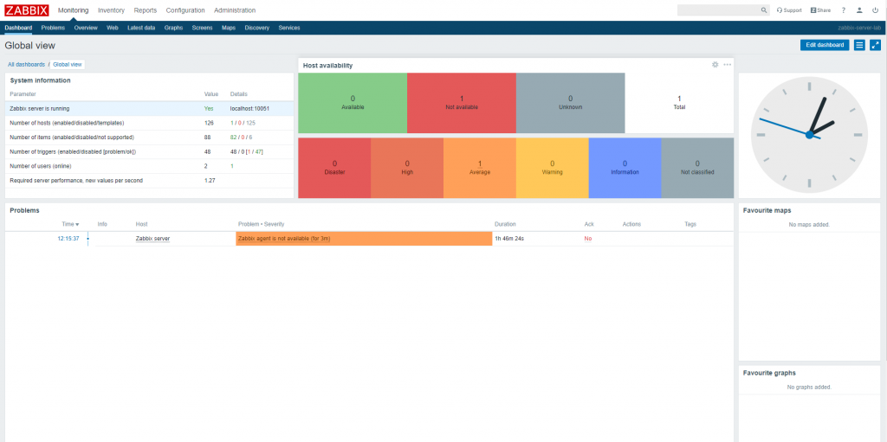

## Nội dụng chính

_Cài đặt Zabbix trên môi trường CentOS 7_

[I. Chuẩn bị](#1)

[II. Tiến hành cài đặt triển khai](#2)

- [1. Cài đặt trên máy 1](#2.1)
- [2. Truy cập vào giao diện web của Zabbix](#2.2)


[Tài liệu tham khảo](#0)


___

## <a name="1" >I. Chuẩn bị</a>

Về cơ bản, để triển khai được Zabbix thì phần cứng không cần yêu cầu quá cao. Chủ yếu cần số lượng máy để có thể giả lập môi trường và triển khai việc giám sát.

Cần chuẩn bị như sau:

- máy 1: chạy CentOS 7: để cài đặt Zabbix Server, Frontend, Agent. Đã tắt firewall và SElinux.
- máy 2: chạy CentOS 7: đề cài Agent, để tham gia vào cụm và được giám sát bởi Zabbix Server. Đã tắt firewall và SElinux.
- máy 3: chạy Windows Server: Cài [SMNP](https://en.wikipedia.org/wiki/Simple_Network_Management_Protocol), sẽ tham gia vào cụm và được giám sát bởi Zabbix Server.

Yêu cầu phần cứng đơn giản: 1 CPU, 1 GB RAM, 40 GB ROM. Vì là triển khai cơ bản nên ưu tiên các máy nằm trong cùng 1 dải mạng.

Sau đây sẽ tiến hành cài đặt phiên bản 5.0 LTS

Mô hình triển khai:


## <a name="2" >II. Tiến hành cài đặt triển khai</a>

### <a name="2.1" >1. Cài đặt trên máy 1</a>

>Dùng để cài đặt Zabbix server nên sẽ yêu cầu:
>
>- đã cài đặt 1 ứng dụng quản lý database. Có thể dùng MySQL, PostgreSQL. Trong bài sử dụng MariaDB 10.6.
>- Sử dụng ít nhất 1 web server để có thể chạy giao diện web của zabbix. Ở bài viết này sử dụng Nginx, sẽ cài đặt song song với zabbix trong quá trình cài đặt.

- B1: cài đặt Zabbix repository

    ```sh
    rpm -Uvh https://repo.zabbix.com/zabbix/5.0/rhel/7/x86_64/zabbix-release-5.0-1.el7.noarch.rpm
    yum clean all
    ```

- B2: cài đặt Zabbix server, agent

    ```sh
    yum install zabbix-server-mysql zabbix-agent -y
    ```

- B3: Install Zabbix frontend

  - Trước hết phải cài đặt [Red Hat Software Collections](https://developers.redhat.com/products/softwarecollections/overview)

    ```sh
    yum install centos-release-scl
    ```

  - Sử dụng trình soạn thảo `vi` truy cập và chỉnh sửa file config `zabbix.repo`:

    ```sh
    vi /etc/yum.repos.d/zabbix.repo
    ```

    Bật zabbix-frontend repository.

    ```sh
    [zabbix-frontend]
    ...
    enabled=1
    ...
    ```

    Lưu lại và thoát

    Tiến hành cài đặt Zabbix frontend

    ```sh
    yum install zabbix-web-mysql-scl zabbix-nginx-conf-scl -y
    ```

- B4: Tạo database ban đầu. Truy cập vào database mà bạn sử dụng. Ở đây sử dụng MariaDB - có nguồn gốc từ MySQL.
  - Tạo database và user cho zabbix:

    ```sh
    mysql> create database zabbix character set utf8 collate utf8_bin;
    mysql> create user zabbix@localhost identified by 'password';
    mysql> grant all privileges on zabbix.* to zabbix@localhost;
    mysql> quit;
    ```

  - Import các data cần thiết:

    ```sh
    zcat /usr/share/doc/zabbix-server-mysql*/create.sql.gz | mysql -uzabbix -p zabbix
    ```

  - Sử dụng `vi` truy cập và chỉnh sửa file config cho zabbix truy cập vào database đã khởi tạo ở trên.

    ```sh
    vi /etc/zabbix/zabbix_server.conf
    ```

B5: cấu hình xử lý PHP cho zabbix frontend

- Sử dụng `vi` truy cập vào file config giao diện web của `zabbix` trong `rh-nginx116`:

    ```sh
    vi /etc/opt/rh/rh-nginx116/nginx/conf.d/zabbix.conf
    ```

    Huỷ comment các dòng sau, có thể chỉnh sửa theo yêu cầu của cá nhân

    ```sh
    # listen 80; -> chỉ định port có thể dùng để truy cập vào giao diện web
    # server_name zabbix.lab; -> tên miền để nginx có thể phân biệt khi máy khách yêu cầu truy cập bằng tên miền.
    ```

    Khai báo thêm các file log cho giao diện web để có thể nắm bắt các lỗi xảy ra khi truy cập và fix chúng:

    ```sh
    access_log /var/log/nginx/zabbix.lab.access.log;
    error_log /var/log/nginx/zabbix.lab.error.log;
    ```

- Truy cập vào file config của PHP72

  ```sh
  vi /etc/opt/rh/rh-php72/php-fpm.d/zabbix.conf
  ```

  và:
  - Khai báo thêm việc sử dụng web server nào. Ở đây sử dụng `Nginx`

    ```sh
    listen.acl_users = apache,nginx
    ```

  - Huỷ comment bằng cách xoá dấu `;` ở đầu dòng, rồi Khai báo timezone:

    ```sh
    php_value[date.timezone] = Asia/Ho_Chi_Minh
    ```

B6: Về cơ bản cấu hình hoàn tất, khởi động lại các dịch vụ để nhận cấu hình mới:

```sh
systemctl restart zabbix-server zabbix-agent rh-nginx116-nginx rh-php72-php-fpm
```

Có thể khai báo khởi động cùng hệ thống khi hệ thống khởi động lại:

```sh
systemctl enable zabbix-server zabbix-agent rh-nginx116-nginx rh-php72-php-fpm
```

### <a name="2.2" >2. Truy cập vào giao diện web của Zabbix</a>

**_Thực hiện trên máy 3: chạy windows server_**

- Sử dụng bất kỳ trình duyệt nào hiện có trên máy, trên thanh địa chỉ truy cập với đường dẫn:

```sh
http://<IP_server>:<port>
```

- Nhận được giao diện như sau là thành công cài đặt, tiếp tục click vào next để tiến hành cấu hình
- 
- Tiếp tục click next, để tiến hành cài đặt giao diện web. Thông thường các chỉ số trạng thái báo xanh tức là cài đặt bình thường.
- 
- 
- 
- Tài khoản dashboard mặc định khi khởi tạo Zabbix server là: Admin/zabbix
- 
- 

## <a name="0" >Tài liệu tham khảo</a>

<https://www.zabbix.com/download?zabbix=5.0&os_distribution=centos&os_version=7&components=server_frontend_agent&db=mysql&ws=nginx>

<https://news.cloud365.vn/tag/zabbix/>


# Nháp

yum autoremove zabbix-agent.x86_64 zabbix-agent2.x86_64 zabbix-agent2-plugin-mongodb.x86_64 zabbix-agent2-plugin-postgresql.x86_64 zabbix-java-gateway.x86_64 zabbix-proxy-mysql.x86_64 zabbix-release.noarch
zabbix-selinux-policy.x86_64 zabbix-sql-scripts.noarch -y


nếu đã cài đặt nginx từ trước cần phải thay đổi port nếu không sẽ bị xung đột với rh-nginx116.

cấu hình chính của rh-nginx116 nằm tại:

/etc/opt/rh/rh-nginx116/nginx/conf.d

cấu hình chính của nginx phục vụ cho zabbix nằm tại

/etc/opt/rh/rh-nginx116/nginx

systemctl restart rh-nginx116-nginx nginx

Kiểm tra kết nối đến máy agent từ máy server, cần phải cài đặt gói zabbit-get:

yum install zabbix-get


[disk-read-write-request-responses-are-too-high](https://www.zabbix.com/forum/zabbix-troubleshooting-and-problems/404010-sda-disk-read-write-request-responses-are-too-high)
