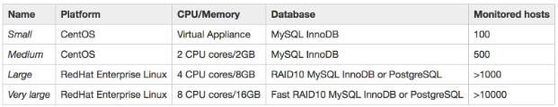

## Nội đung chính

_Cái nhìn tổng quan về Zabbix_

[I. Zabbix là gì?](#1)

[II. Đặc điểm, yêu cầu phần cứng](#2)

- [1. Đặc điểm](#2.1)
- [2. Yêu cầu phần cứng](#2.2)

[III. Các thành phần](#3)

[Tài liệu tham khảo](#0)

___

## <a name="1" >I. Zabbix là gì?</a>

Zabbix là một giải pháp giám sát dịch vụ hệ thống mạng phân tán mã nguồn mở nổi tiếng, có nhiều tính năng độc đáo và khả năng tùy biến cao. Zabbix có khả năng phục vụ cho hệ thống mạng tầm trung và lớn của các doanh nghiệp hiện tại với mức chi phí đầu tư vừa phải.

Được sáng lập bởi Alexei Vladishev và hiện tại được phát triển cũng như hỗ trợ bởi tổ chức Zabbix SIA. Zabbix được viết và phát hành dưới bản quyền General Public License (GPL) phiên bản 2. Zabbix sử dụng các cơ chế cảnh báo linh hoạt cho quản trị viên như email, sms, OTT App,...Và các báo cáo cực chính xác dựa trên các dữ liệu thu thập được từ các thiết bị trong hệ thống.

Tất cả các báo cáo, thống kê, dữ liệu thu thập được đều có thể được hiển thị trên giao diện web rất trực quan.

Trang chủ của Zabbix: <https://www.zabbix.com/>

## <a name="2" >II. Đặc điểm, yêu cầu phần cứng</a>

### <a name="2.1" >1. Đặc điểm</a>

- Mã nguồn mở, chi phí đầu tư ban đầu thấp.
- Giám sát cả server và các thiết bị mạng.
- Hỗ trợ gần như mọi hệ điều hành hiện có trên thị trường.
- Cấu hình nhanh gọn, linh động trong việc phân quyền người sử dụng.
- Có thể phát cảnh báo qua đa dạng các kênh truyền thông: mail, app, SMS,...
- Giao diện web trực quan, đơn giản dễ dàng sử dụng.
- Nhiều plugin hỗ trợ cho các dịch vụ hệ thống khác nhau.
- Không có giao diện web cho điện thoại di động.

### <a name="2.2" >2.2 Yêu cầu phần cứng</a>

- Zabbix không yêu cầu phần cứng quá nhiều, chỉ cần nâng cấp phần cứng tốt dần lên theo kích thước của hệ thống mà nó giám sát. Tứ là hệ thống càng lớn yêu cầu phần cứng để triển khai Zabbix càng cao.

### <a name="3" >III. Các thành phần</a>

a. Zabbix server
Đây là thành phần trung tâm của Zabbix. Zabbix Server có thể kiểm tra các dịch vụ mạng từ xa thông qua các báo cáo của Agent gửi về cho Zabbix Server và từ đó nó sẽ lưu trữ tất cả các cấu hình cũng như là các số liệu thống kê.

b. Zabbix Proxy
Là phần tùy chọn của Zabbix. Nó có nhiệm vụ thu nhận dữ liệu, lưu trong bộ nhớ đệm và chuyển đến Zabbix Server.
Zabbix Proxy là một giải pháp lý tưởng cho việc giám sát tập trung của các địa điểm từ xa, chi nhánh công ty, các mạng lưới không có quản trị viên nội bộ.
Zabbix Proxy cũng được sử dụng để phân phối tải của một Zabbix Server

c. Zabbix Agent
Để giám sát chủ động các thiết bị cục bộ và các ứng dụng (ổ cứng, bộ nhớ, …) trên hệ thống mạng. Zabbix Agent sẽ được cài lên trên thiết bị đó và từ đó Agent sẽ thu thập thông tin hoạt động từ thiết bị mà nó đang chạy và báo cáo dữ liệu này đến Zabbix Server để xử lý.

d. Web interface
Để dễ dàng truy cập dữ liệu theo dõi và sau đó cấu hình từ giao diện web cung cấp. Giao diện là một phần của Zabbix Server, và thường chạy trên các Zabbix Server.

## <a name="0" >Tài liệu tham khảo</a>

<https://cuongquach.com/zabbix-la-gi-tim-hieu-he-thong-zabbix.html>

<https://viblo.asia/p/tong-quan-ve-zabbix-KE7bGo04v5e2>

<https://nhanhoa.com/tin-tuc/zabbix-la-gi.html>

<https://thuvienhay.com/zabbix-la-gi-tinh-nang-cua-zabbix.html>

Date accessed: 22/11/2022
