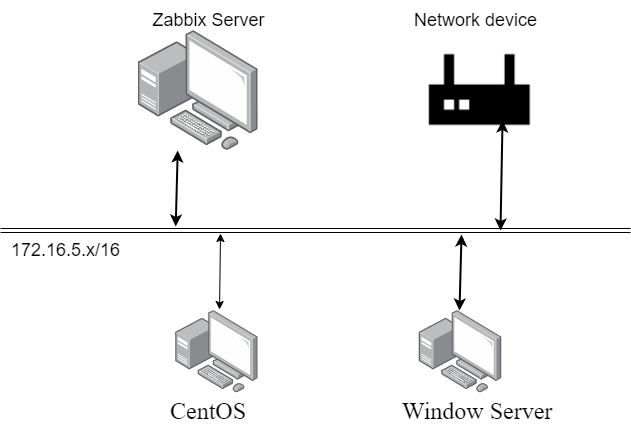
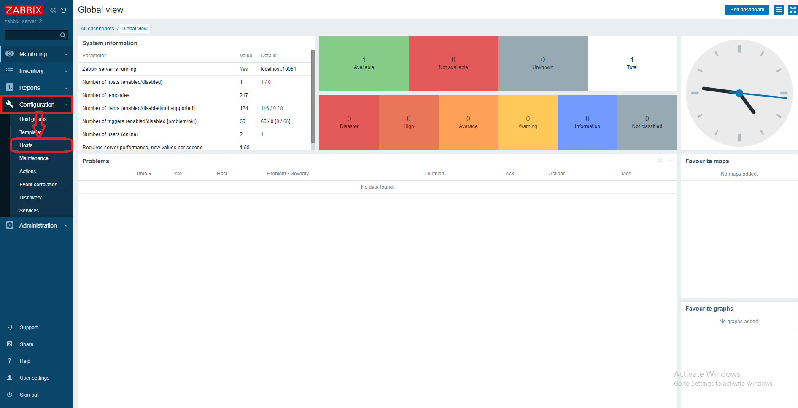

## Nội dung chính

_Thêm 1 số thiết bị vào trong hệ thống giám sát_

## <a name="1" >I. Chuẩn bị</a>

- Máy 1: đã cài thành công Zabbix server, có thể tham khảo bài cài đặt sau: [Cài đặt Zabbix server trên CentOS 7](Install_Zabbix_CentOS7.md)
- Máy 2: chạy bất kỳ phiên bản nào của Linux, ở đây vẫn sử dụng CentOS 7. Để cài Zabbix agent hỗ trợ giám sát hệ thống.
- Máy 3: chạy Windows Server 2016, để cài [SNMP](https://en.wikipedia.org/wiki/Simple_Network_Management_Protocol), đồng thời sử dụng Zabbix trên nền web.
- Các máy kết nối trong cùng một dải mạng.
- 

## <a name="2" >II. Tiến hành</a>

### <a name="2.1" >1. Cài Zabbix agent trên máy 2</a>

- Máy chạy OS CentOS 7, tiến hành cài zabbix agent lên máy để giám sát hiệu suất của máy.
- Thực hiện trong môi trường lab nên đã tắt Firewall và Security Linux. Trong trường hợp không tắt filewall thì cần phải khai báo mở port cho Zabbix agent:

    ```sh
    firewall-cmd --zone=public --add-port=10050/tcp --permanent
    firewall-cmd --reload
    ```

- B1: cài repo của Zabbix:

    ```sh
    rpm -Uvh https://repo.zabbix.com/zabbix/5.0/rhel/7/x86_64/zabbix-release-5.0-1.el7.noarch.rpm
    yum clean all
    ```

- B2: Cài Zabbix agent:

    ```sh
    yum install zabbix-agent
    ```

- B3: Khởi chạy Zabbix agent và bật khởi chạy cùng hệ thống

    ```sh
    systemctl restart zabbix-agent
    systemctl enable zabbix-agent
    ```

- B4: Chỉnh sửa các cấu hình cơ bản để nhận hệ thống mà ta cần thêm vào:
  - Sử dụng `vi` để truy cập vào file config và chỉnh sửa:

    ```sh
    vi /etc/zabbix/zabbix_agentd.conf
    ```

  - Tìm và chỉnh sửa các thông số cơ bản sau, sao cho phù hợp với hệ thống của bạn:

    ```sh
    Server=<IP_ZABBIX_SERVER>
    ServerActive=<IP_ZABBIX_SERVER>
    Hostname=<ZABBIX_SERVER_HOSTNAME>
    ```

    >Đây là bước quan trọng, dù thêm host từ bất kỳ hệ điều hành nào ta cũng cần phải chỉnh sửa lại file cấu hình để host có thể tham gia vào hệ thống.
  
  - Lưu lại và thoát

- B5: khởi động lại dịch vụ để nhận các cấu hình mới

    ```sh
    systemctl restart zabbix-agent
    ```

- B6: Chuyển sang máy server kiểm tra kết nối:

  - Cài đặt câu lệnh cần thiết:

  ```sh
  yum install zabbix-get -y
  ```

  - Thực hiện kiểm tra kết nối với câu lệnh:

  ```sh
  zabbix_get -s <ZABBIX_AGENT_IP> -k agent.version
  ```

  >Nếu trả về số phiên bản của zabbix tức là cài đặt thành công có thể tiến hành kết nối.

- B7: sau khi kiểm tra kết nối thành công, ta tiến hành đăng nhập vào dashboard của zabbix server để thêm máy.
  B7.1: Chọn Configuration -> Host
  - 

  B7.2: 