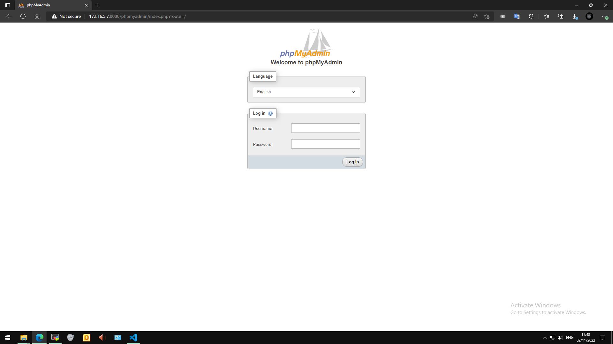

## <a name="" >Nội dung chính</a>

[1. Tổng quan](#1)

[2. Cài đặt triển khai](#2)

[Tài liệu tham khảo](#3)
___

## <a name="1" >1. Tổng quan</a>

PhpMyAdmin là phần mềm mã nguồn mở được viết bằng ngôn ngữ PHP giúp quản trị cở sở dữ liệu MySQL thông qua giao diện web. Tính đến nay, phpMyAdmin đã có đến hàng triệu lượt sử dụng và vẫn không ngừng tăng. Và MariaDB (được tách ra từ MySQL để phát triển riêng) cũng tương thích với PhpMyAdmin 1 cách hoàn hảo.

MySQL/MariaDB cũng có cùng một cách truy xuất và mã lệnh tương tự nhau với ngôn ngữ SQL. MySQL được phát hành từ thập niên 90s. MariaDB được phát hành lần đầu vào năm 2009.

PhpMyAdmin với ưu điểm gọn nhẹ, cài đặt dễ dàng nên được ưu tiên tích hợp sẵn trong LAMP, các dịch vụ cloud, thuê hosting,... Cực kỳ phù hợp với môi trường Linux khi ta có thể quản trị database với hỗ trợ gần đầy đủ các tính năng cần thiết trên giao diện web trực quan, dễ tiếp cận, kể cả với người mới.

Một số tính năng chung thường được sử dụng trên phpMyAdmin:

- Quản lý user (người dùng): thêm, xóa, sửa, phân quyền.
- Quản lý cơ sở dữ liệu: tạo mới, xóa, sửa, thêm bảng, hàng, trường, tìm kiếm đối tượng.
- Nhập xuất dữ liệu (Import/Export): hỗ trợ các định dạng SQL, XML và CSV.
- Thực hiện các truy vấn SQL, giám sát quá trình và theo dõi.
- Sao lưu và khôi phục(Backup/Restore): Thường là phải thao tác thủ công.

Những ưu điểm lớn nhất của phpMyAdmin:

- Tăng hiệu quả công tác quản lý cơ sở dữ liệu: dễ dàng truy cập, thao tác nhanh gọn.
- Cộng đồng hỗ trợ rộng lớn: là mã nguồn mở nên luôn được các lập trình viên trên toàn thế giới đóng góp phát triển.
- Đa ngôn ngữ: đã hỗ trợ lên tới 64 ngôn ngữ người dùng khác nhau.
- Chi phí: nó hoàn toàn miễn phí và dễ dàng để triển khai.

Những nhược điểm đáng chú ý:

- Đầu tiên là vấn đề bảo mật: vì là phần mềm mã nguồn mở nên khi cài đặt từ những nguồn không đáng tin thì rất dễ bị xâm nhập vào cơ sở dữ liệu.
- Vấn đề về sao lưu bảo vệ cơ sở dữ liệu: khi hiện nay phpMyAdmin vẫn chỉ hỗ trợ sao lưu vào các bộ nhớ trên máy local. Và không có tính năng tự động sao lưu.

## <a name="2" >2. Cài đặt triển khai</a>

_Trong bài viết này là cài đăt triển khai cho LEMP stack đã được cài đặt từ trước theo bài viết [install-lemp](install-lemp.md)_

▶

- Tải về phiên bản mới tính tính đến thời điểm hiện tại (11/2022):

```sh
wget https://files.phpmyadmin.net/phpMyAdmin/5.2.0/phpMyAdmin-5.2.0-all-languages.zip
```

- Giải nén:

```sh
yum install unzip -y
unzip phpMyAdmin-5.2.0-all-languages.zip
```

- Di chuyển nó sang bất kỳ thư thư mục nào mà bạn muốn, và phải nhớ đường dẫn đến thư mục đó.

```sh
mv phpMyAdmin-5.2.0-all-languages /var/www/html/phpmyadmin
```

- Như vậy là ta đã có phần mềm phpMyAdmin trên máy. Tiến hành triển khai nên nền web.
- Sử dụng trình soạn thảo `vi` để truy cập vào file cấu hình của website nào đó, miễn là nó đã được cấu hình để xử lý code PHP. Thêm vào đoạn mã sau vào khối `server {...}`:

```sh
server {
    #another_config
#phpmyadmin
        location  /phpmyadmin {

                root /var/www/html;
                index index.php index.html index.htm;

                location ~ ^/phpmyadmin/(.+\.php)$ {

                        try_files $uri =404;
                        root /var/www/html/;
                        fastcgi_pass unix:/run/php-fpm/www.sock;
                        fastcgi_index index.php;
                        fastcgi_param SCRIPT_FILENAME $document_root$fastcgi_script_name;
                        include fastcgi_params;
                }

        location ~* ^/phpmyadmin/(.+\.(jpg|jpeg|gif|css|png|js|ico|html|xml|txt))$ {

                        root /var/www/html/;
                }
        }

        location /phpMyAdmin {
                rewrite ^/* /phpmyadmin last;
        }
}
```

- Lưu lại và thoát.
- Khởi động lại dịch vụ máy chủ web để cập nhật config:

```sh
systemctl restart nginx
```

- Không có bất kỳ thông báo lỗi nào tức là đã thành công.
- Trên máy windows 10 sử dụng trình duyệt để truy cập vào database. Với đường dẫn `http://<ip_or_name_website>:<IP_PORT>/phpmyadmin`

>trong trường hợp bạn đã đổi port trong file config thì mới cần nhập chỉ số port đó vào đường dẫn.

- Nhận được giao diện đăng nhập như hình dưới là thành công.



- Để truy cập vào database thì hãy sử dụng tài khoản và mật khẩu đã thiết lập từ trước trong MariaDB để truy cập.

⏹ **Cài đặt thành công PhpMyAdmin để quản trị MariaDB**

## <a name="3" >Tài liệu tham khảo</a>

<https://wiki.matbao.net/phpmyadmin-la-gi-kien-thuc-can-biet-khi-su-dung-phpmyadmin/#uu-diem-cua-phpmyadmin-la-gi>

<https://bizfly.vn/techblog/phpmyadmin-la-gi-uu-nhuoc-diem-va-huong-dan-su-dung-cho-nguoi-moi.html>

<https://kblinux.com/cai-dat-lemp-stack-toan-tap-tren-centos-7/#LEMP_la_gi>

Date accessed: 31/10/2022
