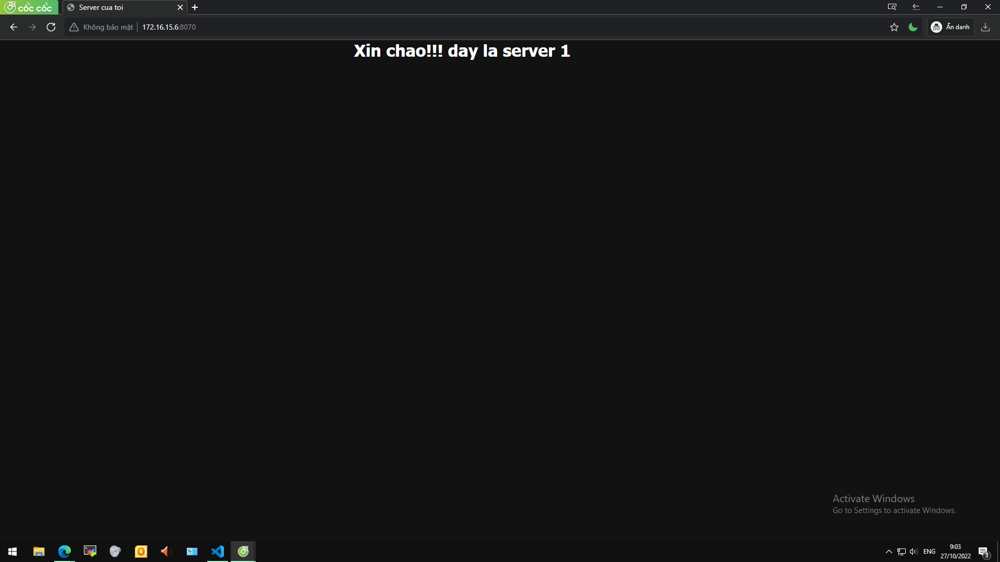
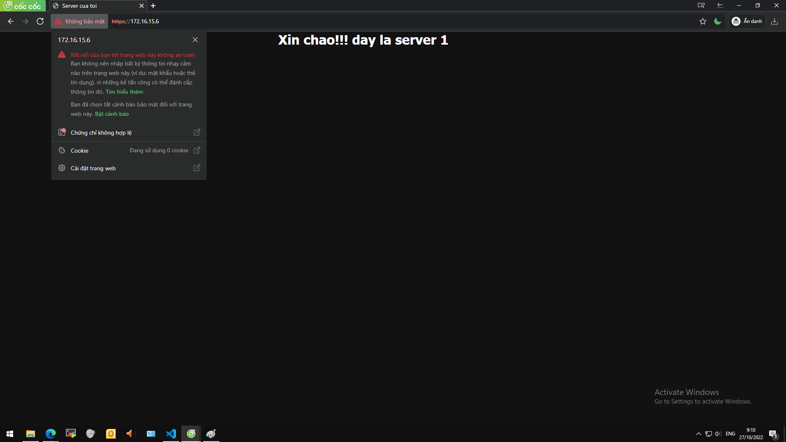

## Nội dung chính

[1. Tổng quan](#1)

[2. Thực hành](#2)

- [2.1 Chuẩn bị](#2.1)
- [2.2 Các câu lệnh cấu hình cơ bản](#2.2)

[3. Kiểm thử](#3)

[Tài liệu tham khảo](#4)

___

## <a name="1" >1. Tổng quan</a>

Bài viết này cung cấp 1 số cách để chuyển hướng yêu cầu từ trình duyệt của người dùng, từ việc sử dụng phương thức HTTP không được bảo mật, sang phương thức HTTPS được bảo mật để truy cập website. Tất nhiên, website của bạn đã được cấp chứng chỉ bảo mật TLS/SSL. Có một vài cách để có bảo mật TLS/SSL cho website, ví dụ như:

- xin chứng chỉ bảo mật từ bên thứ 3 (SSL miễn phí từ Let’s Encrypt): phù hợp cho môi trường public của các cá nhân, doanh nghiệp vừa và nhỏ, cá nhà phát triển cá nhân.
- tự tạo chứng chỉ bảo mật (a-self-signed-ssl-certificate): phù hợp cho môi trường lab, những người mới bắt đầu tìm hiểu về bảo mật website, hoặc các blog cá nhân, có sự tin tưởng ở người sử dụng cuối.

Trong bài viết này website đã được cấp TLS/SSL bằng việc tự tạo chứng chỉ bảo mật, ta sẽ chuyển hướng các yêu cầu của người dùng đến website đang sử dụng HTTP sang website sử dụng HTTPS.

Lợi ích nhất định của việc chuyển hướng này:

    - Bẳ buộc có kết nối an toàn đảm bảo cho cả người sử dụng và người cung cấp webstie.
    - Có 1 cái nhìn tốt cho website trong thế giới SEO trên internet.
    - Đơn giản là chỉ để thông báo tình trạng của trang web.
    - Đồng bộ giữa các website mà không mất quá nhiều chi phí: mua bán, sang nhượng,...

Ta sẽ sử dụng khối code 30x - khối code liên quan đến việc thay đổi địa chỉ của trang web. Thường thì nó sẽ trả về trong phần header chủ yếu là để thông báo cho trình duyệt hoặc các công cụ tìm kiếm. Cơ bản 1 số thông tin như sau:

- 301 Redirect (Moved permanently) là một mã trạng thái HTTP ( response code HTTP) để thông báo rằng các trang web hoặc URL đã chuyển hướng vĩnh viễn sang một trang web hoặc URL khác, có nghĩa là tất cả những giá trị của trang web hoặc URL gốc sẽ chuyển hết sang URL mới.
- 302 Redirect (Moved temporarily) là một mã trạng thái HTTP ( response code HTTP) thể thông báo rằng trang web hoặc URL đã chuyển hướng tạm thời sang địa chỉ mới nhưng vẫn phải dựa trên URL cũ. Vì một lý do nào đó, ví dụ như bảo trì trang web chính.
- Mã 303 (See Other Location): Mã phản hồi này xuất hiện khi người dùng gửi yêu cầu truy cập cho một vị trí khác. Máy chủ sẽ chuyển yêu cầu truy cập đến vị trí đó.
- Mã 304 (Not Modified): Mã phản hồi này cho biết không cần truyền lại các tài nguyên được yêu cầu. Đây là một loại chuyển hướng ngầm đến các tài nguyên được lưu trữ
- Mã 305 (Use proxy): Tài nguyên mà bạn yêu cầu truy cập chỉ có thể truy cập được khi có sử dụng máy chủ proxy.
- Mã 307 (Temporary Redirect): Mã phản hồi này được xem như gần giống với mã 302, nhưng chuyển hướng 307 thường được dùng trong trường hợp nâng cấp source hoặc trang web gặp sự cố, người dung nên tiếp tục truy cập địa chỉ này trong tương lai.

## <a name="2" >2. Thực hành</a>

_Thực hành trên CentOS 7, Nginx 1.22.0_

### <a name="2.1" >2.1 Chuẩn bị</a>

- 01 máy client: sử dụng windows 10
- 01 máy webserver: sử dụng CentOS 7, đã cài Nginx, và triển khai thành công website với HTTP, đồng thời đã cung cấp chứng chỉ TLS/SSL tự ký cho website.

### <a name="2.2" >2.2 Các câu lệnh cấu hình cơ bản</a>

Truy cập vào file config của website cần điều hướng. Thường là được lưu tại `/etc/nginx/conf.d/`. Sử dụng trình soạn thảo `vi` để chỉnh sửa.

- chuyển hướng toàn bộ các yêu cầu đến trang web cũ sử dụng HTTP sang trang web mới sử dụng HTTPS, thêm vào đoạn mã sau trong file config:

```sh
server {

    listen 80 default_server;

    server_name your_servername_or_ip;

    return 301 https://$host$request_uri;

}
```

Trong đó:

    - Listen 80: lắng nghe trên cổng mặc định của HTTP
    - Server_name: tên niềm của website hoặc địa chỉ IP
    - return 301: mã code để thông báo với trình duyệt (công cụ tìm kiếm) website đã chuyển sang tên miền mới vĩnh viễn.
    - https://$host$request_uri: đoạn mã ngắn để chỉ định phiên bản HTTPS cho tên miền mà người dùng nhập vào.

- Chỉ định chuyển hướng cho 1 website nhất định:

```sh
server {

    listen 80 default_server;

    server_name test.com;

    return 301 https://test.com$request_uri;

}
```

- Chỉ chấp nhận kết nối TLS/SSL: đơn giản là xoá bỏ đoạn code lắng nghe port 80, và để lắng nghe mặc định trên port 443. Ví dụ như:
  
  - Đoạn cấu hình trước khi thay đổi, chấp nhận cả kết nối HTTP và HTTPS:


            server {

                listen 80 default_server;

                server_name test.com;

                location {
                    ...
                }
                
            }

            server {

                listen 443;

                server_name test.com;

                location {
                    ...
                }

            }


  - Đoạn cấu hình sau khi thay đổi, chỉ chấp nhận kết nối HTTPS:


            server {

                    listen 443 ssl default_server;

                    server_name test.com;
                 
                    location {
                    ...
                }

            }

- Chuyển hướng cho page:

```sh
server {
    ...
    Location /index.html {

        rewrite ^/oldURL$ https://www.test.com/newURL redirect;

    }
}
```

- Chuyển từ domain cũ sang domain mới:

```sh
server {

    listen 80;

    listen 443 ssl;

    server_name www.old_domain.com;

    return 301 $scheme://www.new_domain.com$request_uri;

}
```

- Chuyển từ `www` sang `non-www` hoặc ngược lại:

```sh
server {

    server_name www.new_domain.com;

    return 301 $scheme://new_domain.com$request_uri;

}
```

## <a name="3" >3. Kiểm thử</a>

- truy cập trang web với phương thức HTTP không được mã hoá:



Có thể thấy trên thanh địa chỉ hiện cảnh báo `Không bảo mật`

- Truy cập trang web như trên nhưng đã được chuyển hướng sang sử dụng phương thức HTTPS đã được mã hoá:

<p align="center">
    
</p>

Có thể thấy trên thanh địa chỉ vẫn hiện cảnh báo, click vào cảnh bảo để xem chi tiết thì thấy `Chứng chỉ không hợp lệ` vì đây là chứng chỉ ta tự ký. Đồng thời đầu tên miền đã có `https`.

Có thể dùng các ứng dụng bắt gói tin qua mạng để xem chi tiết quá trình truyền tin. Gợi ý dùng `WireShark`


## <a name="4" >Tài liệu tham khảo</a>

[redirect-http-to-https-nginx](https://phoenixnap.com/kb/redirect-http-to-https-nginx#:~:text=1%20Nginx%20Redirect%20all%20HTTP%20traffic%20to%20HTTPS.,non-www%20website%204%20Reasons%20to%20Redirect%20Traffic.%20)


[Create a Redirect from HTTP to HTTPS (Optional)](https://www.digitalocean.com/community/tutorials/how-to-create-a-self-signed-ssl-certificate-for-nginx-on-centos-7)

Date acced: 24/10/2022

