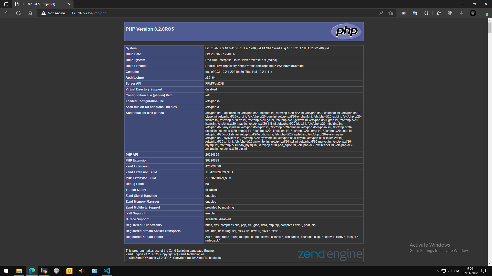

## <a name="" >Nội dung chính</a>

[1. Chuẩn bị](#1)

[2. Tiến hành cài đặt](#2)

- [2.1. Thực hiện trên máy cài LEMP](#2.1)


[Tài liệu tham khảo](#3)

___

## <a name="1" >1. Chuẩn bị</a>

- Một máy client để kiểm thử: sử dụng windows 10.
- Một máy để cài LEMP stack: trên môi trường lab chỉ cần 2 CPU, 2 GB RAM, 40 GB ROM là đủ.
- Cả máy đều có kết nối đến internet để tải các gói cần thiết.
- Sở hữu tài khoản `root` hoặc tài khoản có quyền `sudo`

## <a name="2" >2. Tiến hành cài đặt</a>

_Sau đây thực hiện với tài khoản root. Với tài khoản có quyền sudo thì cần thêm `sudo` vào đầu tất cả các câu lệnh_

### <a name="2.1" >2.1. Thực hiện trên máy cài LEMP </a>

<a name="b1"></a>
▶ B1: chuẩn bị môi trường (L)

- Thực hiện trên môi trường CentOS 7, có thể tắt Selunix (Security Linux) và Firewall.
- Có quyền đăng nhập `root` hoặc có quyền `sudo` (ưu tiên quyền `sudo` nếu thực hiện trên máy vật lý).
- Có ít nhất một địa chỉ IPv4 và có kết nối đến internet.

<a name="b2"></a>
B2: cài đặt Nginx (E)

- Để tránh gây quá nhiều lỗi trong quá trình tự cài đặt, ta sẽ sử dụng cách cài đặt từ câu lệnh `yum`

- Xem chi tiết cách cài đặt và kiểm thử tại bài viết sau: [install-nginx-from-EPEL](../Nginx-basic/install-nginx-from-EPEL.md)

<a name="b3"></a>
B3: cài đặt M - database, ở bài viết này sẽ cài đặt MariaDB. Về cơ bản các câu lệnh của MariaDB cũng là các câu lệnh MySQL.

- cài đặt bằng câu lệnh `yum`:

```sh
yum install mariadb mariadb-server -y
```

File config sẽ được lưu tại `/etc/my.conf`

- Một số câu lệnh để điều khiển dịch vụ MariaDB:

```sh
systemctl start mariadb      (Khởi động dịch vụ mariadb)
systemctl stop mariadb       (Dừng dịch vụ mariadb)
systemctl restart mariadb    (Khởi động lại  dịch vụ mariadb)
systemctl enable mariadb     (Thiết lập mariadb khởi động cùng hệ thống)
systemctl disable mariadb    (Vô hiệu hoá mariadb khởi động cùng hệ thống )
systemctl status mariadb     (Xem trạng thái dịch vụ mariadb)
```

- Thiết lập bảo mật, sử dụng câu lệnh:

```sh
mysql_secure_installation
```
  
  Hoac 
   
   ```sh
   mariadb-secure-installation
   ```

- Thiết lập cơ bản như sau:

```sh
NOTE: RUNNING ALL PARTS OF THIS SCRIPT IS RECOMMENDED FOR ALL MariaDB
      SERVERS IN PRODUCTION USE!  PLEASE READ EACH STEP CAREFULLY!

In order to log into MariaDB to secure it, we'll need the current
password for the root user.  If you've just installed MariaDB, and
you haven't set the root password yet, the password will be blank,
so you should just press enter here.

Enter current password for root (enter for none): (Nhấn Enter)
OK, successfully used password, moving on...

Setting the root password ensures that nobody can log into the MariaDB
root user without the proper authorisation.

Set root password? [Y/n] Y
New password:    (Nhập password root mysql mới)
Re-enter new password: (Nhập lại password)
Password updated successfully!
Reloading privilege tables..
 ... Success!


By default, a MariaDB installation has an anonymous user, allowing anyone
to log into MariaDB without having to have a user account created for
them.  This is intended only for testing, and to make the installation
go a bit smoother.  You should remove them before moving into a
production environment.

Remove anonymous users? [Y/n] Y
 ... Success!

Normally, root should only be allowed to connect from 'localhost'.  This
ensures that someone cannot guess at the root password from the network.

Disallow root login remotely? [Y/n] Y
 ... Success!

By default, MariaDB comes with a database named 'test' that anyone can
access.  This is also intended only for testing, and should be removed
before moving into a production environment.

Remove test database and access to it? [Y/n] Y
 - Dropping test database...
 ... Success!
 - Removing privileges on test database...
 ... Success!

Reloading the privilege tables will ensure that all changes made so far
will take effect immediately.

Reload privilege tables now? [Y/n] Y
 ... Success!

Cleaning up...

All done!  If you've completed all of the above steps, your MariaDB
installation should now be secure.

Thanks for using MariaDB!
```

- Truy cập vào MariaDB bằng câu lệnh:

```sh
mysql -u root -p
```

Nhập mật khẩu của `root` mà bạn vừa tạo ở bước trên. Hiện ra giao diện như sau là cài đặt thành công.


_Tiến hành tạo thử 1 database (có thể thực hiện hoặc chuyển sang [B4](#b4))_

- Tạo 1 database mới:

```sh
CREATE DATABASE bookstore;

USE bookstore;
```

- Tạo bảng mới cho database:

```sh
CREATE TABLE books (
isbn CHAR(20) PRIMARY KEY, 
title VARCHAR(50),
author_id INT,
publisher_id INT,
year_pub CHAR(4),
description TEXT );
```

- Hiện bảng vừa tạo:

```sh
DESCRIBE books;
```

- Thu được kết quả tương tự:

```sh
+--------------+-------------+------+-----+---------+-------+
| Field        | Type        | Null | Key | Default | Extra |
+--------------+-------------+------+-----+---------+-------+
| isbn         | char(20)    | NO   | PRI | NULL    |       |
| title        | varchar(50) | YES  |     | NULL    |       |
| author_id    | int(11)     | YES  |     | NULL    |       |
| publisher_id | int(11)     | YES  |     | NULL    |       |
| year_pub     | char(4)     | YES  |     | NULL    |       |
| description  | text        | YES  |     | NULL    |       |
+--------------+-------------+------+-----+---------+-------+
```

🕊 Thành công tạo 1 database mới với MariaDB.

<a name="b4"></a>
B4: Cài đặt PHP (P)

- Trình biên dịch mã nguồn PHP, thường sử dụng cách chỉ định nguồn cài đặt để có thể cài được phiên bản mới nhất.

- Remi là kho lưu trữ gói phổ biến cung cấp các bản phát hành PHP cập nhật nhất cho các máy chủ CentOS để cài đặt kho Remi cho CentOS 7, hãy chạy:

```sh
yum install -y yum-utils http://rpms.remirepo.net/enterprise/remi-release-7.rpm
```

- Hiện các phiên bản hiện có trong Remi thực hiện câu lệnh:

```sh
yum --disablerepo="*" --enablerepo="remi-safe" list php[7-9][0-9].x86_64
```

Kết quả trả về tương tự như sau:

```sh
[root@lab02 ~]# yum --disablerepo="*" --enablerepo="remi-safe" list php[7-9][0-9].x86_64
Loaded plugins: fastestmirror
Loading mirror speeds from cached hostfile
 * remi-safe: ftp.riken.jp
Available Packages
php70.x86_64                           2.0-1.el7.remi                            remi-safe
php71.x86_64                           2.0-1.el7.remi                            remi-safe
php72.x86_64                           2.0-1.el7.remi                            remi-safe
php73.x86_64                           2.0-1.el7.remi                            remi-safe
php74.x86_64                           1.0-3.el7.remi                            remi-safe
php80.x86_64                           1.0-3.el7.remi                            remi-safe
php81.x86_64                           8.1-1.el7.remi                            remi-safe
php82.x86_64                           8.2-2.el7.remi                            remi-safe
```

- Tiến hành cài đặt với câu lệnh:

```sh
yum -y install yum-utils
yum-config-manager --enable remi-php<version-number>
```

Với số phiên bản tuỳ trọn có trong Remi ta vừa kiểm tra. ví dụ: `sudo yum-config-manager --enable remi-php74`

- Cài đặt thêm 1 số gói cần thiết cho PHP hoạt động tốt với cơ sở dữ liệu và máy chủ web:

```sh
yum install -y php php-fpm php-gd php-json php-mbstring php-mysqlnd php-xml php-xmlrpc php-opcache php-mysql
```

- Kiểm tra phiên bản PHP vừa cài đặt có chính xác không:

```sh
php --version
```

Kết quả trả về tương tự như sau là cài đặt thành công:

```sh
[root@lab02 ~]# php --version
PHP 8.2.0RC5 (cli) (built: Oct 25 2022 17:48:56) (NTS gcc x86_64)
Copyright (c) The PHP Group
Zend Engine v4.2.0RC5, Copyright (c) Zend Technologies
    with Zend OPcache v8.2.0RC5, Copyright (c), by Zend Technologies
```

- Cấu hình cơ bản cho PHP như sau

  - mở file cấu hình để chỉnh sửa với trình soạn thảo `vi` có sẵn

      ```sh
        vi /etc/php-fpm.d/www.conf
      ```
  
  - Tìm các giá trị tương ứng và chỉnh sửa theo đề xuất sau:

      ```sh
        user = apache                       user = nginx
        group = apache                      group = nginx
        listen = 127.0.0.1:9000    =====>   listen = /var/run/php-fpm/www.sock
        ;listen.owner = nobody              listen.owner = nginx
        ;listen.group = nobody              listen.group = nginx
        ;listen.mode = 0660                 listen.mode = 0660
      ```  

  - Chỉnh sửa xong lưu lại và thoát.

- Khởi chạy PHP-fpm:

```sh
systemctl start php-fpm
```

- Cấu hình website có sử dụng `php` cho nội dung động. Thêm đoạn cấu hình sau vào khối `server` của website đó:

```sh
server {
    #another_config  
    error_page 404 /404.html;
    error_page 500 502 503 504 /50x.html;
    
    location = /50x.html {
        root /usr/share/nginx/html;
    }

    location ~ \.php$ {
        try_files $uri =404;
        fastcgi_pass unix:/var/run/php-fpm/php-fpm.sock;
        fastcgi_index index.php;
        fastcgi_param SCRIPT_FILENAME $document_root$fastcgi_script_name;
        include fastcgi_params;
    }
}
```

- Kiểm thử trên nền website (có thể làm hoặc không):

  - Tạo 1 đường dẫn đến trang thông tin của php trên server với câu lệnh:
  
  ```sh
  vi /var/www/html/info.php
  ```
  
  - Điền vào nội dung sau:

  ```sh
  <?php
      phpinfo();
  ?>    
  ```

  - lưu lại và thoát.
  - Khởi động lại Nginx để áp dụng config

  ```sh
  systemctl reload nginx
  ```

⏹

- Trên trình duyệt của máy client, truy cập với đường dẫn

```sh
http://<server_name_or_IP>:IP_PORT/info.php
```

>Nếu bạn chỉnh sửa port trong config thì mới cần nhập vào chỉ số port đã chỉnh sửa.

- Trả về kết quả tương tự như sau là thành công:



**Cơ bản đã cài đặt thành công LEMP stack trên môi trường CentOS 7**

# <a name="3" >Tài liệu tham khảo</a>

<https://huongdan.azdigi.com/huong-dan-cai-dat-lemp-stack-tren-centos-7/>

<https://mariadb.com/kb/en/mariadb-basics/#minor-items>

<https://www.digitalocean.com/community/tutorials/how-to-install-linux-nginx-mysql-php-lemp-stack-on-centos-7>


Date acced: 30/10/2022
