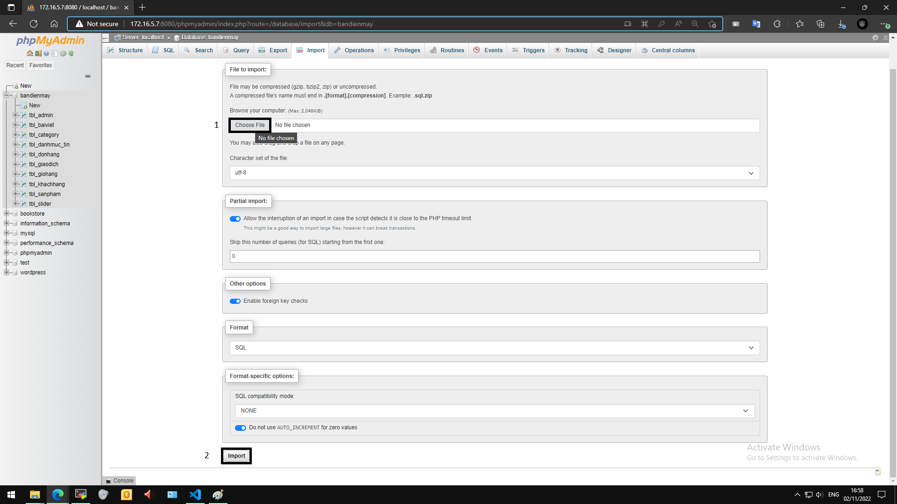
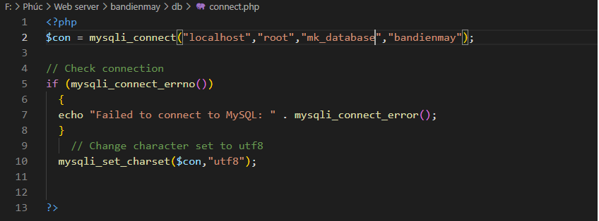
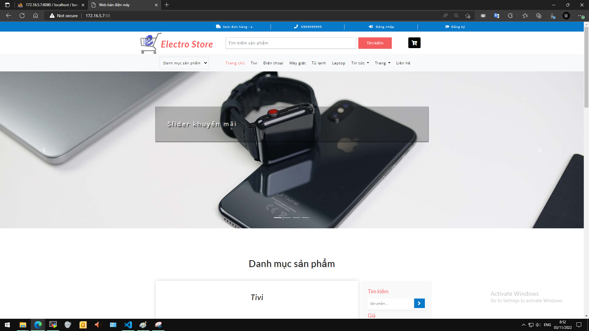

## <a name="" >Nội dung chính</a>

[1. Tổng quan](#1)

[2. Tiến hành cài đặt website](#2)


___

## <a name="1" >1. Tổng quan</a>

- Sau khi cài đặt thành công LEMP stack trên CentOS 7, thì ta cần phải kiểm tra thử hoặt động của máy chủ. Tuy triển khai có thể lâu, nhưng ta có thể chắc chắn được máy chủ hoạt động đúng và chính xác với yêu cầu được đề ra: vận hành web động.

- Cần chuẩn bị một số thứ như sau:

  - Một máy chủ đã cài đặt LEMP stack, có thể theo bài viết sau: [install-lemp.](install-lemp.md)
  - Một web động để cài đặt lên máy chủ, có thể lấy file đã có sau: [website bandienmay.](bandienmay.zip)
    >nếu bạn lấy file trên vui lòng đọc file web-info để hiểu thông tin của website này.
  - Một máy windows 10 để truy cập vào web sau khi đã cài đặt thành công.

## <a name="2" >2. Tiến hành cài đặt website</a>

<a name="b1" >B1: Đưa mã nguồn của web site lên server</a>

- Có thể dùng bất kỳ cách nào bạn biết để đưa mã nguồn của website lên server: tại bài viết sử dụng cách truyền file được bảo mật bởi SSH (SFTP), được tích hợp sẵn trong công cụ MobaXterm.

- Hãy nhớ lấy đường dẫn nơi lưu trữ mã nguồn, nếu bạn đưa lên file zip thì phải giải nén. Tại đây mình lưu với đường dẫn: `/var/www/bandienmay/`

<a name="b2" >B2: Khởi tạo database</a>

_Sử dụng trên nền website nên bước 2 này sẽ thực hiện trên máy windows 10 để truy tiến hành. Trên máy windows 10 cũng phải có mã nguồn website._

- Truy cập vào [PhpMyAdmin](c%C3%A0i-%C4%91%E1%BA%B7t-phpmyadmin-qu%E1%BA%A3n-l%C3%BD-database.md) đã cài đặt từ trước để quản lý MariaDB được dễ dàng hơn.
- Tạo mới 1 database với tên `bandienmay`
- Click chọn vào database `bandienmay` vừa tạo, sử dụng tính năng `import` để tạo các bảng dữ liệu cho database.
  
  - 
  - Chọn `Choose File` tìm đến file `bandienmay.sql` trong thư mục: `/bandienmay/db/bandienmay.sql`
  - Chọn xong file kéo xuống cuối trang chọn `Import`
  - 

- Import thành công, ta đã có database. Truy cập vào file `connect.php` trong thư mục: `/bandienmay/db/connect.php` để chỉnh sửa câu lệnh kết nối đến database
- 

  - Trong đó tại câu lệnh `$con` các giá trị trong "" lần lượt là:

    - localhost: kết nối đến database ở máy local
    - root - mk_database: tài khoản và mật khẩu mà ta đặt lúc cài đặt mariadb, nếu không có bất kỳ thay đổi nào thì nó sẽ là tài khoản root và mật khẩu của root.
    - bandienmay: tên database mà ta kết nối đến.

- Import thành công ta sẽ thấy các bảng dữ liệu của database

<a name="b3" >B3: Khai báo cấu hình website cho web server Nginx</a>

- Thường thì config cho các website trong Nginx sẽ được lưu tại `/etc/nginx/conf.d`

- Sử dụng trình soạn thảo `vi` tạo 1 file config cho website, với các config sau:

  - Tạo ra 1 file config:

   ```sh
   vi /etc/nginx/conf.d/bandienmay.lab.conf
   ```

  - Thêm vào các cấu hình sau:

   ```sh
   server {
        listen  80;
        server_name bandienmay.lab;

        access_log /var/log/nginx/bandienmay.lab.access.log;
        error_log /var/log/nginx/bandienmay.lab.error.log;

        root   /var/www/bandienmay/;

        location / {
            try_files $uri $uri/ =404;
            index index.php;

        }

        #cau-hinh-xu-ly-php-cho-website
        location ~ \.php$ {
            try_files $uri =404;
            fastcgi_pass unix:/var/run/php-fpm/www.sock;
            fastcgi_index index.php;
            fastcgi_param SCRIPT_FILENAME $document_root$fastcgi_script_name;
            include fastcgi_params;
        }
    }
   ```

- Trong môi trường lab, để truy cập vào website vừa triển khai ta sẽ truy cập với đường dẫn

```sh
http://IP_server:port
```

>Nếu có thay đổi port trong tệp cấu hình thì hãy nhập vào chỉ số port để truy cập, mặc định là port 80.

- Thu được giao diện chính của website như hình dưới là thành công trong việc triển khai website với LEMP.

- 

- Để kiểm tra tính hoạt động chính xác của LEMP ta có thể vừa sử dụng các tính năng cơ bản của website như: đăng nhập/đăng ký, thêm vào giở hàng,...Rồi kiểm tra sự thay đổi trong database với PhpMyAdmin.

